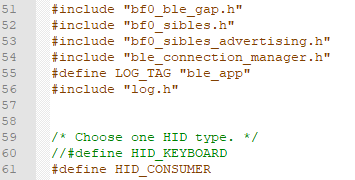

# BLE HID Example

Source Code Path: example/ble/hid

(Platform_hid)=
## Supported Platforms
<!-- List supported boards and chip platforms -->
All platforms

## Overview
<!-- Brief introduction to the example -->
1. This example demonstrates how to implement BLE HID on this platform.
2. The example implements two types of HID: HID_KEYBOARD and HID_CONSUMER.
    1) By default, main.c defines HID_KEYBOARD. You can switch the supported type by undefining HID_KEYBOARD and defining HID_CONSUMER.
    

## Usage Instructions
<!-- Explain how to use the example, such as connecting hardware pins to observe waveforms, compiling and flashing can refer to related documents.
For rt_device examples, also list the configuration switches used in this example, such as PWM1 used in PWM example, which needs to be enabled in the onchip menu -->
1. This example starts broadcasting on boot with the name SIFLI_APP-xx-xx-xx-xx-xx-xx, where xx represents the device's Bluetooth address. It can be directly connected via Windows or Mac Bluetooth.
2. After compiling and flashing, it can be found and connected on the PC. Once connected successfully, you can input via the development board's buttons, and the PC will show the corresponding output: pressing briefly outputs 'a', and long pressing continuously outputs 'aaaaaa...'
* If the PC has a serial tool, you can send the Finsh command "test_hids 4 p" to output 'a' on the PC, and "test_hids 4 r" to stop output.
* You can change the keyboard function, for example, changing 'a' to 'b' by modifying 0x04 to 0x05 in the code (you can find the relevant HID key mapping table online).
Note: After modifying the code, recompiling, and flashing, you need to delete the previously connected device on the PC and reconnect.
```c
static key_mapping_t key_mapping_table[1] = {
    {0x01, 0x04}        // HID keycode for 'a'
};
```
* You can increase the number of buttons, each corresponding to different functions. Add a mapping table and modify the button initialization function as shown below.
```c
static key_mapping_t key_mapping_table[2] = {
    {0x01, 0x04},        // HID keycode for 'a'
    {0x01, 0x05}        // HID keycode for 'b'
    //
};

static void key_button_handler(int pin, button_action_t action)
{
    uint8_t hid_code = 0;
    uint8_t key_idx = 0;
    
    if (pin == BSP_KEY1_PIN) {
        key_idx = 0;  
    } else if (pin == BSP_KEY2_PIN) {
        key_idx = 1;  
    } else {
        LOG_W("Unknown button pin: %d", pin);
        return;
    }
    hid_code = key_mapping_table[key_idx].hid_code;
    switch (action)
    {
    case BUTTON_PRESSED:
        HID_KEY_SET(hid_code);
        HID_KEY_SEND();
        break;
    case BUTTON_RELEASED:
        HID_KEY_CLEAR(hid_code);
        HID_KEY_SEND();
        break;
    default:
        break;
    }
}
static void key_button_init(void)
{
    button_cfg_t key1_cfg = {
        .pin = BSP_KEY1_PIN,
        .mode = PIN_MODE_INPUT_PULLUP,
        .active_state = BUTTON_ACTIVE_HIGH,
        .button_handler = key_button_handler,
    };
    int key1_id = button_init(&key1_cfg);
    if (key1_id >= 0)button_enable(key1_id);

    button_cfg_t key2_cfg = {
        .pin = BSP_KEY2_PIN,
        .mode = PIN_MODE_INPUT_PULLUP,
        .active_state = BUTTON_ACTIVE_HIGH,
        .button_handler = key_button_handler,
    };
    int key2_id = button_init(&key2_cfg);
    if (key2_id >= 0)button_enable(key2_id);
}
```
3. After connecting to the PC device, send the finsh command "test_hids [key] [p|r]" via the serial assistant to initiate control commands to the PC. Here, p|r represents press|release and need to be used in pairs; the key value varies depending on whether the HID type is keyboard or consumer:
    1) Keyboard type key value range:
    
    2) Consumer type key value range:
    
    3) For example, in consumer type, entering "test_hids 0 p" represents the press operation for the key value corresponding to PLAY.


### Hardware Requirements
Before running this example, you need to prepare:
+ A development board supported by this example ([Supported Platforms](#Platform_hid)).
+ A mobile phone device.

### menuconfig Configuration
1. Enable Bluetooth (`BLUETOOTH`):
    - Path: Sifli middleware → Bluetooth
    - Enable: Enable bluetooth
        - Macro switch: `CONFIG_BLUETOOTH`
        - Description: Enable Bluetooth functionality
2. Enable GAP, GATT Client, BLE connection manager:
    - Path: Sifli middleware → Bluetooth → Bluetooth service → BLE service
    - Enable: Enable BLE GAP central role
        - Macro switch: `CONFIG_BLE_GAP_CENTRAL`
        - Description: Switch for BLE CENTRAL (central device). When enabled, it provides scanning and active connection initiation with peripherals.
    - Enable: Enable BLE GATT client
        - Macro switch: `CONFIG_BLE_GATT_CLIENT`
        - Description: Switch for GATT CLIENT. When enabled, it can actively search and discover services, read/write data, and receive notifications.
    - Enable: Enable BLE connection manager
        - Macro switch: `CONFIG_BSP_BLE_CONNECTION_MANAGER`
        - Description: Provides BLE connection control management, including multi-connection management, BLE pairing, link connection parameter updates, etc.
3. Enable NVDS:
    - Path: Sifli middleware → Bluetooth → Bluetooth service → Common service
    - Enable: Enable NVDS synchronous
        - Macro switch: `CONFIG_BSP_BLE_NVDS_SYNC`
        - Description: Bluetooth NVDS synchronization. When Bluetooth is configured to HCPU, BLE NVDS can be accessed synchronously, so enable this option; when Bluetooth is configured to LCPU, this option needs to be disabled.
4. Enable buttons:
    - Path: Sifli middleware
    - Enable: Enable button library
        - Macro switch: `CONFIG_USING_BUTTON_LIB`
        - Description: Enable button library

### Compilation and Programming
Switch to the example project directory and run the scons command to compile:
```c
> scons --board=eh-lb525 -j32
```
Switch to the example `project/build_xx` directory and run `uart_download.bat`, select the port as prompted to download:
```c
$ ./uart_download.bat

     Uart Download

please input the serial port num:5
```
For detailed steps on compilation and downloading, please refer to the relevant introduction in [Quick Start](/quickstart/get-started.md).

## Expected Results
<!-- Explain the expected results of the example, such as which LEDs will light up, which logs will be printed, so that users can judge whether the example is running normally. The running results can be explained step by step in combination with the code -->
After starting the example:
1. It can be discovered and connected by the phone's BLE APP.
2. The phone can be controlled via finsh commands.

## Exception Diagnosis


## Reference Documents
<!-- For rt_device examples, the RT-Thread official website documentation provides more detailed descriptions. Web page links can be added here, for example, refer to RT-Thread's [RTC documentation](https://www.rt-thread.org/document/site/#/rt-thread-version/rt-thread-standard/programming-manual/device/rtc/rtc) -->

## Update History
| Version | Date   | Release Notes |
|:---|:---|:---|
| 0.0.1 | 01/2025 | Initial version |
| | | |
| | | |