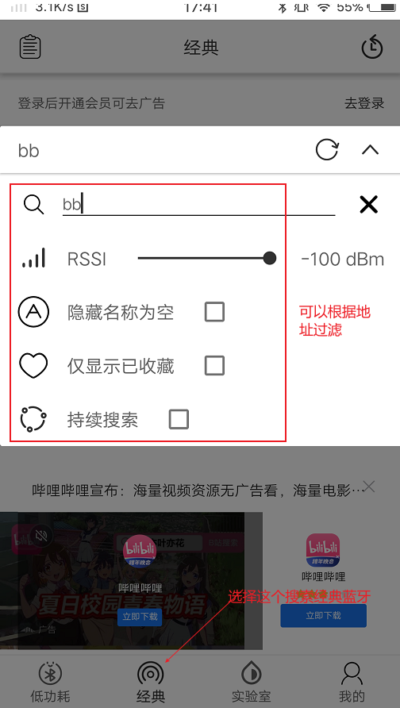
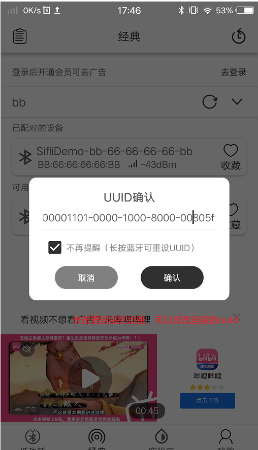
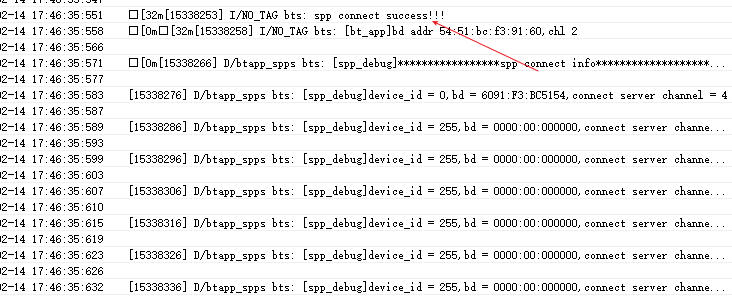
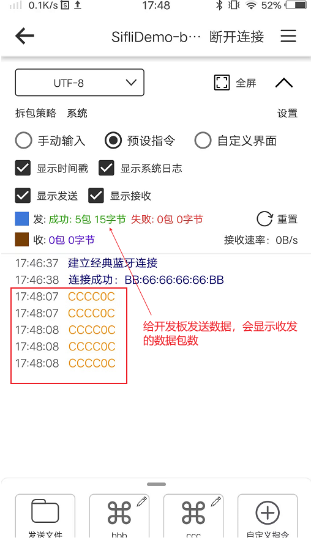
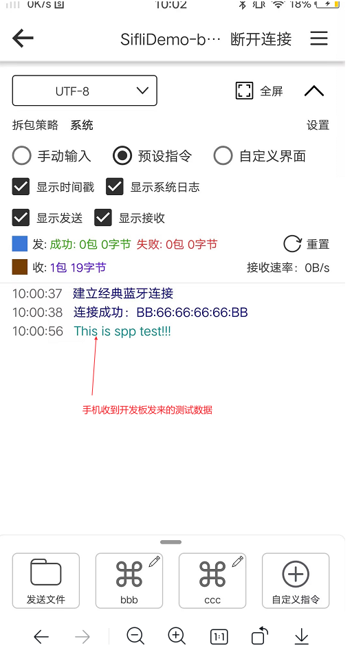
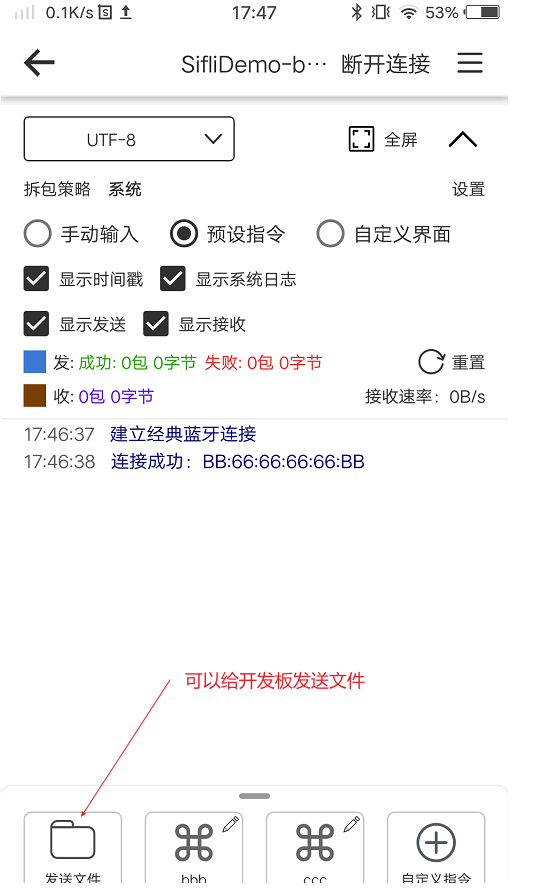
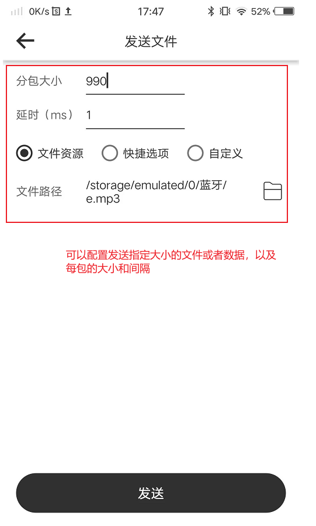
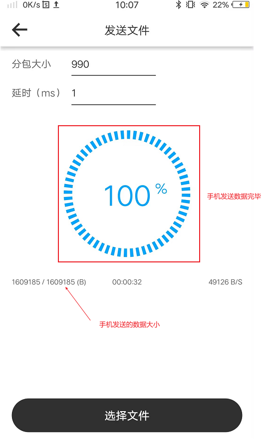
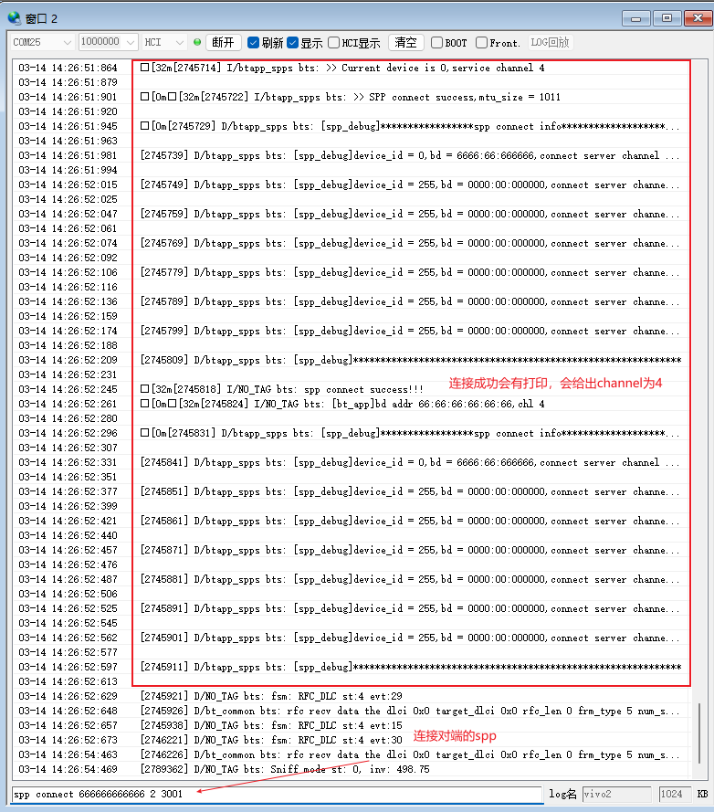
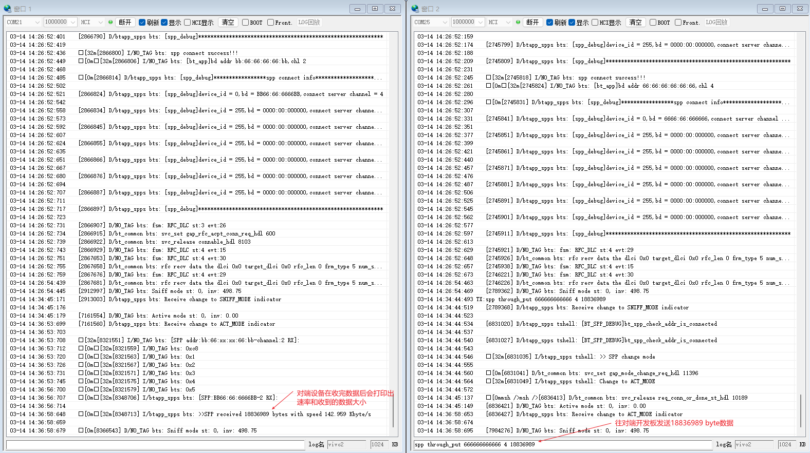

# BT SPP Profile Example

Source code path: example/bt/spp

{#Platform_spp}
## Supported Platforms
<!-- Which boards and chip platforms are supported -->
+ eh-lb52x
+ eh-lb56x
+ eh-lb58x

## Overview
<!-- Example introduction -->
This example demonstrates SPP connection and disconnection, data transmission, file transfer, and speed testing, including:
+ SPP server
+ SPP client
+ SPP server and SPP client

### Hardware Requirements
Before running this example, you need to prepare:
+ One development board supported by this example ([Supported Platforms](#Platform_spp)).
+ An Android phone (SPP only supports Android phones, iOS phones cannot use SPP), and you need to download an SPP Bluetooth serial port tool APP (e.g., SPP Bluetooth Serial Port, e-Debug, etc.).

## Example Usage
<!-- Instructions on how to use the example, such as connecting hardware pins to observe waveforms, compilation and flashing can reference related documentation.
For rt_device examples, you also need to list the configuration switches used in this example, such as PWM example uses PWM1, which needs to be enabled in the onchip menu -->
The example will enable Bluetooth by default at startup, and the phone can enter the SPP Bluetooth serial port tool APP to search and connect (using e-Debug app as an example):

1. Phone app connects to development board SPP:
Enter the classic Bluetooth device search interface on the phone to search for the development board:

After finding the specified device, you can long-press the device to modify the UUID of the SPP to connect (default is 0x1101 UUID). <font color=red>This example supports custom SPP UUIDs to increase the number of SPP connections, and supports up to 7 SPP connections with the same phone. Users can add custom UUIDs by implementing the bt_spp_srv_add_uuid_list interface. Also, if the phone wants to connect multiple SPP connections, it may need to establish one SPP connection in each app separately.</font>


You can see the successful connection log in the serial port output:


2. Phone sends data to development board
You can send data from the phone app to the development board, as shown below:

The development board's serial port log will print the received data size and speed:


3. Development board sends data to phone
Use the command `spp send_data + address + service channel` to send test data to the phone, where the service channel can be obtained from the serial port output:

The phone app will display the received data:


4. Phone sends file to development board
In the phone app, you can select to send a file to the development board:


The development board's serial port log will print the received data size and speed, and the phone will also display the sending progress:



5. Development board sends file to phone
If there are files on the development board, you can use the command `spp send_file + address + service channel + filename` to send the specified file to the phone, where the service channel can be obtained from the serial port output:


The phone will display the received content and data size:


6. Development board initiates SPP connection
The development board can also initiate SPP connections, but since many phones only support 0x1101 SPP, and the development board will be quickly disconnected by the phone after actively connecting, you can choose to connect development board to development board.
Since this example supports custom SPP UUIDs to increase the number of SPP connections, you can flash this example to two development boards separately, allowing multiple SPP connections between development boards, with one acting as the phone role.
For example, if development board A needs to connect to development board B's 0x3001 SPP channel, you can use the command `spp search + address + uuid length + uuid` to first query whether the peer device supports 0x3001 SPP:

Development board A can use the command `spp connect + address + uuid length + uuid` to connect to the peer device's 0x3001 SPP:


7. Throughput test between development boards
The functions mentioned above also exist in connections between development boards. Here we mainly explain the throughput test between development boards. Development board A can use the command `spp through_put + address + service channel + transmitted data size` to transmit random data of specified size to development board B. Development board B will calculate the rate after receiving all data:
The service channel can be obtained from the serial port output:



8. Disconnect specified SPP connection
The development board can use the command `spp disc + address + service channel` to disconnect the specified SPP connection:
The service channel can be obtained from the serial port output:


9. Disconnect all connected SPP
The development board can use the command `spp disc_all` to disconnect all SPP connections.

### menuconfig Configuration

1. This example needs to read and write files, so it requires a file system. Configure the `FAT` file system:
    - Path: RTOS → RT-Thread Components → Device virtual file system
    - Enable: Enable elm-chan fatfs
        - Macro switch: `CONFIG_RT_USING_DFS_ELMFAT`
        - Description: Enable fatfs file system
    ```{tip}
     mnt_init mounts the root partition.
    ```
2. Enable Bluetooth (`BLUETOOTH`):
    - Path: Sifli middleware → Bluetooth
    - Enable: Enable bluetooth
        - Macro switch: `CONFIG_BLUETOOTH`
        - Description: Enable bluetooth function
3. Enable SPP server and SPP client:
    - Path: Sifli middleware → Bluetooth → Bluetooth service → Classic BT service
    - Enable: Enable BT finsh (optional)
        - Macro switch: `CONFIG_BT_FINSH`
        - Description: Enable finsh command line for Bluetooth control
    - Enable: Manually select profiles
        - Macro switch: `CONFIG_BT_PROFILE_CUSTOMIZE`
        - Description: Manually select profiles to enable
    - Enable: Enable SPP client
        - Macro switch: `CONFIG_CFG_SPP_CLT`
        - Description: Enable SPP client function for actively initiating SPP connections, etc.
    - Enable: Enable SPP server
        - Macro switch: `CONFIG_CFG_SPP_SRV`
        - Description: Enable SPP server function so that peer devices can search and connect to SPP service
4. Enable BT connection manager:
    - Path: Sifli middleware → Bluetooth → Bluetooth service → Classic BT service
    - Enable: Enable BT connection manager
        - Macro switch: `CONFIG_BSP_BT_CONNECTION_MANAGER`
        - Description: Use connection manager module to manage BT connections
5. Enable NVDS:
    - Path: Sifli middleware → Bluetooth → Bluetooth service → Common service
    - Enable: Enable NVDS synchronous
        - Macro switch: `CONFIG_BSP_BLE_NVDS_SYNC`
        - Description: Bluetooth NVDS synchronization. When Bluetooth is configured to HCPU, BLE NVDS can be accessed synchronously, enable this option; when Bluetooth is configured to LCPU, this option needs to be disabled

### Compilation and Flashing
Switch to the example project directory and run the scons command to compile:
```c
> scons --board=eh-lb525 -j32
```
Switch to the example `project/build_xx` directory and run `uart_download.bat`, then select the port as prompted to download:
```c
$ ./uart_download.bat

     Uart Download

please input the serial port num:5
```
For detailed steps on compilation and downloading, please refer to the related introduction in [Quick Start](/quickstart/get-started.md).

## Expected Results
<!-- Explain the example running results, such as which LEDs will light up, which logs will be printed, so users can judge whether the example is running normally. Results can be explained step by step combined with code -->
After the example starts:
1. SPP functionality works normally

## Troubleshooting

## Reference Documentation
<!-- For rt_device examples, RT-Thread official documentation provides detailed explanations, you can add webpage links here, for example, refer to RT-Thread's [RTC Documentation](https://www.rt-thread.org/document/site/#/rt-thread-version/rt-thread-standard/programming-manual/device/rtc/rtc) -->

## Update History
|Version |Date   |Release Notes |
|:---|:---|:---|
|0.0.1 |03/2025 |Initial version |
| | | |
| | | |