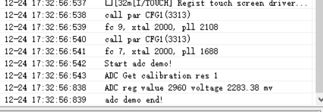

# ADC_battery Example
Source code path: example/hal/adc/adc_battery
## Supported Platforms
The example can run on the following development boards
* sf32lb52-lcd_n16r8

## Overview
* Operating HAL functions for single-channel ADC to read battery voltage

## Example Usage
### Compilation and Programming
The demonstration code defaults to single-channel ADC sampling demonstration

Switch to the example project directory and run the scons command to compile:

```
scons --board=sf32lb52-lcd_n16r8 -j8
```

Execute the programming command
```
build_sf32lb52-lcd_n16r8_hcpu\uart_download.bat
```

Select the port as prompted to download:

```none
please input the serial port num:5
```

#### Example Output Results Display:
* Voltage reading log before connecting battery



* Voltage reading log after connecting battery


The log prints the value as the raw register value, and Voltage is the converted mV voltage


#### ADC Configuration Flow

* Set channel 7 corresponding to the battery Vbat interface


* Enable adc device in menuconfig

```
menuconfig --board=sf32lb52-lcd_n16r8
```


**Note**: 
* Enable the corresponding ADC clock source (enabled by default in code, not mandatory here)
```c
/* 2, open adc clock source  */
HAL_RCC_EnableModule(RCC_MOD_GPADC);
```

* ADC Calibration
1. To improve ADC accuracy, SiFli series chips undergo ADC calibration at the factory (calibration parameters are written to the chip's internal OTP area). Different series have different calibration methods.  
To ensure ADC accuracy, it needs to be called once every power-on. The following is the calibration function, which reads OTP parameters to calculate the slope `adc_vol_ratio` and offset `adc_vol_offset`:

```c
static int utest_adc_calib(void)
```
2. After ADC sampling obtains the raw register value, call the function `example_adc_get_float_mv` and calculate the final voltage value based on the calibrated slope `adc_vol_ratio` and offset `adc_vol_offset`.
3. For 52 series chips, CH8 (Channel 7) is internally connected to Vbat through two equal voltage divider resistors. To get the Vbat value, conversion is needed. To reduce voltage divider resistor errors, the two resistors have been calibrated at the factory:
```c
static float adc_vbat_factor = 2.01; /* Calibrate the two voltage divider resistors from 52 chip internal CH8 (Channel 7) to Vbat */
static void example_adc_vbat_fact_calib(uint32_t voltage, uint32_t reg)
{
    float vol_from_reg;

    // get voltage calculate by register data
    vol_from_reg = (reg - adc_vol_offset) * adc_vol_ratio / ADC_RATIO_ACCURATE;
    adc_vbat_factor = (float)voltage / vol_from_reg;
}
/* Method to convert CH8 (Channel 7) sampling to Vbat voltage value, refer to code in sifli_get_adc_value function */
    float fval = sifli_adc_get_float_mv(fave) * 10; // mv to 0.1mv based
    *value = (rt_uint32_t)fval;
    if (channel == 7)   // for 52x, channel fix used for vbat with 1/2 update(need calibrate)
        *value = (rt_uint32_t)(fval * adc_vbat_factor); /* Convert sampled actual ADC voltage to Vbat voltage value*/
```
## Exception Diagnosis
* ADC sampled voltage value is incorrect
1. Check if ADC hardware is connected correctly. ADC sampling channels are fixed IO ports and cannot be arbitrarily assigned. For which IO corresponds to CH0-7, refer to the chip manual.  
2. ADC input voltage range is 0V - reference voltage (52 defaults to 3v3), cannot exceed the input range  
3. Use debugging tools like Ozone or LightWork. After starting ADC sampling, connect online and check the corresponding register configuration status against the chip manual.
* ADC accuracy is insufficient
1. Check if ADC calibration parameters are obtained and used
2. Check if voltage divider resistor accuracy meets requirements
3. Check if ADC reference voltage is stable and has excessive ripple (refer to ADC voltage reference chip manual for specifics) 

  
## Reference Documents
* EH-SF32LB52X_Pin_config_V1.3.0_20231110.xlsx
* DS0052-SF32LB52x-芯片技术规格书 V0p3.pdf
## Update Log
|Version |Date   |Release Notes |
|:---|:---|:---|
|0.0.1 |10/2024 |Initial version |
| | | |