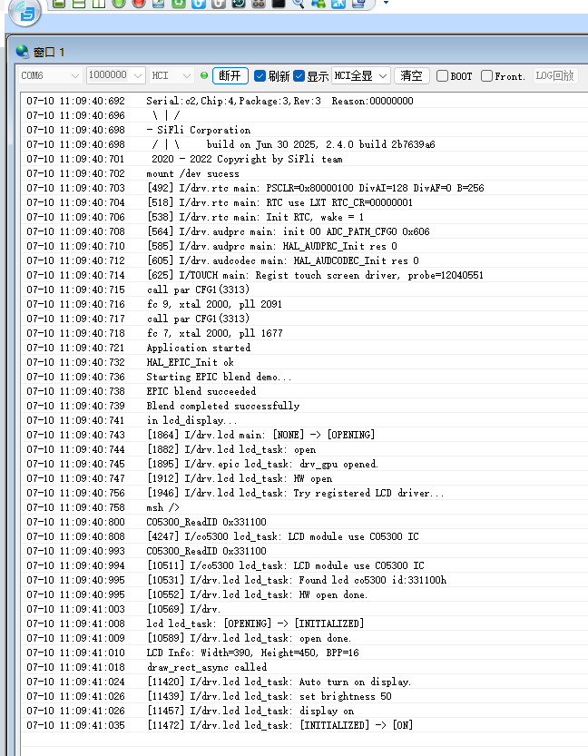
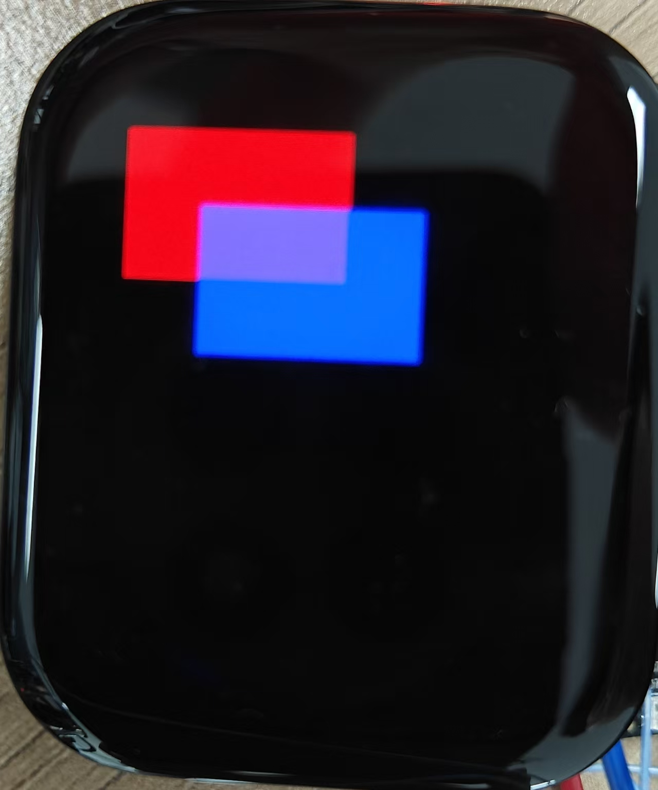

# HAL EPIC 示程
EPIC(ePicasso)，是我们自研的图形引擎，它是专为 2D/2.5D 图像处理设计的硬件加速模块，主要用于分担 CPU 在图像运算中的负载，提升图像处理效率。
## 概述

本程序是一个基于 **HAL（硬件抽象层）** 接口和 **EPIC** 的图形混合示例。它演示了如何使用 HAL 接口控制 EPIC 硬件模块进行图层混合（Alpha Blending），将两个带有透明度的矩形图层叠加，并最终显示在 LCD 屏幕上。

---

## 支持的开发板

- `sf32lb52-lchspi-ulp`
- `sf32lb52-nano_52j`
- `sf32lb52-lcd_n16r8`

---

## 例程功能简介

### 主要流程如下：

1. 初始化 EPIC 及其底层 EZIP 模块。
2. 使用 HAL_EPIC_FillStart() 在两块显存缓冲区中分别绘制蓝色和红色矩形。
3. 设置图层参数并调用 HAL_EPIC_BlendStartEx() 进行图层混合。
4. 将混合后的结果输出到 LCD 显示设备。

---

## 例程的使用
### 编译和烧录
切换到例程project目录，运行scons命令执行编译：
```
scons --board=sf32lb52-lchspi-ulp -j8
```
执行烧写命令：
```
build_sf32lb52-lchspi-ulp_hcpu\uart_download.bat
```
按提示选择端口即可进行下载：
```none
please input the serial port num:6
```

#### 例程输出结果展示:
串口窗口打印如图：

会在 LCD 屏幕上显示如图效果：


---
## 例程的讲解
### 使用到的关键接口：
| 接口名                        | 功能描述                         |
|-----------------------------|------------------------------|
| HAL_EZIP_Init()	          | 初始化 EZIP 模块         |
| HAL_EPIC_Init()        | 初始化 EPIC 图形控制器            |
| HAL_EPIC_LayerConfigInit()| 初始化图层配置结构体               |
| HAL_EPIC_LayerSetDataOffset() | 设置图层数据偏移量（用于裁剪）     |
| HAL_EPIC_FillStart()    | 启动颜色填充操作                |
| HAL_EPIC_BlendStartEx()   | 启动多图层混合操作                   |
---
### 注意事项
裁剪区域设置需谨慎
默认裁剪行为：
如果未调用 HAL_EPIC_LayerSetDataOffset()，默认从 layer.data 指针指向的首地址开始裁剪图像数据，本例程即 (0, 0)。

#### 常见问题：
如果填充区域不在裁剪区域内，则无法提取有效图像数据，导致图层混合失败。
示例：若填充区域为 (100~250, 100~200)，而裁剪区域为 (0~150, 0~100)，则实际裁剪到的混合数据为空。
解决方案：
* 方法一：将填充区域调整至裁剪区域内。
* 方法二：调用 HAL_EPIC_LayerSetDataOffset(layer, x, y) 设置裁剪偏移，注意传入的 x/y 应为 目标坐标 + layer.x_offset / layer.y_offset。