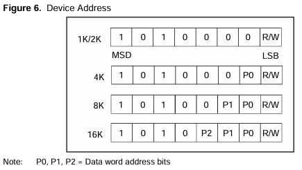

# I2C EEPROM Example
Source code path: example/hal/i2c/eeprom
## Supported Platforms
The example can run on the following development boards.
* sf32lb52-lcd_n16r8
* sf32lb58-lcd_n16r64n4
* sf32lb56-lcd_n16r12n1

## Overview
* Demonstrate I2C HAL functions through read/write operations on EEPROM chip AT24CO8SC module

## Example Usage

### Hardware Connection
Connect AT24CO8SC's VCC and GND to 5V and GND respectively for power supply
Connect AT24CO8SC's SDA and SCK according to the table below based on the development board model

|Development Board    |SDA Pin|SDA Pin Name|SCL Pin|SCL Pin Name|
|:---     |:---    |:---     |:---   |:---      |
|sf32lb52-lcd_n16r8 |3       |PA42     |5      |PA41      |
|sf32lb58-lcd_n16r64n4 |3 (CONN1)   |PB29     |5 (CONN1)  |PB28      |
|sf32lb56-lcd_n16r12n1 |3       |PA12     |5      |PA20      |

* For more detailed pin definitions, please refer to
`[sf32lb52-lcd_n16r8]()`
`[sf32lb58-lcd_n16r64n4]()`

* AT24C08SC


### Compilation and Programming
#### SF525 Project Code Compilation
Switch to the example project directory and run the scons command to compile:

```
scons --board=sf32lb52-lcd_n16r8 -j8
```

Run `build_sf32lb52-lcd_n16r8_hcpu\uart_download.bat`, select the port as prompted to download:

```
build_sf32lb52-lcd_n16r8_hcpu\uart_download.bat

Uart Download

please input the serial port num:5
```

#### SF587 Project Code Compilation
Switch to the example project directory and run the scons command to compile:

```
scons --board=sf32lb58-lcd_n16r64n4 -j8
```

`build_sf32lb52-lcd_n16r8_hcpu\download.bat`, the program downloads automatically via JLink:

```
build_sf32lb58-lcd_n16r64n4_hcpu\download.bat
```

### Example Output Results Display:
* Log output:
```
    SFBL
    Serial:c2,Chip:4,Package:3,Rev:3  Reason:00000000
    \ | /
   - SiFli Corporation
    / | \     build on Nov 29 2024, 2.1.7 build 91ecc2d9
    Copyright by SiFli team
    mount /dev sucess
    [I/drv.rtc] PSCLR=0x80000100 DivAI=128 DivAF=0 B=256
    [I/drv.rtc] RTC use LXT RTC_CR=00000001
    [I/drv.rtc] Init RTC, wake = 0
    [I/drv.audprc] init 00 ADC_PATH_CFG0 0x606
    [I/drv.audprc] HAL_AUDPRC_Init res 0
    [I/drv.audcodec] HAL_AUDCODEC_Init res 0
    [32m][I/TOUCH] Regist touch screen driver, probe=1203ba81 [0m]
    call par CFG1(35bb)
    fc 9, xtal 2000, pll 2123
    call par CFG1(35bb)
    fc 7, xtal 2000, pll 1698
    Start i2c_eeprom demo!
    EEPROM_init0
    i2c write addr:0x1,data:0x11,ret:0
    i2c write addr:0x2,data:0x22,ret:0
    i2c write addr:0x3,data:0x33,ret:0
    i2c write addr:0x4,data:0x44,ret:0
    i2c read reg:0x1,pdata:0x11,ret:0
    i2c read reg:0x2,pdata:0x22,ret:0
    i2c read reg:0x3,pdata:0x33,ret:0
    i2c read reg:0x4,pdata:0x44,ret:0
    i2c_eeprom end!
```
### I2C Read/Write Waveforms
#### I2C read/write waveforms required by AT24C08SC chip manual
* I2C write waveform

* I2C read waveform

#### Logic analyzer captured partial waveforms
* I2C write waveform

* I2C read waveform

#### I2C Parameter Modification
* See comments in EEPROM_init function
```c
/// @brief Initialization work before power on EEPROM 
/// @param  
void EEPROM_init(void)
{
    uint8_t slaveAddr = EEPROM_I2C_ADDRESS; // 7bit address of device
    HAL_StatusTypeDef ret;
    //1. pin mux
#ifdef SF32LB52X
    HAL_RCC_EnableModule(RCC_MOD_I2C2); // enable i2c2 
    #define EXAMPLE_I2C I2C2 // i2c number of cpu
    #define EXAMPLE_I2C_IRQ I2C2_IRQn // i2c number of interruput when using interrupte mode 
    HAL_PIN_Set(PAD_PA41, I2C2_SCL, PIN_PULLUP, 1); // i2c io select
    HAL_PIN_Set(PAD_PA42, I2C2_SDA, PIN_PULLUP, 1);
#elif defined(SF32LB58X)
    #define EXAMPLE_I2C I2C6 // i2c number of cpu
    #define EXAMPLE_I2C_IRQ I2C6_IRQn // i2c number of interruput when using interrupte mode 
    HAL_PIN_Set(PAD_PB28, I2C6_SCL, PIN_PULLUP, 1); // i2c io select
    HAL_PIN_Set(PAD_PB29, I2C6_SDA, PIN_PULLUP, 1);
#elif defined(SF32LB56X)
#define EXAMPLE_I2C I2C3 // i2c number of cpu
#define EXAMPLE_I2C_IRQ I2C3_IRQn // i2c number of interruput when using interrupte mode 
    HAL_PIN_Set(PAD_PA20, I2C3_SCL, PIN_PULLUP, 1); // i2c io select
    HAL_PIN_Set(PAD_PA12, I2C3_SDA, PIN_PULLUP, 1);
#endif

    // 2. i2c init
    i2c_Handle.Instance = EXAMPLE_I2C;
    i2c_Handle.Mode = HAL_I2C_MODE_MASTER; // i2c master mode
    i2c_Handle.Init.AddressingMode = I2C_ADDRESSINGMODE_7BIT; // i2c 7bits device address mode
    i2c_Handle.Init.ClockSpeed = 400000; // i2c speed (hz)
    i2c_Handle.Init.GeneralCallMode = I2C_GENERALCALL_DISABLE;
    ret = HAL_I2C_Init(&i2c_Handle);
    rt_kprintf("EEPROM_init%d\n", ret);
}
```
* Distinguish development boards based on chip type. In the initialization function, configure corresponding I2C pins for specific chips
* For example, use `#elif defined(SF32LB52X)` chip to determine which development board is being used
* Use `#define EXAMPLE_I2C I2C2` for the I2C controller number used by that chip (such as I2C6, I2C3)
* Use `#define EXAMPLE_I2C_IRQ I2C6_IRQn` for the interrupt number corresponding to that I2C controller (for interrupt mode)
* Finally configure I2C SCL and SDA pins through HAL_PIN_Set() function, and need to set to pull-up mode

**Note**: 
1. Except for 55x chips, can be configured to any IO with PA*_I2C_UART function to output I2C SDA, SCLK waveforms
2. The last parameter of HAL_PIN_Set is for hcpu/lcpu selection, 1: select hcpu, 0: select lcpu 

* AT24C08SC device address



#### I2C Register Read Method Modification
In EEPROM_read_data function
```c
void EEPROM_read_data(uint8_t addr, uint8_t *pdata)
{
    HAL_StatusTypeDef ret;
    uint8_t buf = 0;

    __HAL_I2C_ENABLE(&i2c_Handle);  // for master, enable it before transmit

    // 5. Read register value after write

    // device need stop condition before read
    // ret = HAL_I2C_Master_Transmit(&i2c_Handle, EEPROM_I2C_ADDRESS, &addr, 1, 1000);
    // ret = HAL_I2C_Master_Receive(&i2c_Handle, EEPROM_I2C_ADDRESS, (uint8_t *)pdata, 2, 1000);

    // device can read without stop condition, restart condition instead
    ret = HAL_I2C_Mem_Read(&i2c_Handle, EEPROM_I2C_ADDRESS, addr, 1, &buf, 2, 1000);
    *pdata = buf;

    rt_kprintf("i2c read reg:0x%x,pdata:0x%x,ret:%d\n", addr, *pdata, ret);

    __HAL_I2C_DISABLE(&i2c_Handle); // for master, disable it after transmit to reduce error status
}
```
Some I2C peripherals require a STOP signal after sending the register address when reading a specific register. This requires
```c
ret = HAL_I2C_Mem_Read(&i2c_Handle, EEPROM_I2C_ADDRESS, addr, 1, &buf, 2, 1000);
```
to be modified to the following method
```c
ret = HAL_I2C_Master_Transmit(&i2c_Handle, EEPROM_I2C_ADDRESS, &addr, 1, 1000);
ret = HAL_I2C_Master_Receive(&i2c_Handle, EEPROM_I2C_ADDRESS, (uint8_t *)pdata, 2, 1000);
```


## Exception Diagnosis
* I2C has no waveform output
1. Check against chip manual if CPU I2C selection is correct
2. Check if IO configuration and connection are correct
* Consecutive write failures, I2C waveform normal, no acknowledge signal
1. AT24C08SC requires up to 5ms Write Cycle Time wait for data programming during write input 


## Reference Documents
* [AT24C08SC](./assets/at24c02sc.pdf)

## Update Log
|Version  |Date    |Release Notes |
|:---  |:---    |:---    |
|0.0.1 |12/2024 |Initial version |
|      |        |        |