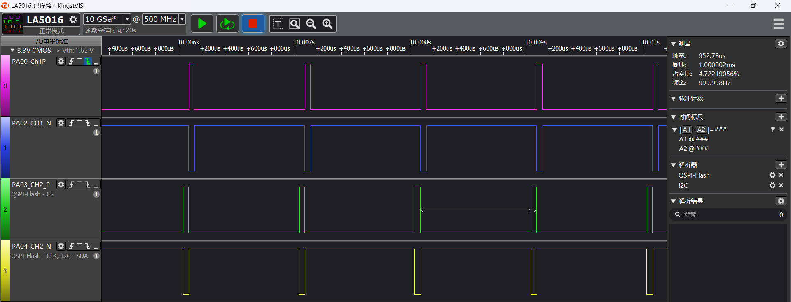
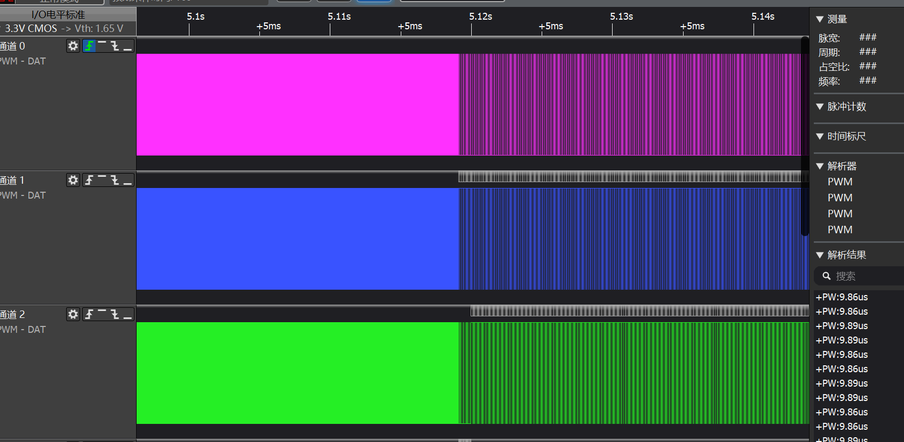
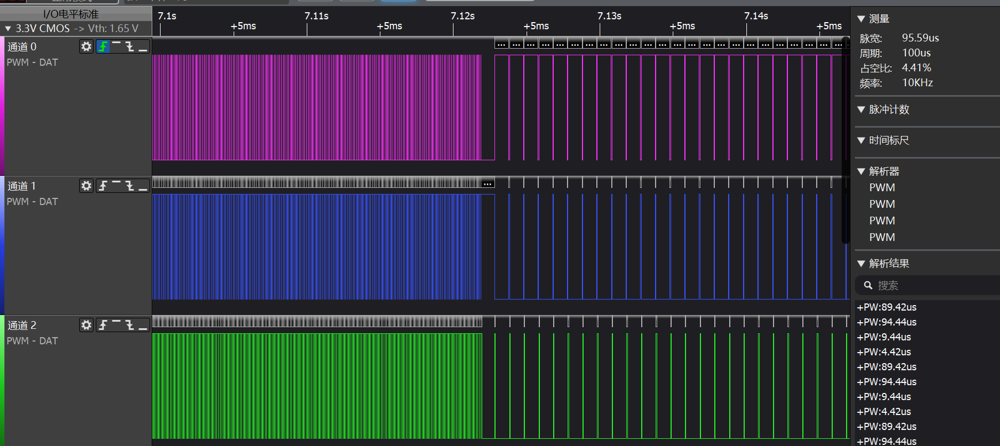

# PWM Example
Source code path: example/hal/pwm
## Supported Platforms
The example can run on the following development boards.
* sf32lb52-lcd_n16r8
* sf32lb58-lcd_n16r64n4
## Overview
* Contains examples of GPtimer outputting PWM through IO ports
* Contains examples of using Atimer to output complementary PWM through IO


## Example Usage
### Compilation and Programming
Switch to the example project directory and run the scons command to compile (board=board type):
```
scons --board=sf32lb52-lcd_n16r8 -j8
```
`build_sf32lb52-lcd_n16r8_hcpu\uart_download.bat`, select the port as prompted to download:

```
build_sf32lb52-lcd_n16r8_hcpu\uart_download.bat

Uart Download

please input the serial port num:5
```

For detailed steps on compilation and downloading, please refer to the relevant introduction in [](/quickstart/get-started.md).
### GPtimer Output PWM
#### Example Output Results Display:
* Log output:
```
SFBL
Start gtimer pwm demo!
GPT_clock 24000000,psc 2, Period 60000,Pulse 12000
gtimer pwm demo end!
msh />
```
* PA09 outputs PWM waveform (default 200Hz, 20% duty cycle)

#### PWM Parameter Modification
* IO output modification

Physical position refers to the actual pin position on the board's header
|Board Name  | PWM       | CHX     |   Pin (Physical Position)  |
|--------|------------|--------|---------|
|525    | GPTIM2     | CH1    |    PA09 (37)     |
|587  | GPTIM1     | CH2  |      PA51    (CONN2 28)    |
```c
    #define PAD_PA_09 PAD_PA09 /* 52 series default PA09 output (physical position 37) */
    HAL_PIN_Set(PAD_PA_09, cfg->pad_func, PIN_PULLUP, 1);/*Configure PA09 as GPTIM2_CH1 function*/


    #define PAD_PA_51 PAD_PA51/* 587 series default PA51 output (physical position CONN2 28) */
    HAL_PIN_Set(PAD_PA_51, cfg->pad_func, PIN_PULLUP, 1);/*Configure PA51 as GPTIM1_CH2 function*/
```
**Note**: 
1. Except for 55x chips, can be configured to any IO with PA_TIM function to output PWM waveform (to query pin multiplexing table, you can search for the corresponding board type pin multiplexing in the project path files such as: bf0_pin_const.c)
2. The last parameter of HAL_PIN_Set is for hcpu/lcpu selection, 1: select hcpu, 0: select lcpu 
* PWM period period, pulse width pulse modification

```c
#if defined(BSP_USING_BOARD_EM_LB525XXX)
    T_haltest_pwm_cfg testcfg[] =
{
    {hwp_gptim2, CORE_ID_HCPU, GPTIM2_CH1, GPT_CHANNEL_1, 5000000, 1000000, 0},
};  //period:0.5s  pulse:0.25s
#elif defined BSP_USING_BOARD_EM_LB587XXX
    T_haltest_pwm_cfg testcfg[] =
{
    {hwp_gptim1, CORE_ID_HCPU, GPTIM1_CH2, GPT_CHANNEL_2, 5000000, 1000000, 0},
};  //period:0.5s  pulse:0.25s
#endif
```
1. Parameter: 5000000 unit is ns, corresponding period is 1/0.005s=200Hz
2. Parameter: 1000000 unit is ns, represents the pulse width of PWM output 1 in one period, cannot be greater than the above parameter,
- 1000000/5000000=1/5=20% duty cycle
### ATtimer Output Complementary PWM
#### Example Output Results Display:
* Log output:
```c
Start atimer pwm demo!
ATIM1_Init
frequency:50000,percentage1:50,percentage2:30
channel1 atim1 plck freq:120000000,PWM_PERIOD:20000,PWM_PULSE:10000
atim1 GPT_clock:120,period:2400,psc:1
atim1 pulse:1200
channel2 atim1 plck freq:120000000,PWM_PERIOD:20000,PWM_PULSE:6000
atim1 GPT_clock:120,period:2400,psc:1
frequency:10000,percentage1:5,percentage2:90
channel1 atim1 plck freq:120000000,PWM_PERIOD:100000,PWM_PULSE:5000
atim1 GPT_clock:120,period:12000,psc:1
atim1 pulse:600
channel2 atim1 plck freq:120000000,PWM_PERIOD:100000,PWM_PULSE:90000
atim1 GPT_clock:120,period:12000,psc:1
frequency:1000,percentage1:95,percentage2:5
channel1 atim1 plck freq:120000000,PWM_PERIOD:1000000,PWM_PULSE:950000
atim1 GPT_clock:120,period:120000,psc:1
atim1 pulse:114000
channel2 atim1 plck freq:120000000,PWM_PERIOD:1000000,PWM_PULSE:50000
atim1 GPT_clock:120,period:120000,psc:1
ATIM1_Stop!
atimer pwm demo end!
```
Physical position refers to the pin position corresponding to the board's header
|Board Name  | PWM       | Output Channel1     | Output Channel2   |    
|--------|------------|---------------|-------------------|
|525    | ATIM1     | PAD_PA00 (physical position 32), PAD_PA02 (physical position 36)   | PAD_PA03 (physical position 40), PAD_PA03 (physical position 38)    |   
|587  | ATIM2     | PAD_PA84 (conn2 21), PAD_PA86 (conn2 24) |PAD_PA90 (conn2 27), PAD_PA91 (conn2 26)  |
* 52 series: PA00, PA02 output Channel1 complementary PWM waveform, PA03, PA04 output Channel2 complementary PWM waveform:
* 587 series: PA84, PA86 output Channel1 complementary PWM waveform, PA90, PA91 output Channel2 complementary PWM waveform:

#### PWM Parameter Modification
* ATIM modification: 52 series selects ATIM1, 587 selects ATIM2
```c
    #if defined(BSP_USING_BOARD_EM_LB525XXX)
    atim_Handle.Instance = (GPT_TypeDef *)hwp_atim1;

    #elif defined (BSP_USING_BOARD_EM_LB587XXX)
    atim_Handle.Instance = (GPT_TypeDef *)hwp_atim2;
    #endif
```
* IO output modification
Except for 55x chips, can be configured to any IO with PA_TIM function to output PWM waveform

```c
#if defined(BSP_USING_BOARD_EM_LB525XXX)
	HAL_PIN_Set(PAD_PA00, ATIM1_CH1,  PIN_PULLUP, 1);
    HAL_PIN_Set(PAD_PA02, ATIM1_CH1N, PIN_PULLUP, 1);
    HAL_PIN_Set(PAD_PA03, ATIM1_CH2,  PIN_PULLUP, 1);
    HAL_PIN_Set(PAD_PA04, ATIM1_CH2N, PIN_PULLUP, 1);

#elif defined(BSP_USING_BOARD_EM_LB587XXX)
    HAL_PIN_Set(PAD_PA84, ATIM2_CH1,  PIN_PULLUP, 1);
    HAL_PIN_Set(PAD_PA86, ATIM2_CH1N, PIN_PULLUP, 1);
    HAL_PIN_Set(PAD_PA90, ATIM2_CH2,  PIN_PULLUP, 1);
    HAL_PIN_Set(PAD_PA91, ATIM2_CH2N, PIN_PULLUP, 1);
#endif
```
* PWM period period, pulse width pulse modification, use delay function to maintain waveform for 2s
```c
    freq = 50000;   /* 50000 is PWM frequency (unit hz) minimum 1Hz, maximum 200000Hz */
    percentage1=50; /* 50 is Channel 1 duty cycle 50% (unit %) minimum 0(0%), maximum 100(100%)*/
    percentage2=50; /* 50 is Channel 2 duty cycle 50% (unit %) minimum 0(0%), maximum 100(100%)*/
    HAL_Delay(2000)
    freq = 10000;   /* 10000 is frequence of pwm（10000hz）*/
    percentage1 = 5; /* 5 is the duty cycle of Channel 1（5%）*/
    percentage2 = 90; /* 90 is the duty cycle of Channel 2（90%）*/
    HAL_Delay(2000)
    freq = 1000; //hz
    percentage1 = 95;
    percentage2 = 5;
    HAL_Delay(2000)
```
* Waveform change diagrams between different parameters





## Exception Diagnosis
If the expected logs and PWM waveform output do not appear, troubleshooting can be performed from the following aspects:
* Whether hardware connection is normal
* Whether pin configuration is correct 
* Whether the pin corresponds to the correct channel 

## Reference Documents

## Update Log
|Version |Date   |Release Notes |
|:---|:---|:---|
|0.0.1 |10/2024 |Initial version |
|0.0.2 |12/2024 |2.0 |