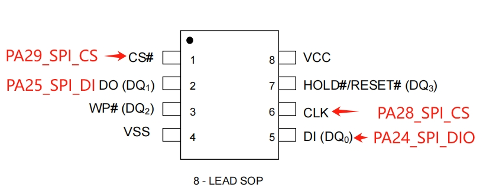
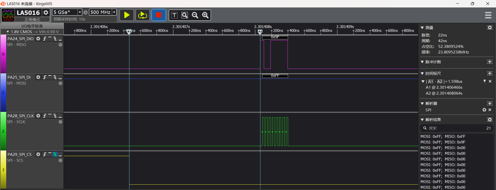

# SPI Example
Source code path: example/hal/spi
## Supported Platforms
The example can run on the following development boards.
* sf32lb52-lcd_n16r8
* sf32lb58-lcd_n16r64n4

## Overview
* Operating SPI HAL functions to demonstrate reading and writing NOR flash

## Example Usage
### Compilation and Programming
#### Using sf32lb52-lcd_n16r8 development board as example
* Switch to the example project directory and run the scons command to compile:
```
scons --board=sf32lb52-lcd_n16r8 -j8
```
Run `build_sf32lb52-lcd_n16r8_hcpu\uart_download.bat`, select the port as prompted to download:
```
> build_sf32lb52-lcd_n16r8_hcpu\uart_download.bat

     Uart Download

please input the serial port num:5
```
For detailed steps on compilation and downloading, please refer to the relevant introduction in [](/quickstart/get-started.md).
### Hardware Connection

```{eval-rst}
+-------------------+--------------+------------------+-------------------+----------------------+
| Development Board | Function Pin | Local Device Pin | Remote Device Pin | Physical Pin (CONN2) |
+===================+==============+==================+===================+======================+
| sf32lb52-lcd      | PA_24        | dio              | SPI_MOSI          | 19                   |
+                   +--------------+------------------+-------------------+----------------------+
|                   | PA_25        | di               | SPI_MISO          | 21                   |
+                   +--------------+------------------+-------------------+----------------------+
|                   | PA_28        | clk              | SPI_CLK           | 23                   |
+                   +--------------+------------------+-------------------+----------------------+
|                   | PA_29        | cs               | SPI_CS            | 24                   |
+-------------------+--------------+------------------+-------------------+----------------------+
| sf32lb58-lcd      | PA_21        | dio              | SPI_MOSI          | 8                    |
+                   +--------------+------------------+-------------------+----------------------+
|                   | PA_20        | di               | SPI_MISO          | 10                   |
+                   +--------------+------------------+-------------------+----------------------+
|                   | PA_28        | clk              | SPI_CLK           | 5                    |
+                   +--------------+------------------+-------------------+----------------------+
|                   | PA_29        | cs               | SPI_CS            | 3                    |
+-------------------+--------------+------------------+-------------------+----------------------+
```

      
sf32lb52-lcd_n16r8 hardware schematic reference as shown below:


#### Example Output Results Display:
* Log output:
```
    Serial:c2,Chip:4,Package:3,Rev:3  Reason:00000080
     \ | /
    - SiFli Corporation
     / | \     build on Oct 25 2024, 2.2.0 build 00000000
     2020 - 2022 Copyright by SiFli team
    mount /dev sucess
    [I/drv.rtc] PSCLR=0x80000100 DivAI=128 DivAF=0 B=256
    [I/drv.rtc] RTC use LXT RTC_CR=00000001
    [I/drv.rtc] Init RTC, wake = 0
    [I/drv.audprc] init 00 ADC_PATH_CFG0 0x606
    [I/drv.audprc] HAL_AUDPRC_Init res 0
    [I/drv.audcodec] HAL_AUDCODEC_Init res 0
    [32m[I/TOUCH] Regist touch screen driver, probe=1203be19 [0m
    call par CFG1(35bb)
    fc 9, xtal 2000, pll 2051
    call par CFG1(35bb)
    fc 9, xtal 2000, pll 2052
    Start spi demo!
    ret:0,spi read:0x85,0x20,0x18,0x85,0x20,0x18,0x85,0x20,0x18,0x85,0x20,0x18,0x85,0x20,0x18,0x85,
    spi demo end!
```
The following diagram shows the captured waveform of HAL_SPI_Transmit(&spi_Handle, (uint8_t *)cmd, 1, 1000); portion:


#### SPI1 Configuration Flow

* Using sf32lb52-lcd_n16r8 as example, set the corresponding SPI1 IO ports
```c
    /* 1, pinmux set to spi1 mode */
    HAL_PIN_Set(PAD_PA24, SPI1_DIO, PIN_PULLDOWN, 1);       // SPI1 (Nor flash)
    HAL_PIN_Set(PAD_PA25, SPI1_DI,  PIN_PULLUP, 1);
    HAL_PIN_Set(PAD_PA28, SPI1_CLK, PIN_NOPULL, 1);
    HAL_PIN_Set(PAD_PA29, SPI1_CS,  PIN_NOPULL, 1);
```
**Note**: 
1. CLK and CS are output ports, no need to configure pull-up/pull-down state
2. DIO and DI ports are input ports, need to configure pull-up/pull-down. If the peripheral has no special requirements, use these default values
3. The last parameter of HAL_PIN_Set is for hcpu/lcpu selection, 1: select hcpu, 0: select lcpu 
4. Hcpu's PA ports cannot be configured as Lcpu's SPI peripherals, such as SPI3, SPI4 output
* Enable the corresponding SPI1 clock source
```
    /* 2, open spi1 clock source  */
    HAL_RCC_EnableModule(RCC_MOD_SPI1);
```
* SPI1 initialization settings
```
    uint32_t baundRate = 20000000; /*SPI clock rate, unit: hz */

    spi_Handle.Instance = SPI1; /* SPI1 corresponds to hwp_spi1 register operation address in register.h */
/** SPI_DIRECTION_2LINES: SPI read and write use different IO ports;
*   SPI_DIRECTION_1LINE: SPI read and write both use DIO single IO port */
    spi_Handle.Init.Direction = SPI_DIRECTION_2LINES; 
    spi_Handle.Init.Mode = SPI_MODE_MASTER; /* SPI master mode */
    spi_Handle.Init.DataSize = SPI_DATASIZE_8BIT; /* Common 8bit, 16bit, 9bit modes */
    
#if   (SPI_MODE == 0)
    spi_Handle.Init.CLKPhase  = SPI_PHASE_1EDGE; /* Clock samples on first clock edge after CS is pulled low */
    spi_Handle.Init.CLKPolarity = SPI_POLARITY_LOW; /* Clock is low level when idle */
#elif (SPI_MODE == 1)
    spi_Handle.Init.CLKPhase = SPI_PHASE_2EDGE; /* Clock samples on second clock edge after CS is pulled low */
    spi_Handle.Init.CLKPolarity = SPI_POLARITY_LOW;
#elif (SPI_MODE == 2)
    spi_Handle.Init.CLKPhase = SPI_PHASE_1EDGE;
    spi_Handle.Init.CLKPolarity = SPI_POLARITY_HIGH; /* Clock is high level when idle */
#else //(SPI_MODE == 3)
    spi_Handle.Init.CLKPhase = SPI_PHASE_2EDGE;
    spi_Handle.Init.CLKPolarity = SPI_POLARITY_HIGH;
#endif

    spi_Handle.core = CORE_ID_HCPU; /* HCPU or LCPU core SPI */
...
/* Due to different CPUs and different core frequencies, the clock may be different. HAL code can refer to drv_spi.c driver layer sifli_spi_init initialization code, or refer to chip manual */
    spi_Handle.Init.BaudRatePrescaler = (SPI_APB_CLOCK + baundRate / 2) /baundRate;

```
SPI mode 0-3 corresponds to the diagram below, need to select according to peripheral specification
1. CLKPolarity (CPOL): Corresponds to clock level state when idle
2. CLKPhase (CPHA): Corresponds to which edge to sample after CS is pulled low

* SPI1 transmit and receive data
```
    // 3.1. spi tx rx
    /* Send single byte 0xff data */
    cmd[0] = 0xff;
    ret = HAL_SPI_Transmit(&spi_Handle, (uint8_t *)cmd, 1, 1000);
    /* Send 0x9f from DIO, then read 16 bytes from DI */
    cmd[0] = 0x9f;
     __HAL_SPI_TAKE_CS(&spi_Handle); /* For multi-byte operations, need to manually control CS pin, otherwise SPI will pull high CS pin when FIFO is empty */
    ret = HAL_SPI_TransmitReceive(&spi_Handle, (uint8_t *)&cmd, (uint8_t *)&read_data, 16, 1000);
    __HAL_SPI_RELEASE_CS(&spi_Handle); /* After sending a series, release CS pin, CS will change from low to high */
    HAL_Delay_us(5);
 /* Another way to demonstrate sending 0x9f then receiving 16 bytes, provides more flexibility */   
    __HAL_SPI_TAKE_CS(&spi_Handle);
    ret = HAL_SPI_Transmit(&spi_Handle, (uint8_t *)cmd, 1, 1000);
    ret = HAL_SPI_Receive(&spi_Handle, (uint8_t *)read_data, 16, 1000);
    __HAL_SPI_RELEASE_CS(&spi_Handle);
```
## Exception Diagnosis
* SPI1 has no waveform output or does not meet expectations
1. Refer to the configuration flow step by step to check if all configurations are successful
2. Each step can be confirmed through relevant registers to see if it takes effect
* SPI1 read data is all 0xFF or 0x00
1. Check if SPI1 transmission timing and commands match the peripheral user manual
2. Check if connection to peripheral is correct, if IO levels are consistent, if peripheral power supply is normal


## Reference Documents
* EH-SF32LB52X_Pin_config_V1.3.0_20231110.xlsx
* DS0052-SF32LB52x-芯片技术规格书 V0p3.pdf
* PY25Q128HA_datasheet_V1.1.pdf

## Update Log
|Version |Date   |Release Notes |
|:---|:---|:---|
|0.0.1 |10/2024 |Initial version |
| | | |