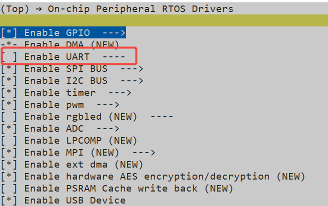
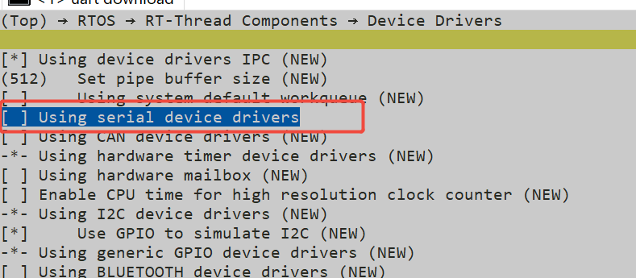
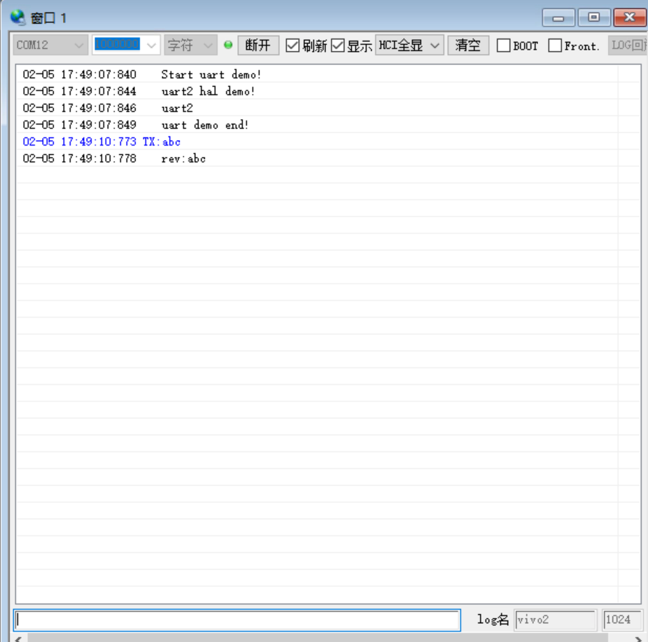

# UART Example
Source code path: example/hal/uart

## Supported Platforms
Examples can run on the following development boards:
* sf32lb52-lcd_n16r8
* sf32lb58-lcd_n16r64n4
* sf32lb56-lcd_n16r12n1

## Overview
* Operate UART hal functions using RX DMA method, operate UART2 to verify its serial port transmission and reception capabilities
* Note: After the development board resets, if uart2 prints logs consistent with the image below, it indicates success
* Note: If the computer-side serial port is closed, this serial port will not print logs

## Example Usage
### Compilation and Programming
For detailed steps on compilation and download, please refer to the relevant introduction in [](/quickstart/get-started.md).

Confirm that rtconfig.h cannot contain the following two macros, otherwise the rt-thread system driver will also initialize the RT system uart once, causing uart redefinition:
```c
#define CONFIG_BSP_USING_UART 1
#define CONFIG_RT_USING_SERIAL is set 1
```


Note: Directly modifying macros in rtconfig.h will still be ineffective. We need to enable it through the menuconfig command as follows. Enter the following command in the programming interface (board=board model):

````{note}
This example redirected printf to serial port transmission, but to avoid activating unnecessary semihosting code during Keil compilation, `proj.conf` is configured to use microlib:
```kconfig
CONFIG_USING_MICROLIB=y
```
````

```
menuconfig --board=sf32lb52-lcd_n16r8
```


The resource selection in the menu is for rt-thread system driver usage. Here we are using hal, so uncheck the resources you want to use to prevent redefinition (press D+Enter to save after checking or unchecking):



Switch to the example project directory and run the scons command to execute compilation: (board=board model)
```
scons --board=sf32lb52-lcd_n16r8 -j8
```

Run `build_sf32lb52-lcd_n16r8_hcpu\uart_download.bat`, select the port as prompted for download:

```
build_sf32lb52-lcd_n16r8_hcpu\uart_download.bat

Uart Download

please input the serial port num:5
```

### Hardware Connection
Physical position refers to the pin header position corresponding to the pins on the board
|Board Name  | UART       | TX(Physical Position)     | RX(Physical Position)   |    
|--------|------------|---------------|-------------------|
|525    | UART2     | PAD_PA27（8）    | PAD_PA20（10）    |   
|587  | UART2     | PAD_PA28 (CONN2 5)  |PAD_PA29 (CONN2 3)  |
|56  | UART2     | PAD_PA37 (38)   |PAD_PA36 (40)  |

* PA27 is software-configured as UART2's TX, connected to the computer's USB-to-serial RX
* PA20 is software-configured as UART2's RX, connected to the computer's USB-to-serial TX
* GND is connected to the USB-to-serial GND, as shown below:


#### Example Output Results Display:
* Log output:
  Log ends with uart2 sending:
  ```
  Start uart demo!
  uart2 hal demo!
  uart2
  uart demo end!
  ```
* Send `abc` to uart2, receive `abc` characters, newline character, carriage return character, total 5 character ASCII codes, print the following content:
    ```
    TX:abc
    rev:abc
    ```

#### Example Output Results Display:


The `rev: ` at the end of the log is the characters received from the computer's USB-to-serial TX:
```
Start uart demo!
uart2 hal demo!
uart2
uart demo end!
TX:abc
rev:abc
```

#### UART2 Configuration Process
* Note that different board types may have different corresponding DMAC1_CHX_IRQHandler
* Configure corresponding Uart2 and RX DMA interrupts, refer to the definitions within the `BSP_USING_UART2` macro and `UART2_RX_DMA_INSTANCE` macro in `dma_config.h` and `uart_config.h`:

```c
#if defined(BSP_USING_BOARD_EM_LB525XXX)
#define UART2_DMA_RX_IRQHandler          DMAC1_CH6_IRQHandler
#elif defined (BSP_USING_BOARD_EM_LB587XXX)
#define UART2_DMA_RX_IRQHandler          DMAC1_CH5_IRQHandler
#endif

#define UART2_RX_DMA_RCC                 0
#define UART2_RX_DMA_INSTANCE            DMA1_Channel6
#define UART2_RX_DMA_REQUEST             DMA_REQUEST_7
#define UART2_RX_DMA_IRQ                 DMAC1_CH6_IRQn

#define UART_INSTANCE           hwp_usart2
#define UART_INTERRUPT          USART2_IRQn
#define UART_IRQ_HANDLER        USART2_IRQHandler
#define UART_RX_DMA_INSTANCE    UART2_RX_DMA_INSTANCE
#define UART_RX_DMA_REQUEST     UART2_RX_DMA_REQUEST
#define UART_RX_DMA_IRQ         UART2_RX_DMA_IRQ
#define UART_RX_DMA_IRQ_HANDLER UART2_DMA_RX_IRQHandler
```

* Set corresponding IO ports for Uart2:
```c
#if defined(BSP_USING_BOARD_EM_LB525XXX)
HAL_PIN_Set(PAD_PA20, USART2_RXD, PIN_PULLUP, 1);
HAL_PIN_Set(PAD_PA27, USART2_TXD, PIN_PULLUP, 1);

#elif defined (BSP_USING_BOARD_EM_LB587XXX)
HAL_PIN_Set(PAD_PA29, USART2_RXD, PIN_PULLUP, 1);
HAL_PIN_Set(PAD_PA28, USART2_TXD, PIN_PULLUP, 1);

#elif defined (BSP_USING_BOARD_SF32LB56_LCD_N16R12N1)
    HAL_PIN_Set(PAD_PA36, USART2_RXD, PIN_PULLUP, 1);
    HAL_PIN_Set(PAD_PA37, USART2_TXD, PIN_PULLUP, 1);
#endif
```

**Note**: 
1. Except for 55x chips, can be configured to any IO with PA*_I2C_UART function to output UART2 waveform (to query pin multiplexing table, search for corresponding board type pin multiplexing in project path files such as: bf0_pin_const.c)
2. The last parameter of HAL_PIN_Set is for hcpu/lcpu selection, 1: select hcpu, 0: select lcpu
3. Hcpu's PA port cannot be configured as Lcpu's uart peripheral, such as uart5, uart6 output

* Enable corresponding uart2 clock source:
```c
    /* 2, open uart2 clock source  */
    HAL_RCC_EnableModule(RCC_MOD_USART2);
```

* UART2 baud rate setting, example baud rate is 1000000:
```c
    UartHandle.Init.BaudRate   = 1000000;
```

* UART2 DMA configuration:
```c
// Start RX DMA
__HAL_LINKDMA(&(UartHandle), hdmarx, dma_rx_handle);
dma_rx_handle.Instance = UART_RX_DMA_INSTANCE;
dma_rx_handle.Init.Request = UART_RX_DMA_REQUEST;
 /**
 buffer: Configure as memory address for DMA reception;
 BUFFER_SIZE: DMA buffer length;
 DMA_PERIPH_TO_MEMORY: Indicates DMA transfers from UART peripheral to configured memory buffer;
 */   
HAL_UART_DmaTransmit(&UartHandle, buffer, BUFFER_SIZE, DMA_PERIPH_TO_MEMORY); /* DMA_PERIPH_TO_MEMORY */

/* Set DMA priority and enable DMA interrupt */
HAL_NVIC_SetPriority(UART_RX_DMA_IRQ, 0, 0);
HAL_NVIC_EnableIRQ(UART_RX_DMA_IRQ);

{
// For RX DMA, also need to enable UART IRQ.
/* UART_IT_IDLE: Configure as uart2 idle interrupt, i.e., uart interrupt is generated only after receiving a string of data */
    __HAL_UART_ENABLE_IT(&UartHandle, UART_IT_IDLE);
    HAL_NVIC_SetPriority(UART_INTERRUPT, 1, 0);/*Configure uart2 interrupt priority*/
    HAL_NVIC_EnableIRQ(UART_INTERRUPT);/* Enable uart2 interrupt */
}
```

* Use state to represent current DMA reception progress:
```c
typedef enum {
    STATE_UNFULL,
    STATE_HALF_FULL,
    STATE_FULL
} ReceiveState;
// Current reception state
ReceiveState currentState = STATE_UNFULL;
```

* Half-full, full, uart idle processing:
```c
In the void UART_IRQ_HANDLER(void) function, after uart idle, judge the current reception state to execute half-full or full or idle processing

switch (currentState) 
{
    case STATE_UNFULL:
        processData(buffer, last_index, recv_total_index);
        last_index2 = recv_total_index;//Update the index of this stay timely when entering full from idle state
        break;
    case STATE_HALF_FULL:
        if(last_index==0)
        {
            last_index2 = recv_total_index;
        }
        else if(count == HALF_BUFFER_SIZE)//If half-full just ends and then enters full, start printing from the middle
        {
            last_index2 = HALF_BUFFER_SIZE; 
        }
        else//If entering full after exceeding half-full, use the previous index for printing
        {
            last_index2 = last_index; 
        }
        processData(buffer, HALF_BUFFER_SIZE, recv_total_index);
        break;
    case STATE_FULL:
        processData(buffer, 0, recv_total_index);
        break;
}

//Half-full operation
void HAL_UART_RxHalfCpltCallback(UART_HandleTypeDef *huart)
{

    if(huart->Instance == hwp_usart2)
    {
        // Implement half-full processing logic, such as writing the first half data to FIFO or preliminary processing
        if(currentState==STATE_UNFULL)
        {
            uint16_t halfLength = HALF_BUFFER_SIZE;
            processData(buffer, last_index, halfLength);//Half-full processes from previous index to middle part
        }
        else if(currentState==STATE_FULL)
        {
            uint16_t halfLength = HALF_BUFFER_SIZE;
            processData(buffer, 0, halfLength);//Half-full processes from previous index to middle part
        }     
        currentState = STATE_HALF_FULL;
        last_index2 = HALF_BUFFER_SIZE;
        __HAL_DMA_CLEAR_FLAG(&dma_rx_handle,DMA_FLAG_HT6);
    }

}

//Full
void HAL_UART_RxCpltCallback(UART_HandleTypeDef *huart)
{
    
   if(huart->Instance == hwp_usart2)
    {       
        
        // Implement full processing logic, such as writing middle to last data to FIFO or preliminary processing
        uint16_t fullLength = BUFFER_SIZE;

        processData(buffer, last_index2, fullLength);
        currentState = STATE_FULL;
        __HAL_DMA_CLEAR_FLAG(&dma_rx_handle,DMA_FLAG_TC6);
    } 
}
```

* UART2 send data:
```c
    /* Send data from uart2 through printf */
    printf("uart2 hal demo!\n");
     /* Send data from uart2 through HAL_UART_Transmit interface */
    uint8_t ptr[] = {'u','a','r','t','2','\n'};
    int len = 6 ;
    HAL_UART_Transmit(&UartHandle, ptr, len, 0xFFFF);
```

## Exception Diagnosis
* UART2 no waveform output:
1. Check step by step according to the configuration process to see if all configurations are successful
2. Check hardware connections, including whether uart2 output level matches computer uart level
3. Whether there is redefinition in menuconfig

## Reference Documents
* EH-SF32LB52X_Pin_config_V1.3.0_20231110.xlsx
* DS0052-SF32LB52x-芯片技术规格书 V0p3.pdf
* DS0058-SF32LB58x-芯片技术规格书 V1p8.pdf

## Update History
|Version |Date   |Release Notes |
|:---|:---|:---|
|0.0.1 |10/2024 |Initial version |
|0.0.2 |12/2024 |2.0  |
| | | |