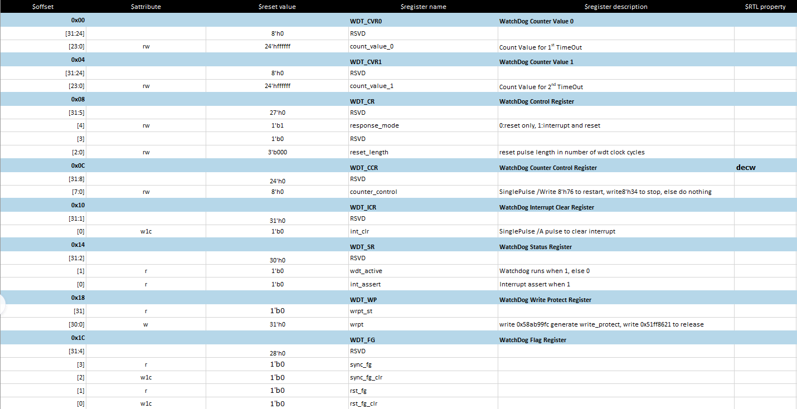

# WDT1 Example

Source code path: example/hal/wdt/wdt1

## Supported Platforms
<!-- Which boards and chip platforms are supported -->
+ sf32lb52-lcd_n16r8
+ sf32lb58-lcd_n16r64n4

## Overview
<!-- Example introduction -->
This example demonstrates WDT1 usage, including:
+ WDT1 configuration and enabling.
+ WDT1 feeding.
+ WDT1 timeout response.

## Example Usage
<!-- Explain how to use the example, such as connecting which hardware pins to observe waveforms, compilation and programming can reference related documents.
For rt_device examples, also need to list the configuration switches used by this example, such as PWM example using PWM1, need to enable PWM1 in onchip menu -->

### Hardware Requirements
Before running this example, prepare a development board supported by this example

### menuconfig Configuration


### Compilation and Programming
Switch to the example project directory and run the scons command to execute compilation:
```
scons --board=sf32lb52-lcd_n16r8 -j32
```

Run `build_sf32lb52-lcd_n16r8_hcpu\uart_download.bat`, select the port as prompted for download:
```
$ ./uart_download.bat

     Uart Download

please input the serial port num:5
```
For detailed steps on compilation and download, please refer to the relevant introduction in [](/quickstart/get-started.md).

## Expected Results of Example
<!-- Explain example running results, such as which LEDs will light up, which logs will be printed, to help users judge whether the example is running normally, running results can be explained step by step combined with code -->
After the example starts, the serial port outputs as follows:
1. WDT1 initialization configuration and enabling successful:
```c
10-28 21:27:41:364    WDT Example:
10-28 21:27:41:366    WDT init OK. Timeout: 10(s) Reload2: 60(s)
10-28 21:27:41:368    WDT_CVR0:0x50000 WDT_CVR1:0x1E0000
```
```{tip}
In this example, WDT1 working mode (`respond mode`) is configured as `interrupt and reset`, counting two rounds, with first round counting timeout of 10 seconds and second round counting timeout of 60 seconds.  
```
2. Feeding the dog (every 5 seconds):
```c
10-28 21:27:46:419    Watchdog feeding.
10-28 21:27:51:332    Watchdog feeding.
10-28 21:27:56:328    Watchdog feeding.
10-28 21:28:01:339    Watchdog feeding.
10-28 21:28:06:329    Watchdog feeding.
10-28 21:28:11:360    Watchdog feeding.
10-28 21:28:16:356    Watchdog feeding.
10-28 21:28:21:368    Watchdog feeding.
10-28 21:28:26:361    Watchdog feeding.
10-28 21:28:31:373    Watchdog feeding.
```
3. After stopping feeding the dog, the first round of counting ends (10s), generating an interrupt:
```c
10-28 21:28:31:373    Watchdog feeding.
10-28 21:28:43:793    WDT timeout. Interrupt triggered.
```
4. The second round of counting ends (60s), resetting the system:
```c
10-28 21:29:58:197    SFBL
10-28 21:29:59:394    Serial:c2,Chip:4,Package:3,Rev:2  Reason:00000002

10-28 21:29:59:398    NAND ID 0x7070cd
10-28 21:29:59:402    det bbm table with 1, 1, 2
```


## Exception Diagnosis

1. Confirm WDT configuration status (enable status, count configuration, working mode) through WDT registers:


2. After WDT is configured correctly, WDT timeout cannot reset the system:  
Need to confirm whether `reboot cause` is correctly configured, `HAL_PMU_SetWdt()` can be used to add the corresponding WDT's `reboot cause`:
    ```c
    /* Add reboot cause for watchdog. */
    HAL_PMU_SetWdt((uint32_t)hwdt.Instance);
    ```

## Reference Documents
<!-- For rt_device examples, RT-Thread official website documentation provides detailed explanations, web links can be added here, for example, refer to RT-Thread's [RTC documentation](https://www.rt-thread.org/document/site/#/rt-thread-version/rt-thread-standard/programming-manual/device/rtc/rtc) -->

## Update History
|Version |Date   |Release Notes |
|:---|:---|:---|
|0.0.1 |10/2024 |Initial version |
| | | |
| | | |