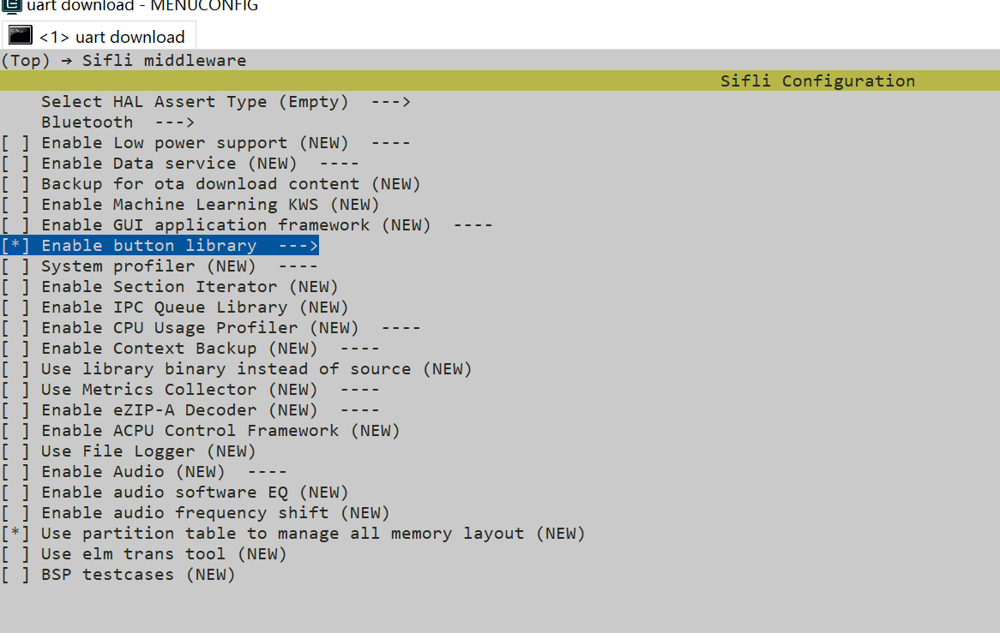
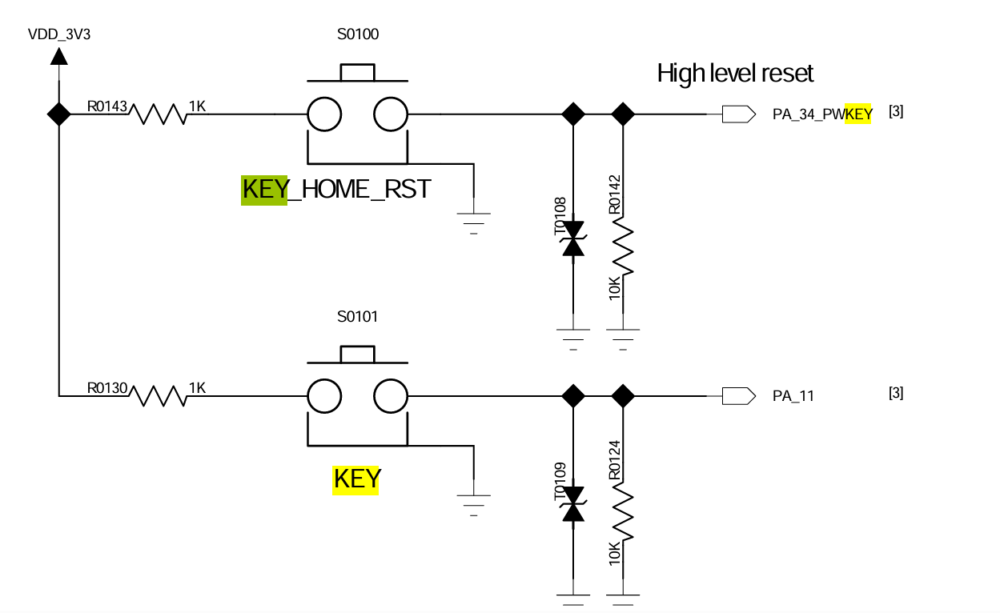
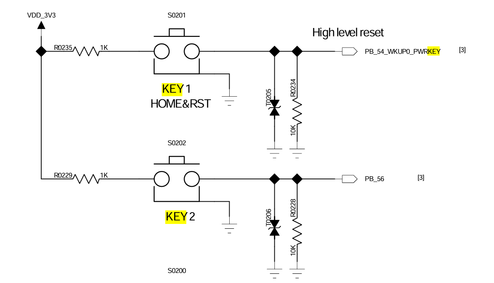
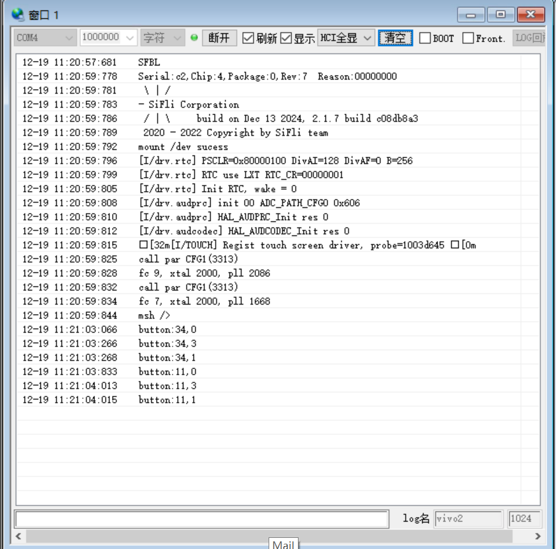

# Button
Source code path: example/misc/button

## Supported Platforms
* sf32lb52-lcd_n16r8
* sf32lb58-lcd_n16r64n4

## Overview
The button library uses pin devices to detect various button actions. It uses one timer to handle debouncing, and another timer to detect long press actions.

It supports the following operations:
- Press: Button is pressed
- Release: Button is released
- Long Press: Button is pressed and held for the time specified by `BUTTON_ADV_ACTION_CHECK_DELAY`
- Click: Button is pressed and released without triggering a long press action in between

Users can register handlers for each button to be notified when any action occurs. Button active state is configurable.

## Example Usage
### Compilation and Programming

Switch to the example project directory and run the scons command to execute compilation (board=board type):
```
scons --board=sf32lb52-lcd_n16r8 -j8
```

Run `build_sf32lb52-lcd_n16r8_hcpu\uart_download.bat`, select the port as prompted for download:

```
build_sf32lb52-lcd_n16r8_hcpu\uart_download.bat

Uart Download

please input the serial port num:5
```

Confirm that rtconfig.h contains the following two macros.
The maximum number of supported buttons and long press action detection threshold are configured by the following macros:
```c
#define BUTTON_MAX_NUM 2
#define BUTTON_ADV_ACTION_CHECK_DELAY 3000
```
They can be configured under `SiFli Middleware->Enable button library`. You can enter by typing `menuconfig` in the compilation interface:


## Using the Button Library
In the following example, it first initializes the button, i.e., binds the button with the pin device and registers button action handlers. Then enables button detection, i.e., enables pin IRQ.

### Hardware Connection
* Note: 587 pins are divided into groups A and B, group B pin numbers need to add 96

54+96->150\
56+96->152\

button52

button587


#### Button Configuration Process
```c
static void button_event_handler(int32_t pin, button_action_t action)
{
    printf("button:%d,%d\n", pin, action);
}


button_cfg_t cfg;

#if defined(BSP_USING_BOARD_EM_LB525XXX)
    cfg.pin = 34;
#elif defined (BSP_USING_BOARD_EM_LB587XXX)
    cfg.pin = 152;
#endif
    cfg.active_state = BUTTON_ACTIVE_HIGH;
    cfg.mode = PIN_MODE_INPUT;
    cfg.button_handler = button_event_handler;
    int32_t id = button_init(&cfg);
    RT_ASSERT(id >= 0);
    RT_ASSERT(SF_EOK == button_enable(id));


#if defined(BSP_USING_BOARD_EM_LB525XXX)
    cfg.pin = 11;
#elif defined (BSP_USING_BOARD_EM_LB587XXX)
    cfg.pin = 150;
#endif
    cfg.active_state = BUTTON_ACTIVE_HIGH;
    cfg.mode = PIN_MODE_INPUT;
    cfg.button_handler = button_event_handler;
    id = button_init(&cfg);
    RT_ASSERT(id >= 0);
    RT_ASSERT(SF_EOK == button_enable(id));
```

#### Button Pin Parameter Modification

```c
#if defined(BSP_USING_BOARD_EM_LB525XXX)
    HAL_PIN_Set(PAD_PA34, GPIO_A34, PIN_PULLDOWN, 1);
    HAL_PIN_Set(PAD_PA11, GPIO_A11, PIN_PULLDOWN, 1);
#elif defined (BSP_USING_BOARD_EM_LB587XXX)
    HAL_PIN_Set(PAD_PB56, GPIO_B56, PIN_PULLDOWN, 1);
    HAL_PIN_Set(PAD_PB54, GPIO_B54, PIN_PULLDOWN, 1);
#endif
```

#### Example Output Results Display:

* Log output:

```c
button:34,0
button:34,3
button:34,1
button:11,0
button:11,3
button:11,1
```

* Meaning of actions represented by states 0,1,2,3:
```c
    action:
    BUTTON_PRESSED  = 0,    Indicates that a button is pressed
    BUTTON_RELEASED = 1,    Indicates that a button is released
    BUTTON_LONG_PRESSED = 2, Indicates that a button is long released
    BUTTON_CLICKED  = 3,     Indicates that a button is clicked
```

**Note**: 
1. Interrupt handling functions can be viewed in startup_bf0_hcpu.S
2. The last parameter of HAL_PIN_Set is for hcpu/lcpu selection, 1: select hcpu, 0: select lcpu

## Exception Diagnosis
If button press does not produce expected print results, troubleshooting can be performed from the following aspects:
* Whether hardware connections are normal
* Whether pin configuration (especially pin mode configuration) is correct

## Update History
|Version |Date   |Release Notes |
|:---|:---|:---|
|0.0.1 |10/2024 |Initial version |
|0.0.2 |12/2024 |2.0 |