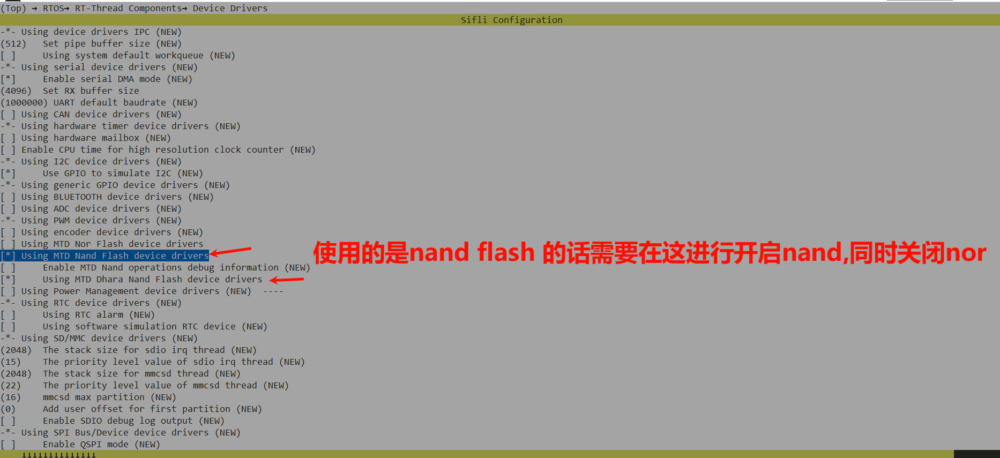
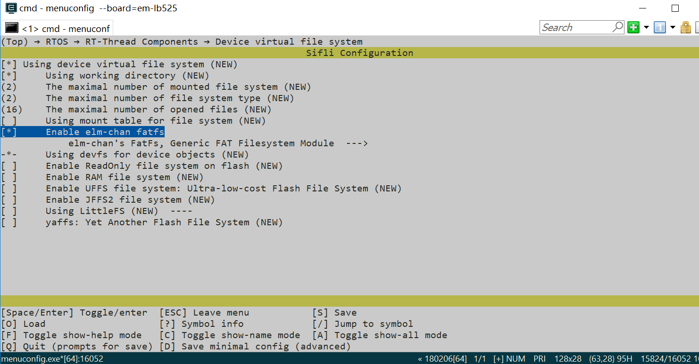
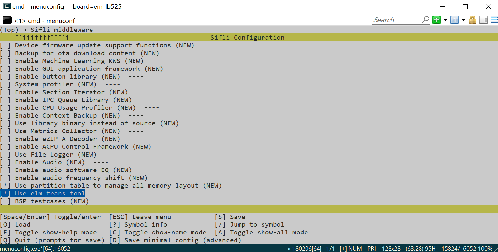
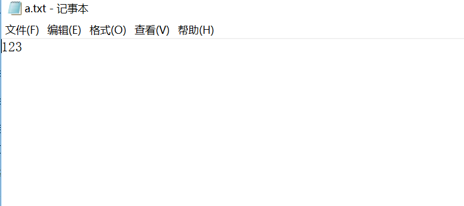

# ELM_RW Example
## Overview
This example demonstrates file data read/write operations using ELM, paired with FsrwTool for visual file transfer.

## Supported Development Boards
The example can run on the following development boards.<br>
* sf32lb52-lcd_n16r8
* sf32lb58-lcd_n16r64n4
* 56_devkit_lcd
* em-lb586_nand

**Note:** Generally, examples run on the chip's HCPU. "eh-lb563_v2" is equivalent to "eh-lb563_v2_hcpu". If you want to run the example on LCPU, you can use "eh-lb563_v2_lcpu". Currently, USB functionality is temporarily only supported on HCPU.

## Example Directory Structure
The ELM_RW project contains 1 .c file (main.c). The tree structure below shows other files in the project directory.
```c
|--README.md
|--src
|    |--main.c
|    |--Sconscript
|--project  
        |--Kconfig
        |--Kconfig.proj
        |--proj.conf
        |--rtconfig.py
        |--SConscript
        |--SConstruct
```
## Using the Example
### Hardware Requirements
1. The prerequisite for running the example is having a development board that supports this example.
2. A USB data cable capable of data transmission.

### menuconfig Configuration
```c
//Command execution
 menuconfig --board=sf32lb52-lcd_n16r8
```
#### menuconfig Configuration 1
Controls whether to compile and enable support for NOR Flash devices.


Support for NAND flash devices corresponding to the board

#### menuconfig Configuration 2
Enable Device File System (DFS) and ELM FAT file system support. DFS is an abstraction layer in the RT-Thread operating system used to uniformly manage different types of file systems.

#### menuconfig Configuration 3
Enable ELM module read/write functionality.


### Compilation and Programming
Following these steps, you can complete compilation and programming.

> scons --board=sf32lb52-lcd_n16r8 

> .\build_sf32lb52-lcd_n16r8\uart_download.bat

## Example Output Results Display
The results below show the logs after the example runs on the development board.
System startup

 > mount /dev sucess\
 > mount fs on flash to root success\
 > Use help to check elm_rw file system command!\
 > msh />


## FsrwTool Interactive Usage
* The tool is located in the tools\FsrwTool directory


### File Import:
We drag the files we want to import into the list box, click file import, and pay attention to serial port connection and baud rate configuration


### View Information of Imported Files:
Use the `ls` command to view file information. The a.txt in the example has no content so it shows 0 characters. Use the `echo "123" a.txt` command to add file content, where the content in quotes is what you want to add to the file


### File Export:
* FsrwTool file export does not move files from the development board but copies them out (the board will still retain the previously imported files)
* You can see that after adding content, the opened a.txt file content has changed

### File Deletion:
* Enter `rm file` to delete files imported to the development board


### FsrwTool-log
* File import log


* File content addition and export log


 ## Troubleshooting
If the expected logs do not appear, troubleshooting can be performed from the following aspects:
* Whether hardware connections are normal
* Whether menuconfig configuration is set
* Whether the development board flash is normal
* Whether imported/exported files are empty or duplicated