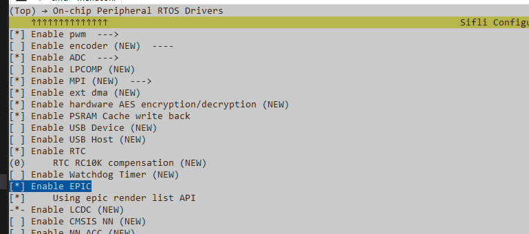

# AGIF+LVGL(V9) Animation Example

Source Code Path: example/multimedia/agif/lvgl_v9

## Supported Platforms
<!-- Which boards and chip platforms are supported -->
+ eh-lb525

## Overview
<!-- Brief introduction of the example -->
This example contains two watch faces with GIF animations, demonstrating animation implementation based on agif + lvgl(V9), including:
+ .gif conversion to .c using eZIP.exe:
    - Placement location: `src/resource/images/common/gif/`
    - Resource processing: `src/resource/images/SConscript` will compile .gif files in the above path. The generated .c files can be found in `project/build_xxx/src/resource/images/common/gif` path.
    ```{tip}
    Resources can also be processed manually using `/tools/png2ezip/eZIP.exe`. Run eZIP.exe to view help for command format.
    ```
+ gif display
    - `src/gui_apps/clock/app_clock_agif.c`:
        * Resource declaration:
        ```c
        /* Image decalration */
        LV_IMG_DECLARE(agif_icon);
        ```
        * gif widget creation and configuration:
        ```c
        /* Create agif. */
        lv_color_t bg_color;
        p_clk_agif->gif = lv_gif_dec_create(parent, LV_EXT_IMG_GET(agif_icon), &bg_color, LV_COLOR_DEPTH);
        RT_ASSERT(p_clk_agif->gif);
        lv_obj_align(p_clk_agif->gif, LV_ALIGN_CENTER, 0, 0);

        /* loop is enabled by default. */
        lv_gif_dec_loop(p_clk_agif->gif, 1, 16);
        /* This callback function is executed at the end of GIF playback. */
        lv_gif_dec_end_cb_register(p_clk_agif->gif, agif_loop_end_func);
        ```
        * gif refresh pause and resume:
        ```c
        static rt_int32_t resume_callback(void)
        {
            /* Resume gif animation refresh */
            lv_gif_dec_task_resume(p_clk_agif->gif);
            return RT_EOK;
        }

        static rt_int32_t pause_callback(void)
        {
            /* Pause gif animation refresh */
            lv_gif_dec_task_pause(p_clk_agif->gif, 0);
            return RT_EOK;
        }
        ```
        * gif destruction
        ```c
        /* Release gif context. */
        lv_gif_dec_destroy(p_clk_agif->gif);
        p_clk_agif->gif = NULL;
        ```
    - `src/gui_apps/clock/app_clock_agif_2.c`:  
        `lv_gif_dec_create` automatically creates an lv timer for periodic GIF refreshing. This example demonstrates pausing (`lv_gif_dec_task_pause`) the automatically created lv timer and creating an external lv timer for refreshing. The refresh code is as follows:
        ```c
        static void agif_refresh_timer_cb(struct _lv_timer_t * t)
        {
            /* Next frame. */
            int ret = lv_gif_dec_next_frame(p_clk_agif->gif);

            /* if ret == 0, it means that reach the last frame. */
            if (0 == ret)
            {
                /* Playback complete. */
                agif_loop_end_func();
                /* Replay it. */
                lv_gif_dec_restart(p_clk_agif->gif);
            }
        }
        ```


## Example Usage
<!-- Instructions on how to use the example, such as connecting hardware pins to observe waveforms. Compilation and flashing can reference related documents.
For rt_device examples, also list the configuration switches used in this example, such as PWM examples using PWM1, which need to enable PWM1 in the onchip menu -->

### Hardware Requirements
Running this example requires:
+ A development board supported by this example ([Supported Platforms](quick_start)).


### menuconfig Configuration

1. Enable LVGL:  

2. Enable EPIC/EZIP:  


3. Configure the LCD driver according to the LCD used.  

### Compilation and Flashing
Switch to the example project directory and run the scons command to compile:
```c
> scons --board=eh-lb525 -j32
```
Switch to the example `project/build_xx` directory and run `uart_download.bat`, then select the port as prompted to download:
```c
$ ./uart_download.bat

     Uart Download

please input the serial port num:5
```
For detailed compilation and download steps, please refer to the relevant introduction in [Quick Start](quick_start).

## Expected Results
<!-- Explain the expected results of the example, such as which LEDs will light up and which logs will be printed, to help users judge whether the example is running normally. The running results can be explained step by step in combination with the code -->
After the example starts:
+ Defaults to the `agif` watch face, with `agif_icon.gif` refreshing and displaying in a loop.
+ Swipe left and right to switch between `aigf` and `agif02` watch faces.
+ `agif.h` also provides some other control APIs that can be modified in the example to see the effects.

## Troubleshooting

+ Compilation error, gif resource not found: As described in [Overview](#overview), confirm whether the .c file of the gif is generated normally.

## Reference Documents
<!-- For rt_device examples, the rt-thread official documentation provides more detailed explanations, and web links can be added here, for example, refer to RT-Thread's [RTC documentation](https://www.rt-thread.org/document/site/#/rt-thread-version/rt-thread-standard/programming-manual/device/rtc/rtc) -->

## Update History
| Version | Date   | Release Notes |
|:---|:---|:---|
| 0.0.1 | 05/2025 | Initial version |
| | | |
| | | |