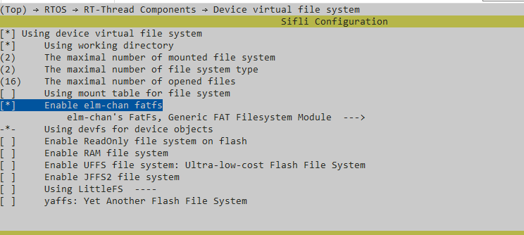

# Local Music Example

Source code path: example/multimedia/audio/local_music

## Supported Platforms
<!-- Which boards and chip platforms are supported -->
+ sf32lb52-lcd_n16r8
+ eh-lb525

## Overview
<!-- Example introduction -->
This example demonstrates local music playback, including:
+ Preset a wav audio file in the root partition.
+ Play the preset wav file.

## Example Usage
<!-- Explain how to use the example, such as connecting which hardware pins to observe waveforms, compilation and programming can reference related documents.
For rt_device examples, also need to list the configuration switches used by this example, such as PWM example using PWM1, need to enable PWM1 in onchip menu -->

### Hardware Requirements
Before running this example, prepare:
+ A development board supported by this example ([Supported Platforms](quick_start)).
+ Speaker.

### menuconfig Configuration

1. This example needs to read and write files, so it needs to use a file system. Configure the `FAT` file system:


     ```{tip}
     Mount root partition in mnt_init.
     ```
2. Enable AUDIO CODEC and AUDIO PROC:

3. Enable AUDIO(`AUDIO`):

4. Enable AUDIO MANAGER.(`AUDIO_USING_MANAGER`)

5. (`AUDIO_LOCAL_MUSIC`)

6. Preset audio files (also supports MP3), place them in the \disk\ directory below for preset download:  
* Audio files are under multimedia/audio/local_music/disk

### Compilation and Programming
Switch to the example project directory and run the scons command to execute compilation:
```c
> scons --board=eh-lb525 -j32
```
Switch to the example `project/build_xx` directory and run `uart_download.bat`, select the port as prompted for download:
```c
$ ./uart_download.bat

     Uart Download

please input the serial port num:5
```
For detailed steps on compilation and download, please refer to the relevant introduction in [Quick Start](quick_start).

## Expected Results of Example
<!-- Explain example running results, such as which LEDs will light up, which logs will be printed, to help users judge whether the example is running normally, running results can be explained step by step combined with code -->
After the example starts:
Play the preset 16k.wav audio file once. Expected to complete normal playback.

```{tip}
If you need to play MP3 files, you can preset an MP3 file (note whether the audio file size exceeds the file system capacity) and configure the playback path:
```c
#define MUSIC_FILE_PATH "/Cloudy_Day.mp3"
```
```

## Exception Diagnosis


## Reference Documents
<!-- For rt_device examples, RT-Thread official website documentation provides detailed explanations, web links can be added here, for example, refer to RT-Thread's [RTC documentation](https://www.rt-thread.org/document/site/#/rt-thread-version/rt-thread-standard/programming-manual/device/rtc/rtc) -->

## Update History
|Version |Date   |Release Notes |
|:---|:---|:---|
|0.0.1 |10/2024 |Initial version |
| | | |
| | | |