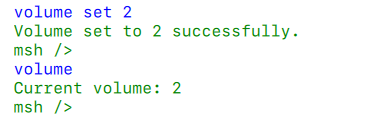

# MP3 Local Music Player

Source code path: example/multimedia/audio/mp3_sd_player

## Supported Platforms
<!-- Which boards and chip platforms are supported -->
+ sf32lb52-lchspi-ulp

## Overview
<!-- Example introduction -->
This example will demonstrate playing MP3 or wav audio files in the `music` directory on the SD card, and provides a shell interface for modifying playback volume.

## Example Usage
<!-- Explain how to use the example, such as connecting which hardware pins to observe waveforms, compilation and programming can reference related documents.
For rt_device examples, also need to list the configuration switches used by this example, such as PWM example using PWM1, need to enable PWM1 in onchip menu -->

### Hardware Requirements
Before running this example, prepare:
+ A development board supported by this example ([Supported Platforms](quick_start)).
+ Speaker.

```{warning}
Note that on the `sf32lb52-lchspi-ulp` platform, an external battery is required, otherwise long button presses cannot be detected.
```

### menuconfig Configuration

1. This example needs to read and write files, so it needs to use a file system. Configure the `FAT` file system:

1. This example uses SPI1 as the SD card interface, so SPI1 needs to be enabled:

1. The SD card in this example is driven using SPI, so the `MSD` driver needs to be enabled:

1. Enable AUDIO CODEC and AUDIO PROC:

1. Enable AUDIO(`AUDIO`):

1. Enable AUDIO MANAGER.(`AUDIO_USING_MANAGER`)

1. (`AUDIO_LOCAL_MUSIC`)


### Compilation and Programming

Switch to the example project directory and run the scons command to execute compilation:

```bash
scons --board=sf32lb52-lchspi-ulp -j32
```

Switch to the example `project/build_xx` directory and run `uart_download.bat`, select the port as prompted for download:

```bash
$ ./uart_download.bat

     Uart Download

please input the serial port num:5
```

For detailed steps on compilation and download, please refer to [Quick Start](quick_start).

## Expected Results of Example
<!-- Explain example running results, such as which LEDs will light up, which logs will be printed, to help users judge whether the example is running normally, running results can be explained step by step combined with code -->
After the example runs, it will play MP3 or wav files in the `music` directory on the SD card. After power-on, it is in stop playback state by default. When the music in the list finishes playing, it will automatically loop from the first song.

For the `sf32lb52-lchspi-ulp` platform, long press the `KEY1` button to start playback. Long pressing `KEY1` during playback will stop playback, and the next start will begin from the first song. Short press `KEY1` button to pause/resume playback, short press `KEY2` button to switch to the next music.

The example also provides a shell interface. You can use the `volume` command to get or set the volume. Enter the `volume` command to view the current volume, enter `volume set <value>` to set the volume, where `<value>` ranges from 0-15.



## Exception Diagnosis

## Reference Documents
<!-- For rt_device examples, RT-Thread official website documentation provides detailed explanations, web links can be added here, for example, refer to RT-Thread's [RTC documentation](https://www.rt-thread.org/document/site/#/rt-thread-version/rt-thread-standard/programming-manual/device/rtc/rtc) -->

## Update History
|Version |Date   |Release Notes |
|:---|:---|:---|
|0.0.1 |6/2025 |Initial version |
| | | |