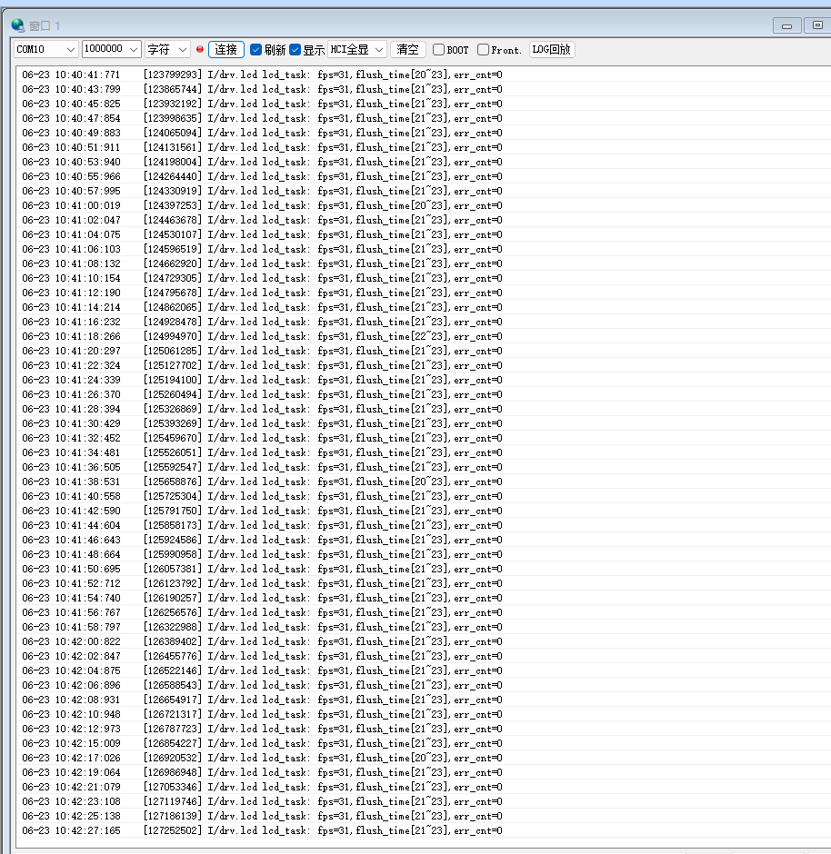
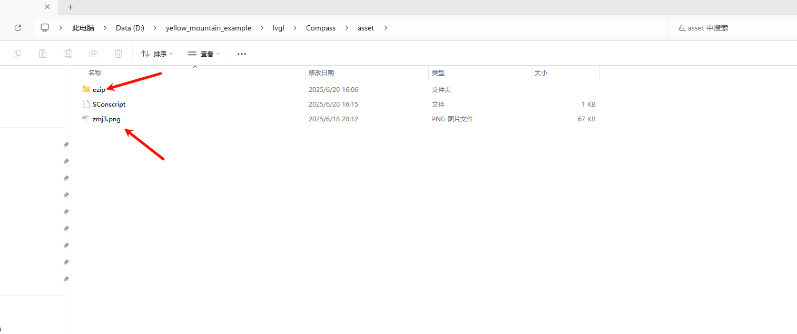

# Electronic Compass Example
Made using LVGL v8 (v9 version will be available later), displays a circular compass dial, pointer that rotates with orientation, and shows current direction and angle

## Supported Platforms
+ sf32lb52-lchspi-ulp

## Introduction to Electronic Compass

* Uses 3-axis magnetic values obtained from MMC56x3 sensor, reads data through I2C interface, converts the data to angles using the atan2f function in the math library, sets each obtained angle as the pointer's deflection angle to control pointer rotation.
* This example uses APIs in LVGL V8 to complete interface layout and application.

## Example Usage

### Hardware Requirements
Before running this example, prepare:
+ A development board required for this example
+ A USB data cable capable of communication

### Hardware Configuration

* The sensor communicates with the development board through I2C protocol, with specific connection pins being PA40 (SCL clock line) and PA39 (SDA data line)
* Configure IO pins to I2C mode using HAL_PIN_Set() function, set to pull-up mode, the last parameter is for hcpu/lcpu selection, 1: select hcpu, 0: select lcpu
```c
static void board_io_init(void)
{
    HAL_PIN_Set(PAD_PA40, I2C2_SCL, PIN_PULLUP, 1);
    HAL_PIN_Set(PAD_PA39, I2C2_SDA, PIN_PULLUP, 1);
}
```

### menuconfig Configuration Process
* Enable MMC5603 sensor and I2C2 in menuconfig
* These configurations are already enabled by default, users don't need to enable them manually
```
scons --board=<name> --menuconfig
```

  

### Compilation and Programming
Switch to the example project directory and run the scons command to execute compilation:
```
scons --board=sf32lb52-lchspi-ulp -j8
```
Execute programming command:
```
build_sf32lb52-lchspi-ulp_hcpu\uart_download.bat
```
Select the port as prompted for download:
```none
please input the serial port num:10
```

## Expected Results
* Capable of simulating phone compass functionality, indicating direction and angle
* Input: lcd_ctrl fps to view frame rate
* Specific demonstration video reference link: [Compass Demo Video](https://www.bilibili.com/video/BV1BxKmzaEVc/?spm_id_from=333.337.search-card.all.click&vd_source=00a26cb15a9627841023f7adb1c7c7f4)
 
 

## Exception Diagnosis
If the demonstration video effect is not achieved, troubleshooting can be performed from the following aspects:
* Check if there are magnets or devices that can affect the local magnetic field nearby

### Custom Compass Interface
If you find the dial and pointer in the compass not beautiful enough or need to customize some dials and pointers, this is also supported
* First ensure that custom images are in .png format
* Second, place the images in the asset folder
* Place the custom dial in the asset folder, then place the custom pointer in the ezip folder. Of course, images should not be too large, otherwise it will affect the overall compass frame rate. Dial (390x390), pointer (230x230)
