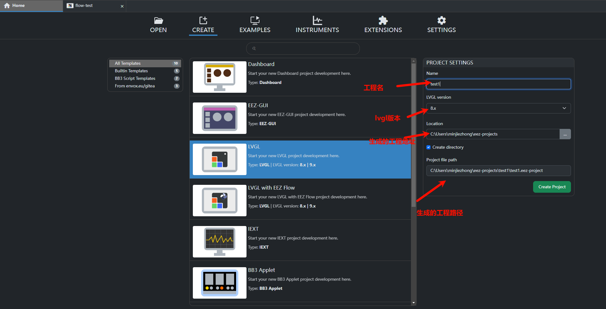
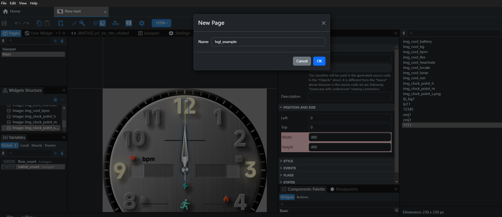
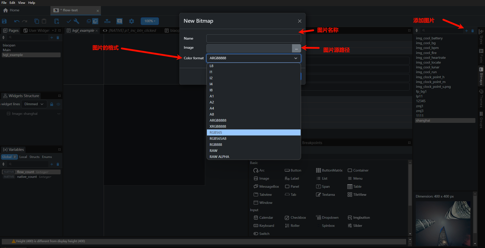
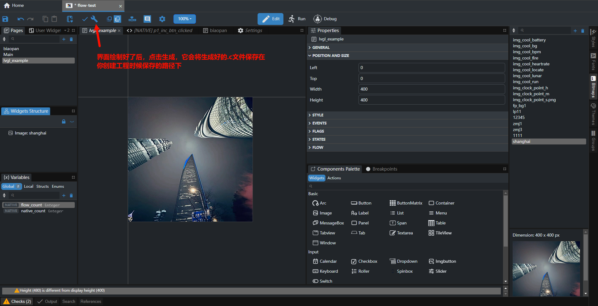

# EEZ Studio Example (RT-Thread)

## Supported Platforms
<!-- Which boards and chip platforms are supported -->
- Any board (including `pc`)

## Example Overview
Using the EEZ Studio tool, convert PNG images into image arrays and LVGL image structures, and generate C files. Place the generated .c files into the project, modify and compile (due to interface differences in the generated structures), and use SDK's LVGL interface to display images on the screen.

## Using EEZ Studio Software
EEZ Studio software download link: [EEZ Studio Download](https://github.com/eez-open/studio/releases), select the .exe file to download

* After downloading and installing, open EEZ Studio and create a project on the home page


* After creating the project, add items as shown in the figures



* Interface usage: you can set project size, layout, styles, flags, widgets, events, actions, etc.


* The following demonstrates adding an image control


* After completion, compile to generate .c files


For more detailed operations, please refer to: [EEZ Studio Tutorial](https://www.bilibili.com/video/BV1vkp2egERj?spm_id_from=333.788.videopod.sections&vd_source=00a26cb15a9627841023f7adb1c7c7f4)

## Modifications to Generated Code
* Due to slight differences between the generated code and the SDK's header file references, it cannot be fully used directly and requires modification. (However, most of the code can be reused)
* For generated code, we can refer to the ui_image_xxx.c file, which stores our image data and interfaces. There is also a screens file
* We need to make some modifications to use it in our SDK, mainly header file issues, requiring the operations shown in the figure


* Next is creating the LVGL interface. The generated code is stored in the screens.c file, which also has some differences in writing style, so adjustments are needed (but most of the code can be reused)


## Example Usage
### Hardware Requirements
* A board that supports this example
* A USB data cable

### menuconfig Configuration Process
* LVGL is enabled by default, no additional configuration is needed
* Enable LVGL in menuconfig

* Select LVGL display driver in menuconfig

### Compilation and Flashing
Switch to the example project directory and run the scons command to compile:
```
scons --board=sf32lb52-lcd_n16r8 -j32
```
```
build_sf32lb52-lcd_n16r8_hcpu\uart_download.bat
```

### Running Results
* The converted image will be displayed on the screen
