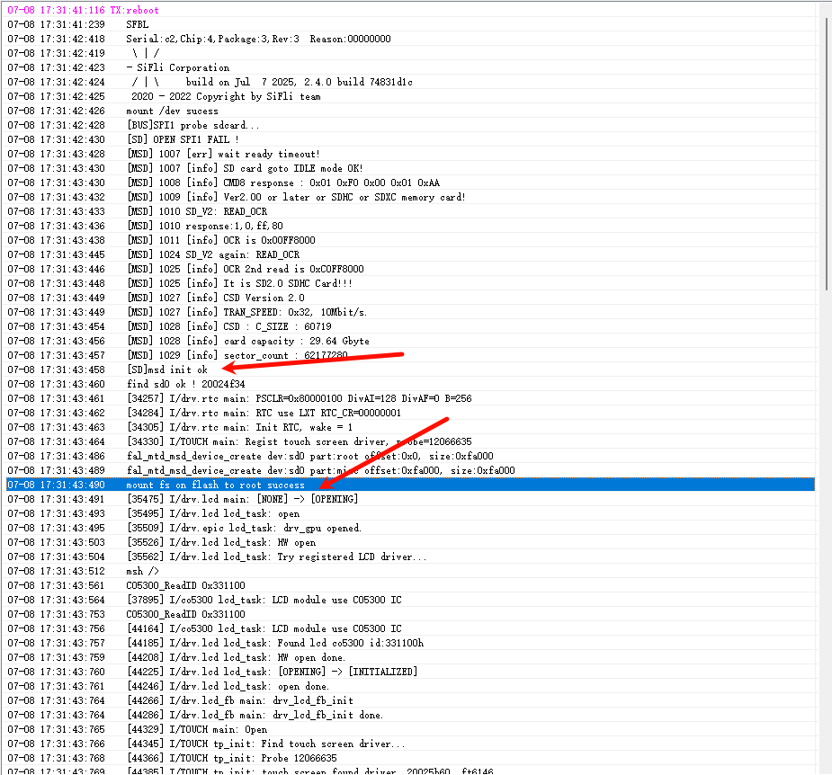
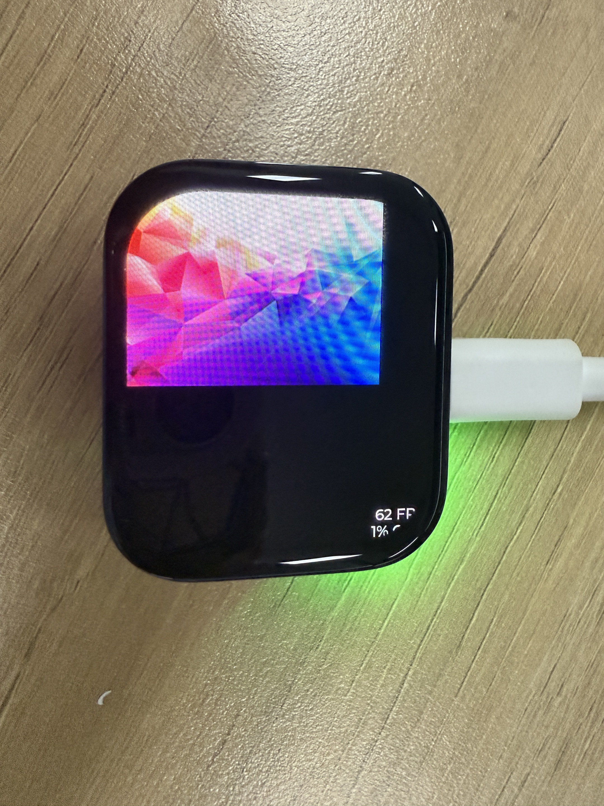
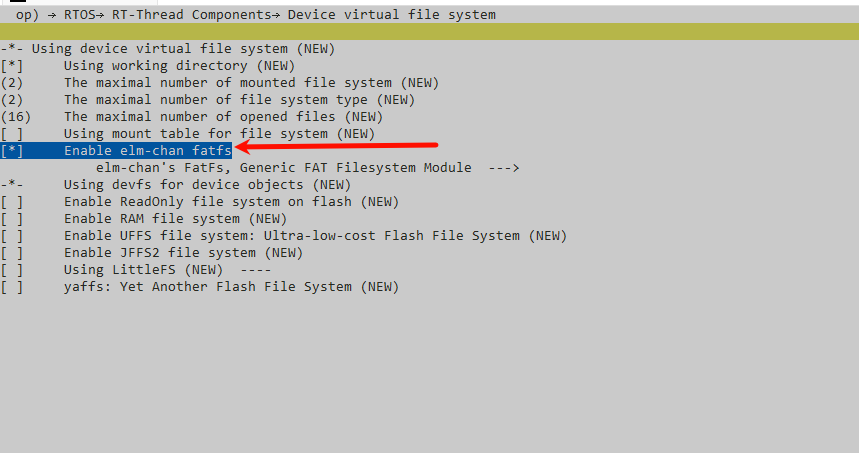
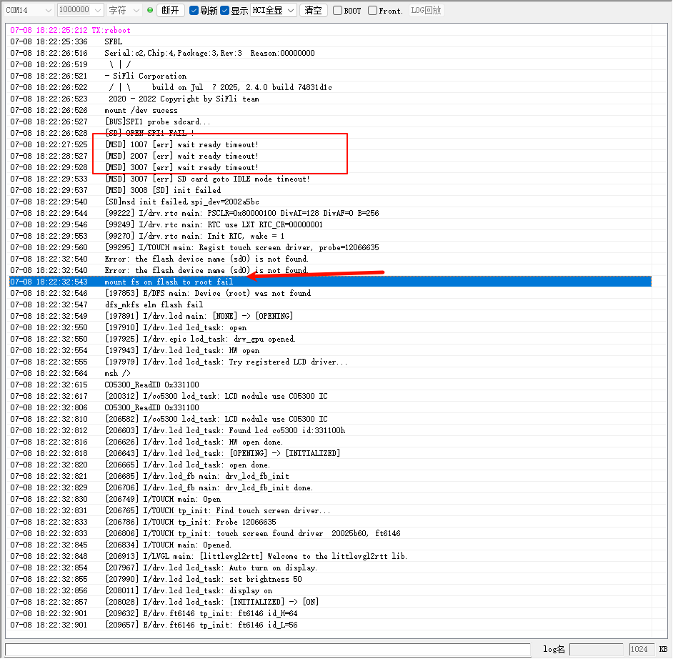

# LVGL v8 Official Example

## Introduction
This example is used to test LVGL V8 APIs using officially provided examples.
You can replace the lv_example_scroll_1() function in src/main.c (simulator in simulator/applications/application.c) to test other APIs.
Other API functions can be referenced in the src/examples/lv_examples.h header file.

## Project Compilation and Download:
Board projects in the project directory can be compiled for specific boards by specifying the board parameter:
- To compile a project that can run on HDK 563, execute scons --board=eh-lb563 to generate the project
- Download can be performed through download.bat in the build directory. For example, to flash the 563 project generated in the previous step, execute .\build_eh-lb563\download.bat to download via J-Link
- Special note: For SF32LB52x/SF32LB56x series, an additional uart_download.bat will be generated. You can execute this script and enter the download UART port number to perform the download
Simulator project is in the simulator directory:
- Compile using scons. The SiFli-SDK/msvc_setup.bat file needs to be modified accordingly to match the local MSVC configuration
- You can also use scons --target=vs2017 to generate the MSVC project project.vcxproj and compile using Visual Studio.

```{note}
If using VS2022 or other versions besides VS2017, you will be prompted to upgrade the MSVC SDK when loading the project. After upgrading, it can be used normally.
```

## Supplementary Instructions - How to Use sjpg
Source Code Path: SiFli-SDK\example\multimedia\lvgl\lvgl_v8_examples

### Supported Platforms
This example can run on the following development boards:
* sf32lb52-lchspi-ulp
* sf32lb52-lcd_n16r8


### Overview
* After inserting an SD card to complete file system mounting, read and display .sjpg and .jpg format images from it

### Hardware Requirements
* Huangshan development board or 52x series development board
* A USB data cable with data transfer capability
* A TF card and a TF card reader

### Example Usage

#### Compilation and Flashing
The default display image in the demo code is: ``` small_image.sjpg ```

Switch to the example project directory and run the scons command to compile:

```
scons --board=sf32lb52-lchspi-ulp -j8
```

Execute the flashing command:
```
build_sf32lb52-lchspi-ulp_hcpu\uart_download.bat
```

Select the port as prompted to download:

```none
please input the serial port num:5
```

#### Example Output Result Display:
* After inserting the SD card, mount the file system and read/display images from the file system. The log containing `mount fs on flash to root success` indicates successful file system mounting



* You can input 'ls' to view image files in the file system


### Example Effect Display


#### Example Configuration Process
* By default, SPI is not enabled for TF file system mounting. If needed, configure as follows:
* First, use a TF card reader to write image files to the TF card, then insert the TF card into the board
* Configure through `menuconfig` as follows:
``` c
menuconfig --board=sf32lb52-lchspi-ulp
```
* Enable SPI bus


* Mount SD\TF device on SPI bus


* Configure file path



* Enable LVGL file system interface, configure drive letter, and enable decoder


### Troubleshooting
* Abnormal log

If the above situation occurs, the TF card may be loose, unable to communicate properly, or not inserted