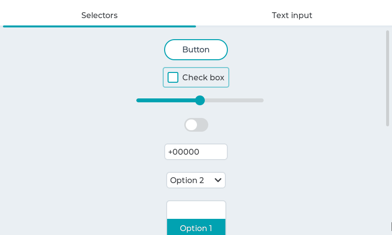
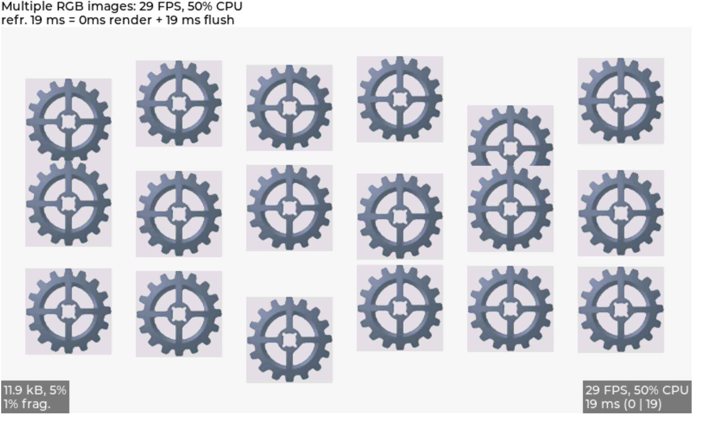

# LVGL 演示程序

## 将示例添加到您的项目中
1. 克隆 lvgl 后，可以在 'demos' 文件夹中找到演示程序。

2. 在 ***lv_conf.h*** 或等效位置，您可以找到演示相关的宏，更改其值以启用或禁用指定的演示：

```c
...
/*===================
 * 演示程序使用
 ====================*/

/*显示一些控件。可能需要增加 `LV_MEM_SIZE` */
#define LV_USE_DEMO_WIDGETS        0

/*演示编码器和键盘的使用*/
#define LV_USE_DEMO_KEYPAD_AND_ENCODER     0

/*对您的系统进行基准测试*/
#define LV_USE_DEMO_BENCHMARK   0

/*LVGL 压力测试*/
#define LV_USE_DEMO_STRESS      0

/*音乐播放器演示*/
#define LV_USE_DEMO_MUSIC       0
#if LV_USE_DEMO_MUSIC
# define LV_DEMO_MUSIC_SQUARE       0
# define LV_DEMO_MUSIC_LANDSCAPE    0
# define LV_DEMO_MUSIC_ROUND        0
# define LV_DEMO_MUSIC_LARGE        0
# define LV_DEMO_MUSIC_AUTO_PLAY    0
#endif

/*弹性布局演示*/
#define LV_USE_DEMO_FLEX_LAYOUT     0

/*智能手机风格的多语言演示*/
#define LV_USE_DEMO_MULTILANG       0

/*控件变换演示*/
#define LV_USE_DEMO_TRANSFORM       0

/*演示滚动设置*/
#define LV_USE_DEMO_SCROLL          0
...
```

3. 如果您的开发环境或工具链没有自动添加 '***lvgl***' 文件夹内的源文件，请确保包含 `demos` 文件夹进行编译。
4. 在您的应用程序源文件中包含 "***demos/lv_demos.h***"，例如：

```c
//! main.c
#include "lvgl.h"
#include "demos/lv_demos.h"
...
```

## 配置演示程序入口

"demos/lv_demos.c" 提供 `lv_demos_create` 和 `lv_demos_show_help` 来简化演示程序的创建。

如果您构建名为 `lv_demos` 的主程序，那么您可以通过运行 `lv_demos widgets` 来运行控件演示，通过运行 `lv_demos benchmark 1` 来运行基准测试演示。

例如：

```c
//! main.c
#include "lvgl.h"
#include "demos/lv_demos.h"

...
static lv_display_t* hal_init(void)
{
  lv_display_t* disp = NULL;

  ...
  /* TODO: 初始化显示和输入设备 */
  ...

  return disp;
}

int main(int argc, char ** argv)
{
  lv_init();

  lv_display_t* disp = hal_init();
  if (disp == NULL) {
    LV_LOG_ERROR("lv_demos 初始化失败！");
    return 1;
  }

  if (!lv_demos_create(&argv[1], argc - 1)) {
    lv_demos_show_help();
    goto demo_end;
  }

  while (1) {
    uint32_t delay = lv_timer_handler();
    if (delay < 1) delay = 1;
    usleep(delay * 1000);
  }

demo_end:
  lv_deinit();
  return 0;
}

```

## 演示程序

### 控件
使用内置的 Material 主题显示控件的默认外观。

请参阅 [widgets](https://github.com/lvgl/lvgl/tree/master/demos/widgets) 文件夹。


为了正确运行此演示，请确保 **LV_MEM_SIZE** 至少为 **38KB**（推荐 **48KB**）：

```c
#define LV_MEM_SIZE    (38ul * 1024ul)
```


### 音乐播放器
音乐播放器演示展示了可以在 LVGL 上创建的现代智能手机风格用户界面。它最适合 480x272 或 272x480 分辨率的显示器。

请参阅 [music](https://github.com/lvgl/lvgl/tree/master/demos/music) 文件夹。


### 键盘和编码器
LVGL 允许您在没有触摸板的情况下使用键盘和/或编码器控制控件。此演示展示了如何在没有触摸板的情况下处理按钮、下拉列表、滚轮、滑块、开关和文本输入。
了解更多关于 LVGL 无触摸板使用的信息，请访问[这里](https://docs.lvgl.io/master/overview/indev.html#keypad-and-encoder)。

请参阅 [keypad_encoder](https://github.com/lvgl/lvgl/tree/master/demos/keypad_encoder) 文件夹。



### 基准测试
用于测量 LVGL 性能或比较不同设置的演示。
请参阅 [benchmark](https://github.com/lvgl/lvgl/tree/master/demos/benchmark) 文件夹。


### 压力测试
LVGL 的压力测试。它包含大量对象创建、删除、动画、样式使用等。如果在大量使用期间出现内存损坏或任何内存泄漏，可以使用它。
请参阅 [stress](https://github.com/lvgl/lvgl/tree/master/demos/stress) 文件夹。


## 贡献
有关贡献和编码风格指南，请参考主 LVGL 仓库中的 docs/CONTRIBUTING.md 文件：
  https://github.com/lvgl/lvgl
