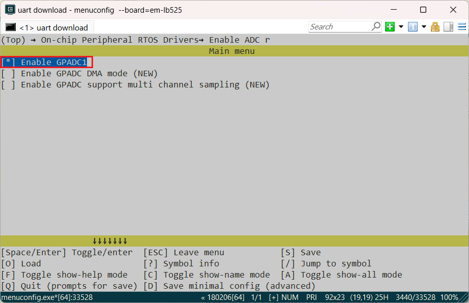

# ADC_battery Example
Source code path: example/rt_device/adc/adc_battery
## Supported Platforms
The example can run on the following development boards.
* sf32lb52-lcd_n16r8

## Overview
* Under RT-Thread operating system, ADC single-channel sampling to read vbat battery voltage

## Example Usage
### Compilation and Flashing
* This example uses ADC. Under RT-Thread operating system, ADC peripheral is virtualized as an rt_device for read/write operations. At this time, you need to confirm whether the `rtconfig.h` file in the current path contains the following 2 macros:

```c
#define BSP_USING_ADC 1
#define BSP_USING_ADC1 1
#define RT_USING_ADC 1
```

Only when the above three macros are included, the `sifli_adc_init` function will register the `"bat1"` rt_device through the `rt_hw_adc_register` function, and then the device can be successfully found with `rt_device_find` and controlled with `rt_device_control`.<br>
**Note**<br>
SiFli series MCUs support timer interrupt to trigger multi-channel simultaneous sampling. You can refer to the definition within macro `BSP_GPADC_SUPPORT_MULTI_CH_SAMPLING` and the chip user manual
* If the above three macros are missing, you need to enable them through `menuconfig` with the following command  

> menuconfig --board=sf32lb52-lcd_n16r8       525 development board

> menuconfig --board=sf32lb52-lcd_52d       52d development board


As shown in the figure below, select GPADC1, save and exit menuconfig, check if the `rtconfig.h` macro is generated

* Switch to the example project directory and run the scons command to compile:

```
scons --board=em_lb525 -j8
```

* Run `build_sf32lb52-lcd_n16r8_hcpu\uart_download.bat`, select the port as prompted to download:

```
build_sf32lb52-lcd_52d_hcpu\uart_download.bat

Uart Download

please input the serial port num:5
```

#### Example Output Results Display:
* Voltage reading log before connecting battery


* Voltage reading log after connecting battery


The value printed in the log is the original register value, Voltage is the converted mV voltage


#### ADC Configuration Process

* Set channel 7 corresponding to battery Vbat interface


**Note**  
1. ADC input ports are fixed IO ports, as shown in the figure below:<br>52 chip ADC CH1-7 distribution, corresponding to software configured Channel0-6, the last channel CH8(Channel 7) is internally connected to battery Vbat detection and is not mapped to external IO<br>

1. `HAL_PIN_Set` `HAL_PIN_Set_Analog` the last parameter is for hcpu/lcpu selection, 1: select hcpu, 0: select lcpu<br>


* Use `rt_device_find` and `rt_device_control` sequentially to find and configure the `bat1` device interface function.
`rt_adc_ops` does not define `rt_device_open`, so not executing `rt_device_open` will not affect ADC functionality, it will only affect whether `bat1` shows open status in `list_device`
```c
#define ADC_DEV_NAME        "bat1"      /* ADC1 device, already registered in rt_hw_adc_register function, cannot be modified arbitrarily */
#define ADC_DEV_CHANNEL     7           /* ADC channel selection vbat fixed to CH8(Channel 7) */
//#define REFER_VOLTAGE       330         /* ADC reference voltage, 52 chip can choose 1v8 or 3v3, interface is not currently open, fixed to 3V3 */
static rt_device_t s_adc_dev; /* Define an rt_device device */
static rt_adc_cmd_read_arg_t read_arg;

void adc_example(void)
{
    rt_err_t r;

    /* Configure PA28 as analog input IO and cannot enable internal pull-up/pull-down */
    //HAL_PIN_Set_Analog(PAD_PA28, 1);

    /* Find bat1 device, if BSP_USING_ADC1 is not enabled, device will not be found and system will hang */
    s_adc_dev = rt_device_find(ADC_DEV_NAME);

    /* Configure sampling channel to channel 0*/
    read_arg.channel = ADC_DEV_CHANNEL;

    r = rt_adc_enable((rt_adc_device_t)s_adc_dev, read_arg.channel);
    
    /* This interface will call sifli_adc_control function, read only once, users can process data themselves */   
    r = rt_device_control(s_adc_dev, RT_ADC_CMD_READ, &read_arg.channel);
    /* Log printed value is in 0.1mV units, 20846 equals 2084.6mV or 2.0846V  */
    LOG_I("adc channel:%d,value:%d",read_arg.channel,read_arg.value); /* (0.1mV), 20846 is 2084.6mV or 2.0846V */

    /* This demonstrates another way to perform ADC sampling, this interface will call sifli_get_adc_value function, will perform default 22 times averaging  */
    rt_uint32_t value = rt_adc_read((rt_adc_device_t)s_adc_dev, ADC_DEV_CHANNEL);
    /* Log printed value is in 0.1mV units, 20700 equals 2070.0mV or 2.0700V  */
    LOG_I("rt_adc_read:%d,value:%d",read_arg.channel,value); /* (0.1mV), 20700 is 2070mV or 2.070V */

    /* After sampling is complete, close adc */
    rt_adc_disable((rt_adc_device_t)s_adc_dev, read_arg.channel);

}
```


## Exception Diagnosis
* Program crashes with the following log
```c
   Start adc demo!
   Assertion failed at function:rt_adc_enable, line number:144 ,(dev)
   Previous ISR enable 0
```
Reason:  
`BSP_USING_ADC1` is not defined, causing `rt_hw_adc_register` function to not register `"bat1"`, and Assert crashes when `rt_device_find` searches for this device  
Ensure the `rtconfig.h` file contains the following 3 macros:
```c
#define BSP_USING_ADC 1
#define BSP_USING_ADC1 1
#define RT_USING_ADC 1
```
* ADC sampled voltage value is incorrect

1. Use `list_device` command to check if `bat1` device exists. ADC driver does not affect ADC functionality when `bat1` device is not opened with `rt_device_open`
```
    msh />
 TX:list_device
    list_device
    device           type         ref count
    -------- -------------------- ----------
    audcodec Sound Device         0       
    audprc   Sound Device         0       
    rtc      RTC                  0       
    pwm3     Miscellaneous Device 0       
    pwm2     Miscellaneous Device 0       
    touch    Graphic Device       0       
    lcdlight Character Device     0       
    lcd      Graphic Device       0       
    bat1     Miscellaneous Device 0       
    i2c4     I2C Bus              0       
    i2c1     I2C Bus              0       
    spi1     SPI Bus              0       
    lptim1   Timer Device         0       
    btim1    Timer Device         0       
    gptim1   Timer Device         0       
    uart2    Character Device     0       
    uart1    Character Device     2       
    pin      Miscellaneous Device 0       
    msh />
```
2. Check if ADC hardware is connected correctly. ADC sampling channels are fixed IO ports and cannot be specified arbitrarily. For specific CH0-7 IO assignments, refer to the chip manual  
3. ADC input voltage range is 0V - reference voltage (52 defaults to 3v3), cannot exceed input range  
* ADC accuracy is insufficient
1. Whether ADC calibration parameters are obtained and used
2. Whether the accuracy of voltage divider resistors meets requirements
3. Whether ADC reference voltage is stable and has excessive ripple (refer to ADC voltage reference chip manual for details) 


## Reference Documents
* EH-SF32LB52X_Pin_config_V1.3.0_20231110.xlsx
* DS0052-SF32LB52x-芯片技术规格书 V0p3.pdf
* [RT-Thread Official Website](https://www.rt-thread.org/document/site/#/rt-thread-version/rt-thread-standard/programming-manual/device/adc/adc)<br>
https://www.rt-thread.org/document/site/#/rt-thread-version/rt-thread-standard/programming-manual/device/adc/adc
## Update History
|Version |Date   |Release Notes |
|:---|:---|:---|
|0.0.1 |11/2024 |Initial version |
| | | |