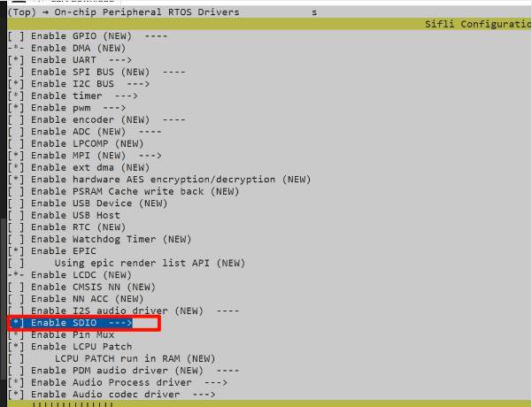
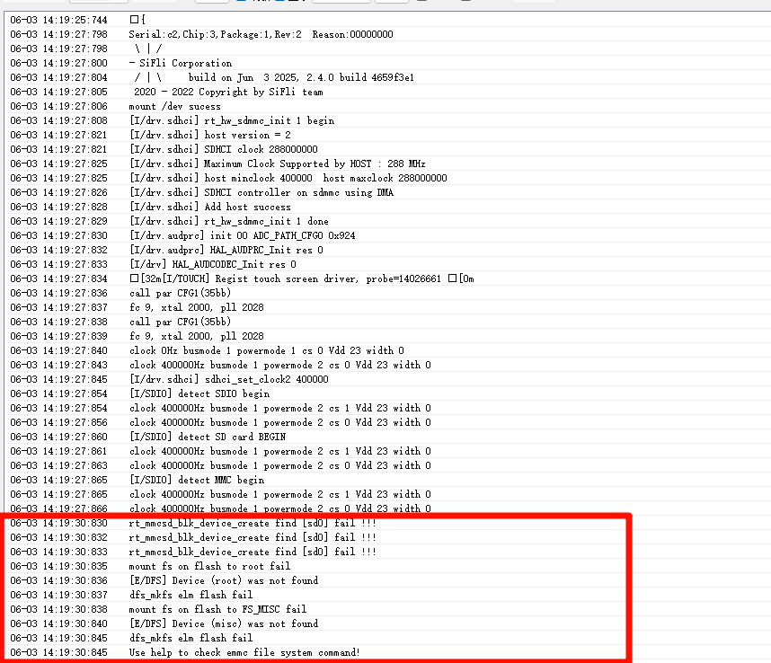

# eMMC/SD Card Example
Source code path: example/rt_device/emmc
## Overview
The example demonstrates creating partitions on eMMC or SD card, mounting elm file system on partitions, and performing various file system operations
## Supported Platforms
* sf32lb56-lcd_a128r12n1
* sf32lb56-lcd_n16r12n1
* sf32lb58-lcd_n16r64n4
* sf32lb58-lcd_a128r32n1_dsi

## Usage Guide
    The emmc application will create a partition on the board's TF card, mount the file system in the partition. The file system uses FAT format, and common file commands can be called in UART Console.
```
df               - Disk free//View disk space usage of file system
mountfs          - Mount device to file system//Mount device to file system
mkfs             - Format disk with file system//Format disk with file system
mkdir            - Create the DIRECTORY.//Create directory
pwd              - Print the name of the current working directory.//Print current working path
cd               - Change the shell working directory.//Change directory
rm               - Remove(unlink) the FILE(s).//Delete files and directories
cat              - Concatenate FILE(s)//Create file and write content
mv               - Rename SOURCE to DEST.//Rename file
cp               - Copy SOURCE to DEST.//Copy file content to another file
ls               - List information about the FILEs.//List all file information
```
## menuconfig Configuration
```
menuconfig --board=56devkit_lcd(board= followed by board name)
```
1. Enable SDIO


2. Enable and configure sd device


### Compilation and Flashing
Follow these steps to complete compilation and flashing.
```
scons --board=56_devkit_lcd -j8
build_56_board_lcd_hcpu\download.bat(uart_download.bat)//Can flash through jlink and serial port two methods
```

## Experimental Results

1. Successful mount log (If you see the output log contains the items framed in the picture, it means mount is successful)


2. Perform file creation operations. First input ls to view existing files or directories in the file system, then use mkdir XXX to create, cd to the created directory, use echo command to create text and write content, then use cat command to view the created file content, finally use pwd command to view the current working path


## Results that could not be completed as expected (log)


## Failure reasons and solutions
1. If the log shows the following, first check if TF card is inserted, then check if SD in the above menuconfig is enabled, you can refer to the above menuconfig operation configuration
```
rt_mmcsd_blk_device_create find [sd0] fail !!!
```

2. If the log shows the following, please check if TF card is inserted
```
[E/DFS] Device (root) was not found
[E/DFS] Device (misc) was not found
```
If the expected log does not appear, you can troubleshoot from the following aspects:
* Whether hardware connection is normal
* Check if USB interface is loose
* Check if USB cable has data transmission capability
* Whether TF card is usable