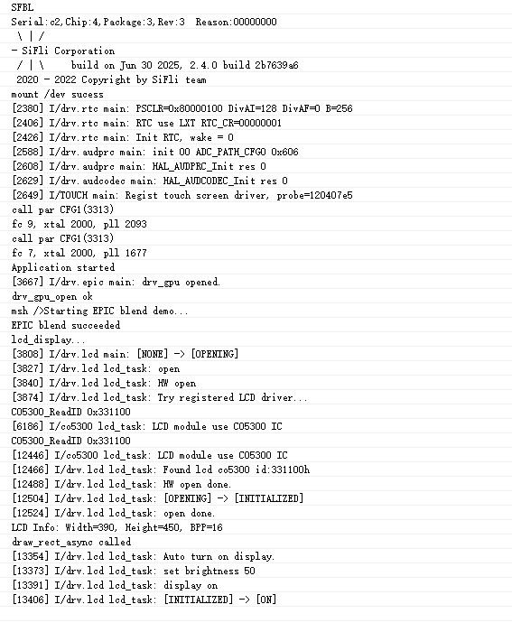
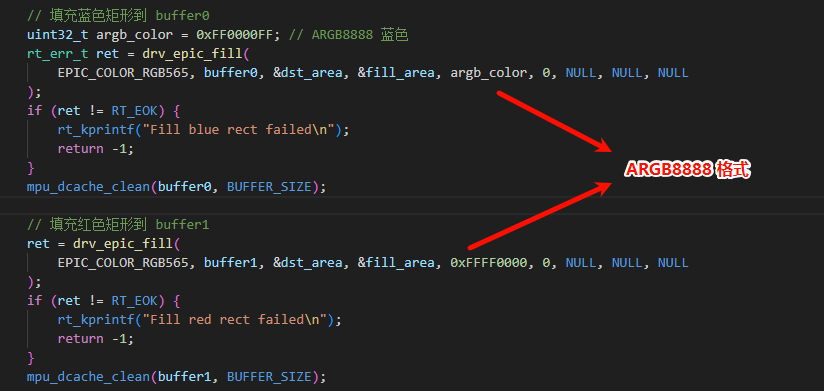
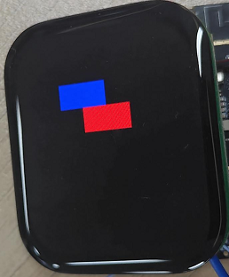
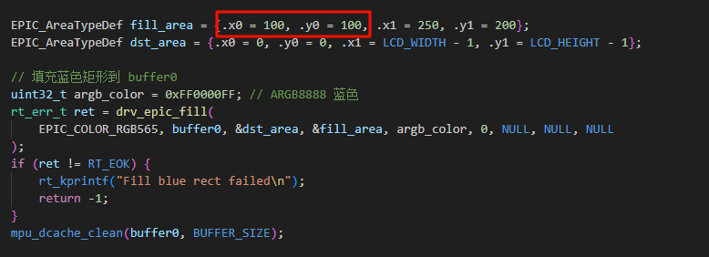
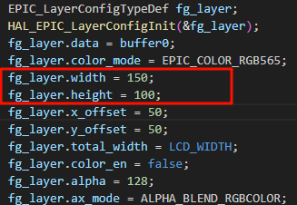
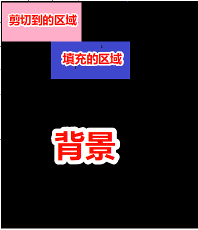

# EPIC 例程程序
EPIC(ePicasso)，是我们自研的图形引擎，它是专为 2D/2.5D 图像处理设计的硬件加速模块，主要用于分担 CPU 在图像运算中的负载，提升图像处理效率。

## 概述
该程序是一个基于 RT-Thread 操作系统和 EPIC 的图形混合示例。它演示了如何使用硬件加速进行图层混合（alpha blending），将两个带有透明度的矩形图层叠加，并最终显示在 LCD 屏幕上。

## 支持的开发板
例程可以运行在以下开发板.
* sf32lb52-lchspi-ulp
* sf32lb52-nano_52j
* sf32lb52-lcd_n16r8

## 例程的使用
### 编译和烧录
切换到例程project目录，运行scons命令执行编译：
```
scons --board=sf32lb52-lchspi-ulp -j8
```
执行烧写命令：
```
build_sf32lb52-lchspi-ulp_hcpu\uart_download.bat
```
按提示选择端口即可进行下载：
```none
please input the serial port num:6
```

#### 例程输出结果展示:
串口窗口打印如图：

会在 LCD 屏幕上显示如图效果：


---

## 例程的讲解
### 程序主要流程包括：
初始化 GPU 和 LCD 设备 ---> 在两个缓冲区中分别绘制蓝色和红色矩形 --> 使用 EPIC 图形引擎对两个图层进行混合 --> 将混合后的图像输出到屏幕显示.
### 使用到的关键接口：
#### 1.GPU/EPIC接口：
| 接口名                        | 功能描述                         |
|-----------------------------|------------------------------|
| drv_gpu_open()          | 初始化 GPU 资源，包括中断等         |
| drv_epic_fill()        | 使用指定颜色填充矩形区域            |
| HAL_EPIC_LayerConfigInit()| 初始化图层配置结构体               |
| HAL_EPIC_LayerSetDataOffset() | 设置图层数据偏移量（用于裁剪）     |
| drv_epic_blend()    | 执行多图层混合操作                |
| drv_epic_wait_done()   | 等待混合操作完成                   |

#### 2.LCD 显示接口：
| 接口名                                       | 功能描述                             |
|-------------------------------------------|----------------------------------|
| rt_device_find("lcd") | 查找 LCD 设备                     |
| rt_device_open()      | 打开 LCD 设备                     |
| rt_device_control(..., RTGRAPHIC_CTRL_SET_BUF_FORMAT) | 设置显存格式              |
| rt_device_control(..., RTGRAPHIC_CTRL_GET_INFO)   | 获取 LCD 屏幕信息                 |
| rt_graphix_ops()->draw_rect_async() | 异步绘制矩形并刷新屏幕               |

---

## 注意的点！！！
当发现屏幕没有显示的时候，排查填充的颜色是否为 ARGB8888 格式，因为drv_epic_fill接口要求填充的颜色格式为 ARGB8888

当发现出来的图片效果没有达到预期效果或者屏幕没有显示时(如图示例情况): 可能是裁剪没做好。


---

#### 关于裁剪
* 本例程的混叠原理是将图层fg_layer和图层bg_layer中的填充区域给裁剪 ‘拿’ 出来，然后将它们放在一个output_layer中。
* 但是需要注意的是，当没有调用裁剪接口如 HAL_EPIC_LayerSetDataOffset() 时，默认的裁剪起始位置就是 layer.data 指针指向的首地址，在本例程中为左上角即(0,0)。那么被剪到的区域就会是 (layer.width - 0 ，layer.height - 0)。
这个时候如果我们对图层fg_layer和图层bg_layer设置的填充区域没有在被剪的区域中，那么我们的有效数据就没有被 ‘拿’ 到。
* 如图代码本例程中设置的填充区域为(100 ~ 250，100 ~ 200),被剪到的区域为(0 ~ 150,0 ~ 100)，我们填充的区域完美的避开了被剪的区域，那么被剪 ‘拿’ 出来的数据就会是空的，只剪到了背景。



---
那我们该怎么 既想要自己设置填充区域位置，又要准确剪切 ‘拿’ 到我们的填充区域呢？ 
* 第一种最为简单的方法就是在不调用任何剪切函数的情况下，我们将填充区域的起始位置跟 layer.data 指针指向的首地址的位置保持一致(就是将填充的区域放到剪切的区域中) 
* 第二种就是调用剪切接口例如 HAL_EPIC_LayerSetDataOffset(EPIC_BlendingDataType *layer, int16_t x, int16_t y)，参数layer为剪切的图层，x为想要剪切的起始位置的x坐标，y为想要剪切的起始位置的y坐标，这样子我们就可以做到想剪哪里剪哪里。需要注意的是，x 和 y的值需要在你想剪的起始位置的基础上再加上 layer.x_offset 和 layer.y_offset 的值。如图本例程想剪的起始位置是(100,100), layer.x_offset 和 layer.y_offset 的值为 50，50 ，那么我们 x 和 y 的值就是 100 + 50 = 150, 100 + 50 = 150。
