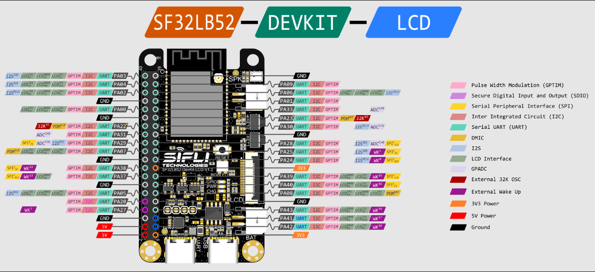
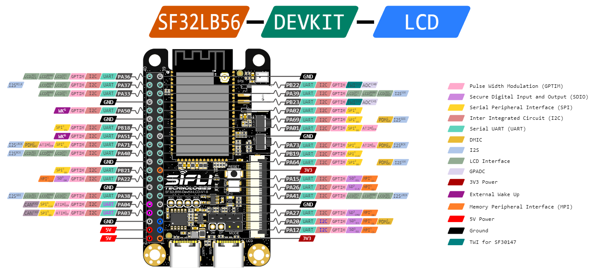

# I2S Example

Source path: example/rt_device/i2s

## Supported Platforms
<!-- Which boards and chip platforms are supported -->
+ eh-lb525
+ sf32lb52-lcd_n16r8

## Overview
<!-- Example introduction -->
In this example, two development boards are used to demonstrate I2S transmission and reception (one development board A as tx, one development board B as rx), including:
+ Development board A:
    - mic recording.
    - Send to development board B via i2s.
+ Development board B:
    - Receive data from development board A via i2s.
    - speaker playback.

## Example Usage
<!-- Explain how to use the example, such as which hardware pins to connect to observe waveforms, compilation and flashing can reference related documentation.
For rt_device examples, you also need to list the configuration switches used by this example, such as PWM example using PWM1, which needs to be enabled in the onchip menu -->

### Hardware Requirements
Before running this example, you need to prepare:
+ Two development boards supported by this example ([Supported platforms](quick_start)).
+ Speaker.
+ Two data cables (used for program flashing of the two boards respectively).

### menuconfig Configuration

1. Enable I2S


    ```{tip}
    If the chip supports multiple I2S, configure according to actual usage.
    ```
2. Enable AUDIO CODEC and AUDIO PROC:


3. This example uses FINSH functionality, need to enable `RT_USING_FINSH`.  

```{tip}
Configurations 2 and 3 are used for auxiliary function demonstration in this example, not necessary for I2S configuration.
```  

### Hardware Connection\PIN CONFIG

Taking `SF32LB52_DevKit-LCD` as an example, this example uses `PA02 ~ PA06` as I2S pins, pin configuration is as follows:
```c
    /* PIN CONFIG */
#ifdef BSP_ENABLE_I2S_CODEC
#ifdef SOC_SF32LB52X
    HAL_PIN_Set(PAD_PA06, I2S1_LRCK, PIN_NOPULL, 1);
    HAL_PIN_Set(PAD_PA05, I2S1_BCK, PIN_NOPULL, 1);
    HAL_PIN_Set(PAD_PA04, I2S1_SDI, PIN_PULLDOWN, 1);
    HAL_PIN_Set(PAD_PA03, I2S1_SDO, PIN_NOPULL, 1);
    HAL_PIN_Set(PAD_PA02, I2S1_MCLK, PIN_NOPULL, 1);
#endif
#endif
```

If you need to use other development board models, you need to change the pinmux configuration. Here is an example for 56x:
```c
#ifdef SOC_SF32LB56X
    HAL_PIN_Set(PAD_PA71, I2S1_LRCK, PIN_NOPULL, 1);
    HAL_PIN_Set(PAD_PA40, I2S1_BCK, PIN_NOPULL, 1);
    HAL_PIN_Set(PAD_PA38, I2S1_SDI, PIN_PULLDOWN, 1);
    HAL_PIN_Set(PAD_PA39, I2S1_SDO, PIN_NOPULL, 1);
    HAL_PIN_Set(PAD_PA37, I2S1_MCLK, PIN_NOPULL, 1);
#endif
```

Wiring:
Development board A | -- | Development board B
--|--|--
I2S1_LRCK|--|I2S1_LRCK
I2S1_BCK|--|I2S1_BCK
I2S1_SDI|--|I2S1_SDO
I2S1_SDO|--|I2S1_SDI
I2S1_MCLK|--|I2S1_MCLK

If you are unsure about pin positioning, you can refer to the following figures:
SF32LB52x_DevKit_40p diagram:

SF32LB56x_DevKit_40p diagram:

```{warning}
On `SF32LB52_DevKit-LCD`:  
+ `PA02 ~ PA06` will be used when LCD is configured, pay attention to conflicts (need to disable LCD: `BSP_USING_LCD = n BSP_USING_LCDC = n`).  

For other form factors, you need to refer to the specification to select pins.
```

### Compilation and Programming
Switch to the example project directory and run the scons command to execute compilation:
```shell
> scons --board=eh-lb525 -j32
```
Switch to the example `project/build_xx` directory and run `uart_download.bat`, select the port as prompted to download:
```shell
$ ./uart_download.bat

     Uart Download

please input the serial port num:5 (Board A port number)
```
Flash board B again
$ ./uart_download.bat

     Uart Download

please input the serial port num:6 (Board B port number)

For detailed steps on compilation and downloading, please refer to the relevant introduction in [Quick Start](quick_start).

## Expected Results
<!-- Explain the example running results, such as which LEDs will light up, what logs will be printed, so that users can judge whether the example is running normally. The running results can be explained step by step combined with the code -->
This example operates through FINSH commands:
Purpose | Command | Example |Notes
|---|--|--|--|
Recording|audprc rx [channels:1/2] [sampling rate] [sampling bits]|`audprc rx 1 16000 16` |Recording is saved to ram buffer (recording automatically stops after reaching 1M)
I2S transmission|i2s tx [tx channels:1/2] [tx sampling rate] [tx sampling bits]|`i2s tx 1 16000 16`|Send recorded data in ram buffer via i2s. `The example is configured in master mode by default.` Configuration method can be seen in `i2s_config_tx`.
I2S reception|i2s rx [rx channels:1/2] [rx sampling rate] [rx sampling bits]|`i2s rx 1 16000 16`|Received data is saved to ram buffer (stops receiving after reaching 1M). `The example is configured in slave mode by default.` Configuration method can be seen in `i2s_config_rx`.
Playback recording|audprc tx [channels:1/2] [sampling rate] [sampling bits]|`audprc tx 1 16000 16`| Playback data from ram buffer

Operations are as follows:
1. Development board A, record an audio clip.
    ```c
    01-03 00:50:30:962 TX:audprc rx 1 16000 16
    01-03 00:50:30:987    [EX_I2S]Start recording.
    01-03 00:50:30:991    [EX_I2S]audprc_rx_entry
    01-03 00:50:30:995    [EX_I2S]codec input parameter:sub_type=4 channels 1, rate 16000, bits 16
    01-03 00:50:31:000    [EX_I2S]mic input:rx channel 0, channels 1, rate 16000, bitwidth 16
    01-03 00:50:31:002    get_mic_volume = 0db

    01-03 00:50:31:005    get_mic_volume = 0db

    01-03 00:50:31:009    [EX_I2S]start_rx
    01-03 00:50:31:011    [I/drv.audcodec] pll config state:1, samplerate:0 
    01-03 00:50:31:013    
    01-03 00:50:31:225    [EX_I2S]recording. size:6400
    01-03 00:50:31:440    [EX_I2S]recording. size:12800
    01-03 00:50:31:633    [EX_I2S]recording. size:19200
    01-03 00:50:31:826    [EX_I2S]recording. size:25600
    01-03 00:50:32:040    [EX_I2S]recording. size:32000
    01-03 00:50:32:232    [EX_I2S]recording. size:38400

    // Recording completed
    01-03 00:51:03:629    [EX_I2S]recording. size:1043200
    01-03 00:51:03:804    [EX_I2S]recording finished. size:1048320
    01-03 00:51:03:808    [EX_I2S]Recording finished.
    01-03 00:51:03:815    [EX_I2S]stop_rx
    01-03 00:51:03:822    [I/drv.audcodec] bf0_audio_stop 0x401
    01-03 00:51:03:828    
    01-03 00:51:03:834    [I/drv.audcodec] audcodec close adc
    01-03 00:51:03:840    [I/drv.audcodec] bf0_audio_stop 0x401 done
    01-03 00:51:03:850    
    01-03 00:51:03:854    [I/drv.audprc] bf0_audio_stop 0x1001
    ```

2. I2S transmission and reception  

    Development board A starts I2S transmission
    ```c
    01-03 00:51:44:552 TX:i2s tx 1 16000 16
    01-03 00:51:44:577    [EX_I2S]I2S TX:
    01-03 00:51:44:582    [EX_I2S]i2s_tx_entry
    // Transmission completed (recorded data transmission completed)
    01-03 00:52:00:382    [EX_I2S]I2S TX. size:1011200
    01-03 00:52:00:474    [EX_I2S]I2S TX. size:1017600
    01-03 00:52:00:569    [EX_I2S]I2S TX. size:1024000
    01-03 00:52:00:680    [EX_I2S]I2S TX. size:1030400
    01-03 00:52:00:772    [EX_I2S]I2S TX. size:1036800
    01-03 00:52:00:865    [EX_I2S]I2S TX. size:1043200
    01-03 00:52:00:957    [EX_I2S]I2S TX finished.
    01-03 00:52:00:962    [EX_I2S]i2s_stop_tx
    ```
    `At the same time`, development board B starts I2S reception
    ```c
    01-03 00:51:43:833 TX:i2s rx 1 16000 16
    01-03 00:51:43:865    [EX_I2S]I2S RX.
    01-03 00:51:43:873    [EX_I2S]i2s_rx_entry[I/drv.i2s_audio] Configure audio chn 2, samplerate 16000, bitwidth 16
    // Reception completed (full 1M)
    01-03 00:51:59:786    [EX_I2S]I2S RX. size:1017600
    01-03 00:51:59:878    [EX_I2S]I2S RX. size:1024000
    01-03 00:51:59:991    [EX_I2S]I2S RX. size:1030400
    01-03 00:52:00:083    [EX_I2S]I2S RX. size:1036800
    01-03 00:52:00:177    [EX_I2S]I2S RX. size:1043200
    01-03 00:52:00:270    [EX_I2S]I2S RX finished.
    01-03 00:52:00:274    [EX_I2S]i2s_stop_rx
    ```
    ```{tip}
    After i2s tx starts, there will be empty data. Development board A starting i2s tx and development board B starting i2s rx are not completely synchronized. Empty data is not handled here, so the 1M data received by development board B may have empty data at the beginning and end.
    ```

3. Development board B plays the received data

```
    01-03 00:52:13:543 TX:audprc tx 1 16000 16
    01-03 00:52:13:591    [EX_I2S]audprc_tx_entry
    01-03 00:52:13:600    [EX_I2S]prc_codec : sub_type=1 channel 1, samplerate 16000, bits 16
    01-03 00:52:13:604    [EX_I2S]speaker OUTPUTSRC channel=1 in_rate=16000 out_rate=16000
    01-03 00:52:13:611    [EX_I2S]speaker select=0x5050 mixer=0x5150
    01-03 00:52:13:618    [EX_I2S]tx[0]: sub_type 0, ch 1, samrate 16000, bits 16
    01-03 00:52:13:622    [EX_I2S]init volume=-18
    01-03 00:52:13:627    [I/drv.audcodec] dac set volume: prc=0 codec=-18
    01-03 00:52:13:631    
    01-03 00:52:13:634    [EX_I2S]start_tx
    01-03 00:52:13:639    [I/drv.audcodec] codec dac mute set:1
    01-03 00:52:13:646    
    01-03 00:52:13:651    [I/drv.audcodec] pll config state:1, samplerate:0 
    01-03 00:52:13:658    
    01-03 00:52:13:662    [I/drv.audprc] samplerate = 16000, select voice eq
    01-03 00:52:13:667    
    01-03 00:52:13:671    [I/drv.audprc] -----tx dma size = 320
    01-03 00:52:13:675    sifli_aw8155 to do power handle 
    01-03 00:52:13:679    sifli_aw8155_start,mode:1 10
    01-03 00:52:13:685    [I/drv.audcodec] codec dac mute set:0
    01-03 00:52:13:690    
    01-03 00:52:46:330    [EX_I2S]Play finished.
    01-03 00:52:46:336    [EX_I2S]Play finished.
    01-03 00:52:46:343    [EX_I2S]stop_tx
    01-03 00:52:46:350    [I/drv.audcodec] bf0_audio_stop 0x100
    01-03 00:52:46:354    
    01-03 00:52:46:358    [I/drv.audcodec] audcodec close dac
    01-03 00:52:46:363    [I/drv.audcodec] bf0_audio_stop 0x100 done
    01-03 00:52:46:368    
    01-03 00:52:46:372    [I/drv.audprc] bf0_audio_stop 0x100
    01-03 00:52:46:377    
    01-03 00:52:46:381    [I/drv.audprc] audprc close adc/dac
    01-03 00:52:46:385    [I/drv.audprc] bf0_audio_stop 0x100 done
    01-03 00:52:46:392    
    01-03 00:52:46:398    sifli_aw8155_stop 
    ```

## Exception Diagnosis


## Reference Documentation
<!-- For rt_device examples, the RT-Thread official website documentation provides more detailed explanations, you can add webpage links here, for example, refer to RT-Thread's [RTC documentation](https://www.rt-thread.org/document/site/#/rt-thread-version/rt-thread-standard/programming-manual/device/rtc/rtc) -->

## Update Log
|Version |Date   |Release Notes |
|:---|:---|:---|
|0.0.1 |12/2024 |Initial version |
| | | |
| | | |