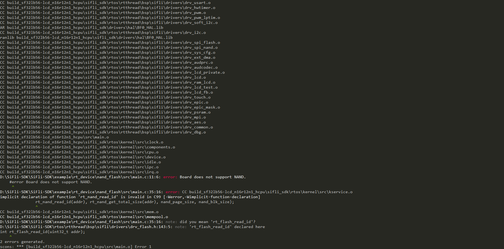
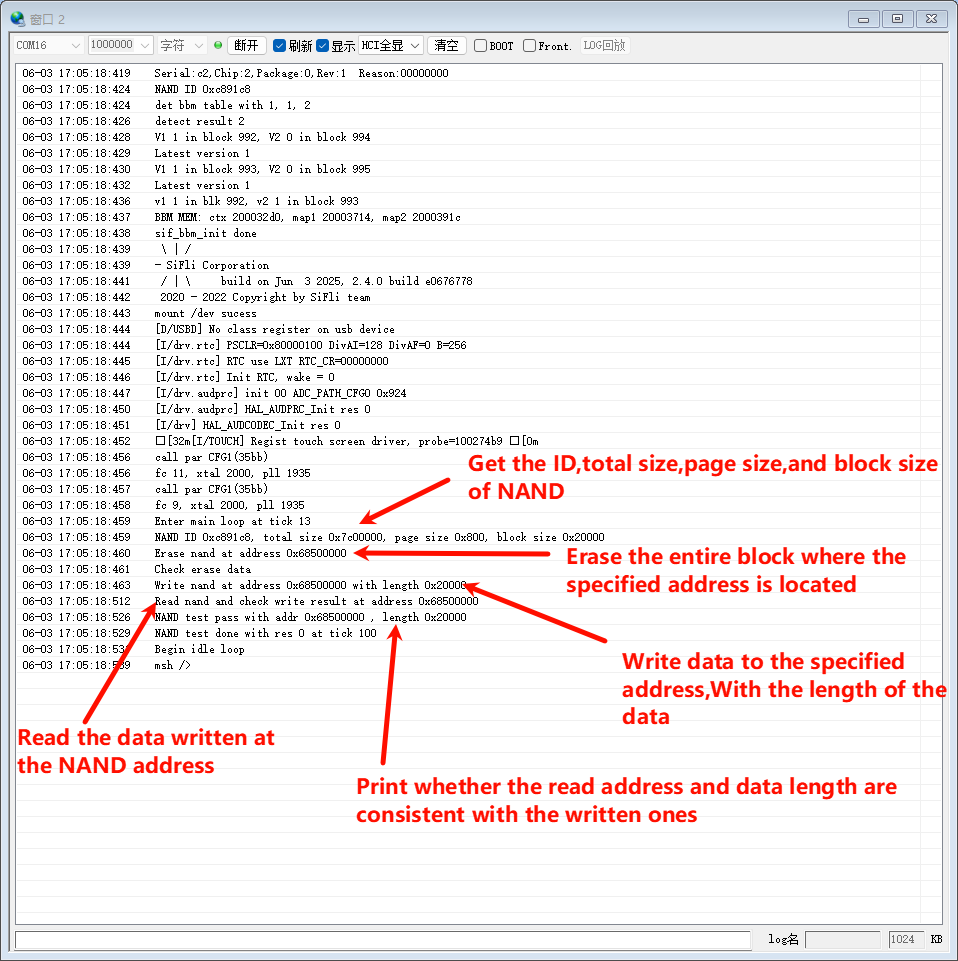

# nand_flash
Source path: SiFli-SDK\example\rt_device\nand_flash
## Supported Platforms
* sf32lb56-lcd_a128r12n1
* sf32lb58-lcd_a128r32n1

## Overview
The nand_flash example is used to demonstrate the RT-Thread layer's NAND read, write, and erase function interfaces.

Before compilation, you need to configure the corresponding controller as a NAND interface. When the system starts, it will initialize NAND and perform bad block management information initialization (applications do not need to pay attention to this part).

NAND erase operations must be performed with block alignment (including address and length). The block size can be obtained through the interface.

NAND write operations must be performed with page alignment (including address and length). The page size can be obtained through the interface. Read operations are recommended to be page-aligned.
     
## Example Usage
Taking sf32lb56-lcd_a128r12n1 as an example
### Compilation and Programming
* Compilation method: Switch to the project example project directory and run the scons command to compile the code:
```
scons --board=board_name -j8
For example: scons --board=sf32lb56-lcd_a128r12n1 -j8
```
If the following error occurs during compilation, it means that the board participating in compilation is not a nand flash type board.

* Download method: Enter the project directory and execute the build command to flash the compiled program
```
build_<board_name>_hcpu\download.bat(uart_download.bat)
<board_name>: board name
download.bat: used for jlink programming
uart_download.bat: used for serial port programming
For example: build_sf32lb56-lcd_a128r12n1_hcpu\download.bat
```
### Example Output Display
First, get the NAND device handle based on the address and confirm whether the address is valid
If invalid, the log will print: ```Address 0x%x is not for NAND FLASH```

Then get the NAND ID, total capacity (total size), page size (page size), block size (block size)

Then perform erase processing
If erase fails, the log will print: ```Erase fail at address 0x%x, res %d ```

Check if erase is successful
If the check is not all 1s, the log will print: ```"Data not 0xffffffff after erase at pos 0x%x ```

Then generate random numbers and write them to all pages in the entire block
If it fails, the log will print: ```write page fail at pos 0x%x ```

Finally read and verify
If the read data is inconsistent with the written data, the log will print: ```"Read page fail at pos 0x ``` ```Read data not same to source at pos 0x ```

### Troubleshooting
If the log does not show the expected log and phenomena, you can troubleshoot from the following aspects:
* Whether the hardware connection is normal
* Check if the USB cable has data transmission capability
* Troubleshoot based on the information in the above log