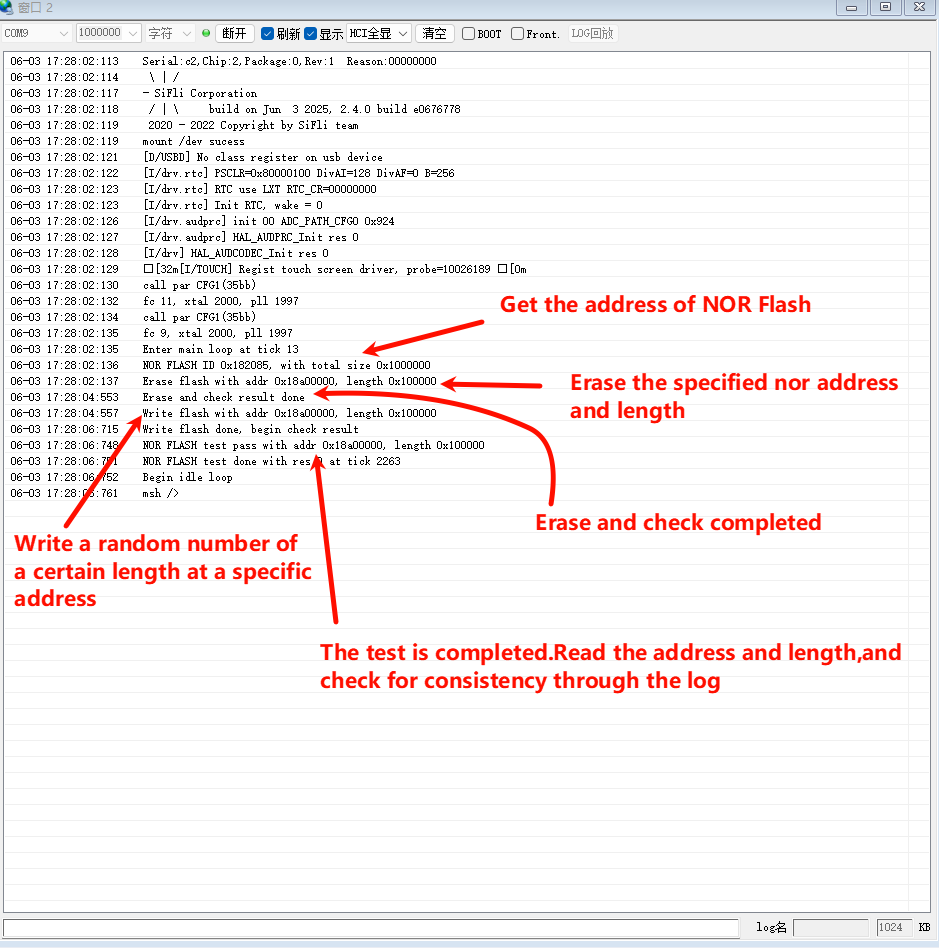

# nor_flash
## Overview
nor_flash is used to demonstrate the RT-Thread layer's NOR FLASH read, write, and erase function interfaces.

Before compilation, you need to configure the corresponding controller as a Nor interface. When the system starts, it will initialize Nor and perform bad block management information initialization. Applications do not need to pay attention to this part.

NOR FLASH erase operations need to be 4KB aligned (including address and length). There are no requirements for read and write operations.

## Supported Platforms
* sf32lb52-lcd_n16r8
* sf32lb56-lcd_n16r12n1
* sf32lb58-lcd_n16r64n4

## Example Usage
Taking sf32lb56-lcd_n16r12n1 as an example
### Compilation and Programming
* Compilation method: Switch to the project example project directory and run the scons command to compile the code:
```
scons --board=board_name -j8
For example: scons --board=sf32lb56-lcd_n16r12n1 -j8
```

* Download method: Enter the project directory and execute the build command to flash the compiled program
```
build_<board_name>_hcpu\download.bat(uart_download.bat)
<board_name>: board name
download.bat: used for jlink programming
uart_download.bat: used for serial port programming
For example: build_sf32lb56-lcd_n16r12n1_hcpu\download.bat
```
### Example Output Display
First, get the NOR device handle based on the address and confirm whether the address is valid
If invalid, the log will print: ```Address 0x%x not NOR FLASH```

Then get the NOR ID, total capacity (length)
Then perform erase processing
If erase fails, the log will print: ```FLASH ERASE fail %d ```

Check if erase is successful
If the check is not all 1s, the log will print: ```"Data not 0xffffffff but 0x%08x after erase at pos 0x%x ```

Then generate random numbers and write them to all pages in the entire block
If it fails, the log will print: ```Write flash fail ```

Finally read and verify
If the read data is inconsistent with the written data, the log will print: ```compare flash fail ```

### Troubleshooting
If the log does not show the expected log and phenomena, you can troubleshoot from the following aspects:
* Whether the hardware connection is normal
* Check if the USB cable has data transmission capability
* Troubleshoot based on the information in the above log