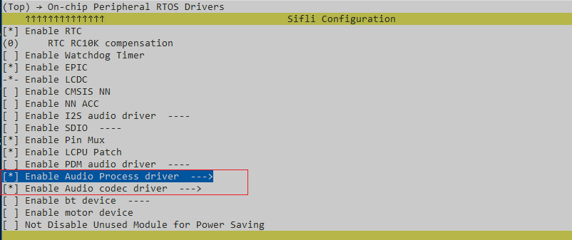

# PDM Example

Source path: example/rt_device/pdm

## Supported Platforms
<!-- Which boards and chip platforms are supported -->
+ sf32lb52-lcd_n16r8
+ eh-lb525

## Overview
<!-- Example introduction -->
This example demonstrates PDM recording, including:
+ Recording via PDM, PCM data saved to Flash (raw write).
+ Read recorded data and playback.


## Example Usage
<!-- Explain how to use the example, such as which hardware pins to connect to observe waveforms, compilation and flashing can reference related documentation.
For rt_device examples, you also need to list the configuration switches used by this example, such as PWM example using PWM1, which needs to be enabled in the onchip menu -->

### Hardware Requirements
Before running this example, you need to prepare:
+ One development board supported by this example ([Supported platforms](quick_start)).
+ PDM
+ Speaker.

### menuconfig Configuration

1. Enable PDM (using PDM1 here)


2. Enable AUDIO CODEC and AUDIO PROC:

3. Enable AUDIO(`AUDIO`):

4. Enable AUDIO MANAGER.(`AUDIO_USING_MANAGER`)


```{tip}
Configurations 3 and 4 are for playing recorded files. In this example, recording playback uses Audio manager interface.
```  

### Hardware Connection\PIN CONFIG
|Development Board  | PDM       | PDM1_CLK    | PDM1_DATA   |   Power Supply | GND | SEL(left/right channel selection) |
|--------|------------|---------------|-------------------|---|---|---|
|SF32LB52_DevKit-LCD    | PDM1     | PAD_PA22/PAD_PA07    | PAD_PA23/PAD_PA08 |   3.3V | GND | GND/3.3V |

```{tip}
+ When there are two PDM channels, SEL is used to distinguish left and right channels.
+ When there is one PDM channel, SEL can be left floating.
```

Taking `SF32LB52_DevKit-LCD` as an example, using `PA07/PA08` as `PDM1_CLK/PDM1_DATA`, pin configuration is as follows:
```C
    /* PIN CONFIG */
#ifdef SOC_SF32LB52X
#if !defined(BSP_USING_LCD) && defined(BSP_USING_PDM1)
    HAL_PIN_Set(PAD_PA07, PDM1_CLK, PIN_NOPULL, 1);
    HAL_PIN_Set(PAD_PA08, PDM1_DATA, PIN_PULLDOWN, 1);
#endif
#endif
````


```{warning}
On `SF32LB52_DevKit-LCD`:  
+ `PA07/PA08` will be used when LCD is configured, pay attention to conflicts (need to disable LCD: `BSP_USING_LCD = n BSP_USING_LCDC = n`).
+ `PA22/PA23` will be used when 32k is configured, pay attention to conflicts (need to disable 32k: `LXT_DISALBE = y`).  

For other form factors, you need to refer to the specification to select pins.
```


### Compilation and Programming
Switch to the example project directory and run the scons command to execute compilation:
```c
> scons --board=sf32lb52-lcd_n16r8 -j32
```
Switch to the example `project/build_xx` directory and run `uart_download.bat`, select the port as prompted to download:
```c
$ ./uart_download.bat

     Uart Download

please input the serial port num:5
```
For detailed steps on compilation and downloading, please refer to the relevant introduction in [Quick Start](quick_start).

## Expected Results
<!-- Explain the example running results, such as which LEDs will light up, what logs will be printed, so that users can judge whether the example is running normally. The running results can be explained step by step combined with the code -->
This example operates recording and playback through FINSH commands:
1. Start recording command: `pdm open [channel selection] [depth] [sampling rate]`  
For example:
+ `pdm open 1 16 16000`  
Means configure for left channel, 16-bit, 16k sampling rate recording.
+ `pdm open 2 16 16000`  
Means configure for dual channel (stereo), 16-bit, 16k sampling rate recording.

2. End recording command: `pdm stop`
+ `pdm stop`  
Means end recording.

3. Playback recording command: `pdm play [channel count] [depth] [sampling rate]`  
For example:
+ `pdm play 1 16 16000`  
Means playback mono, 16k sampling rate, 16-bit recorded data.
+ `pdm play 2 16 16000`  
Means playback dual channel, 16k sampling rate, 16-bit recorded data.

After executing recording and then playback, normal recording and playback can be achieved.  

Serial port log output reference:
```c
// Start pdm recording (erasing flash takes some time)
12-29 11:55:48:261 TX:pdm open 2 16 16000
12-29 11:55:48:287    example_pdm_record_start
12-29 11:55:48:293    [I/drv.pdm_audio] PDM audio init
12-29 11:55:48:301    PDM opened
12-29 11:55:48:308    pdm_record_init
12-29 11:55:48:315    erasing flash.
12-29 11:55:58:295    erase finished.
12-29 11:55:58:301    CONFIG ch 2 samplefmt 16 samplerate 16000
12-29 11:55:58:312    [I/drv.pdm_audio] Config PDM channel 2, depth 16, samplerate 16000
12-29 11:55:58:320    
12-29 11:55:58:328    [I/drv.pdm_audio] bf0_audio_init len=1280, hdmarx=20038598
// Stop recording
12-29 11:56:51:055 TX:pdm stop
12-29 11:56:51:072    example_pdm_record_stop
12-29 11:56:51:077    [I/drv.pdm_audio] PDM audio stop
12-29 11:56:51:086    [I/drv.pdm_audio] PDM audio stop
12-29 11:56:51:095    pdm_record_deinit
12-29 11:56:51:104    g_wr_cache_offset 101120 g_saved_size 3276800 align_size 100352
12-29 11:56:51:288    FINSH. Total size : 0x338800
// Playback
12-29 11:57:06:101 TX:pdm play 2 16 16000
12-29 11:57:06:117    pdm_record_play
12-29 11:57:06:122    [I/drv.audprc] set g_eq_enable=1
12-29 11:57:06:128    [I/drv.audcodec] dac set volume: prc=0 codec=-28
12-29 11:57:06:139    
12-29 11:57:06:146    [I/drv.audcodec] codec dac mute set:1
12-29 11:57:06:154    
12-29 11:57:06:161    [I/drv.audprc] samplerate = 16000, select voice eq
12-29 11:57:06:169    
12-29 11:57:06:176    [I/drv.audprc] -----tx dma size = 1600
12-29 11:57:06:182    [I/drv.audcodec] pll config state:1, samplerate:0 
12-29 11:57:06:190    
12-29 11:57:06:200    sifli_aw8155 to do power handle 
12-29 11:57:06:207    sifli_aw8155_start,mode:1 10
12-29 11:57:06:243    [I/drv.audcodec] codec dac mute set:0
12-29 11:57:06:253    
12-29 11:57:06:259    audio_callback_play cmd= 0
12-29 11:57:06:267    PDM start play. g_play_client 537065664 samplefmt 16 samplerate 16000
12-29 11:57:06:273    audio_callback_play cmd= 4
12-29 11:57:06:280    g_saved_size 3377152 POS 0
12-29 11:57:06:290    [I/drv.audcodec] dac set volume: prc=0 codec=-8
12-29 11:57:06:296    
12-29 11:57:06:304    audio_callback_play cmd= 4
12-29 11:57:06:312    g_saved_size 3377152 POS 2048
12-29 11:57:06:319    audio_callback_play cmd= 4
12-29 11:57:06:325    g_saved_size 3377152 POS 4096
12-29 11:57:06:332    audio_callback_play cmd= 4
12-29 11:57:06:338    g_saved_size 3377152 POS 6144
12-29 11:57:06:347    audio_callback_play cmd= 3
... ...
// Playback completed
12-29 11:57:59:013    PDM play end.
12-29 11:57:59:014    audio_callback_play cmd= 1
12-29 11:57:59:014    sifli_aw8155_stop 
12-29 11:57:59:015    [I/drv.audcodec] codec dac mute set:1
12-29 11:57:59:016    
12-29 11:57:59:016    [I/drv.audcodec] bf0_audio_stop 0x100
12-29 11:57:59:017    
12-29 11:57:59:018    [I/drv.audcodec] audcodec close dac
12-29 11:57:59:019    [I/drv.audcodec] bf0_audio_stop 0x100 done
12-29 11:57:59:019    
12-29 11:57:59:020    [I/drv.audprc] bf0_audio_stop 0x100
12-29 11:57:59:021    
12-29 11:57:59:021    [I/drv.audprc] audprc close adc/dac
12-29 11:57:59:023    [I/drv.audprc] bf0_audio_stop 0x100 done
12-29 11:57:59:024    
12-29 11:57:59:025    PLL disable
```

## Exception Diagnosis


## Reference Documentation
<!-- For rt_device examples, the RT-Thread official website documentation provides more detailed explanations, you can add webpage links here, for example, refer to RT-Thread's [RTC documentation](https://www.rt-thread.org/document/site/#/rt-thread-version/rt-thread-standard/programming-manual/device/rtc/rtc) -->

## Update Log
|Version |Date   |Release Notes |
|:---|:---|:---|
|0.0.1 |12/2024 |Initial version |
| | | |
| | | |