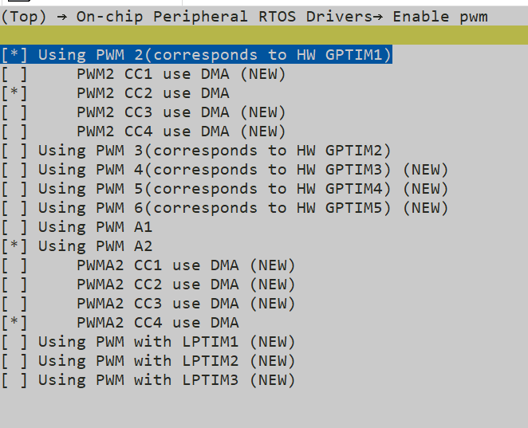

# PWM_DMA Example

Source path: example\rt_device\pwm
## Supported Platforms
The example can run on the following development boards.
* sf32lb52-lcd_n16r8
* sf32lb58-lcd_n16r64n4
## Overview
* Includes examples of Gtime, Atime using pwm+dma functionality to output PWM waveforms via IO ports


## Example Usage
### Hardware Requirements
Before running this example, you need to prepare a development board supported by this example

### menuconfig Configuration
sf32lb52-lcd_n16r8 menuconfig configuration

sf32lb58-lcd_n16r64n4 menuconfig configuration

**Note**: pwm setting already sets TIM configuration, check if Enable timer configuration causes conflicts


Similar conflict error:


### Compilation and Programming
Switch to the example project directory and run the scons command to execute compilation:

```
scons --board=sf32lb52-lcd_n16r8 -j8
```

Run `build_sf32lb52-lcd_n16r8_hcpu\uart_download.bat`, select the port as prompted to download:

```
build_sf32lb52-lcd_n16r8_hcpu\uart_download.bat

Uart Download

please input the serial port num:5
```

For detailed steps on compilation and downloading, please refer to the relevant introduction in [](/quickstart/get-started.md).
### Atime Output Waveform

### Gtime Output Waveform


#### Example Output Results Display:
* 52x log output:
```
Start atimer pwm demo!
[32m][2692] I/NO_TAG: pwm_set:percentage:90,period:1000000,freq:1000hz
[0m][32m][2721] I/NO_TAG: hwp_atim1_ccr1:107999
[0m][32m][2739] I/NO_TAG: hwp_atim1_arr:119999
[0m]DMA data before transfer:
pulse_dma_data[0]: 59999
pulse_dma_data[1]: 71999
pulse_dma_data[2]: 83999
atimer pwm demo end!
msh />Start gtimer pwm demo!
[32m][3471] I/NO_TAG: pwm_set:percentage:10,period:1000000,freq:1000hz
[0m][32m][3500] I/NO_TAG: hwp_gptim2_ccr1:2399
[0m][32m][3518] I/NO_TAG: hwp_gptim2_arr:23999
[0m]DMA data before transfer:
dma_data[0]: 4799
dma_data[1]: 7199
dma_data[2]: 9599
gtimer pwm demo end!
msh />
``` 

#### Pin Parameter Modification
* IO Output Modification

Physical position refers to the pin header position corresponding to the pin on the board

|Form Factor Name  | PWM       | Pin (Physical Position)            |    
|--------|---------------------------|-------------------|
|525    | GPTIM2_CH1/ATIM1_CH1          | PA20 (10)                  |   
|587  | GPTIM1_CH2/ATIM2_CH4      |PA51 (CONN2 28)                  |


```c
void pwm_dma_atim_set_example()
{
     #ifdef SF32LB52X
     HAL_PIN_Set(PAD_PA20, ATIM1_CH1, PIN_NOPULL, 1);//52x ATIM1_CH1 corresponds to pwma1_cc1
     #elif defined SF32LB58X
     HAL_PIN_Set(PAD_PA51, ATIM2_CH4, PIN_NOPULL, 1);//58X ATIM2_CH4 corresponds to pwma2_cc4
     #endif

     #ifdef SF32LB52X
     config_atim.channel = 1;//pwm config
     #elif defined SF32LB58X
     config_atim.channel = 4;//58 pwm config
     #endif

     //Set basic data（ARR,CRR） and calculate pulse
     rt_device_control((struct rt_device *)device,PWM_CMD_SET,(void *)&config_atim);
     //dma_transfer
     rt_device_control((struct rt_device *)device,PWM_CMD_ENABLE,(void *)&config_atim);

}

void pwm_dma_gptim_set_example()
{
     #ifdef SF32LB52X
     HAL_PIN_Set(PAD_PA20, GPTIM2_CH1, PIN_NOPULL, 1);//52x gtime2_ch1 corresponds to pwm3_cc1
     #elif defined SF32LB58X
     HAL_PIN_Set(PAD_PA51, GPTIM1_CH2, PIN_NOPULL, 1);//58X gtime1_ch2 corresponds to pwm2_cc2
     #endif

     #ifdef SF32LB52X
     config_gtim.channel = 1;//pwm config
     #elif defined SF32LB58X
     config_gtim.channel = 2;//58 pwm config
     #endif

     rt_device_control((struct rt_device *)device,PWM_CMD_SET,(void *)&config_gtim);
     //dma_transfer
     rt_device_control((struct rt_device *)device,PWM_CMD_ENABLE,(void *)&config_gtim);
}


```
**Note**: 
1. Except for 55x chips, can be configured to any IO with PA_TIM function to output PWM waveform
2. The last parameter of HAL_PIN_Set is hcpu/lcpu selection, 1: select hcpu, 0: select lcpu 
* PWM period, pulse width modification
```c
     uint32_t period = PWM_PERIOD;
     uint8_t percentage = 10;
     rt_uint32_t pulse = (percentage % 100) * period / 100;

    config_gtim.period = period;
    config_gtim.pulse = pulse;
    config_gtim.use_percentage = 1;//Enables the percentage calculation of pulse
    config_gtim.data_len = 3;//dma_data_len
```


## Exception Diagnosis
If the expected log and PWM waveform output don't appear, you can troubleshoot from the following aspects:
* Whether hardware connection is normal
* Whether pin configuration is correct 
* Whether the selected pin mode conflicts or mismatches


## Reference Documentation
- For rt_device examples, the RT-Thread official website documentation provides more detailed explanations, you can add webpage links here, for example, refer to RT-Thread's [RTC documentation](https://www.rt-thread.org/document/site/#/rt-thread-version/rt-thread-standard/programming-manual/device/rtc/rtc)

## Update Log
|Version |Date   |Release Notes |
|:---|:---|:---|
|0.0.1 |10/2024 |Initial version |
|0.0.2 | 12/2024| 2.0|
| | | |