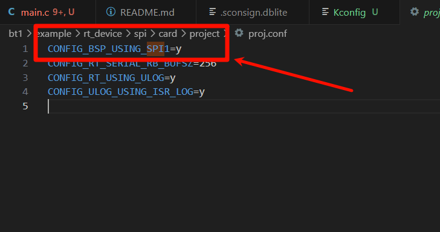
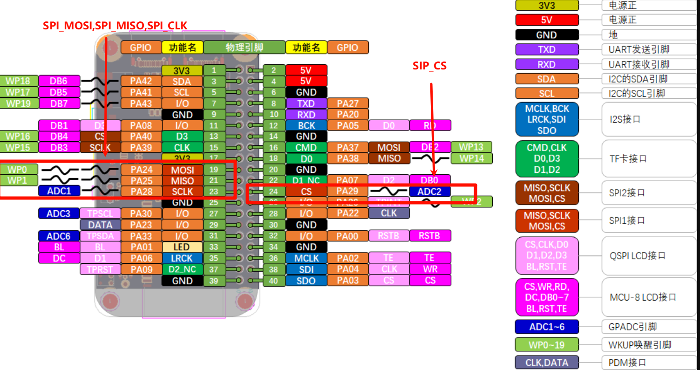
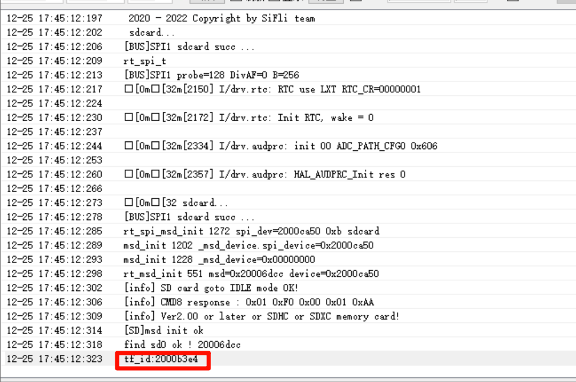
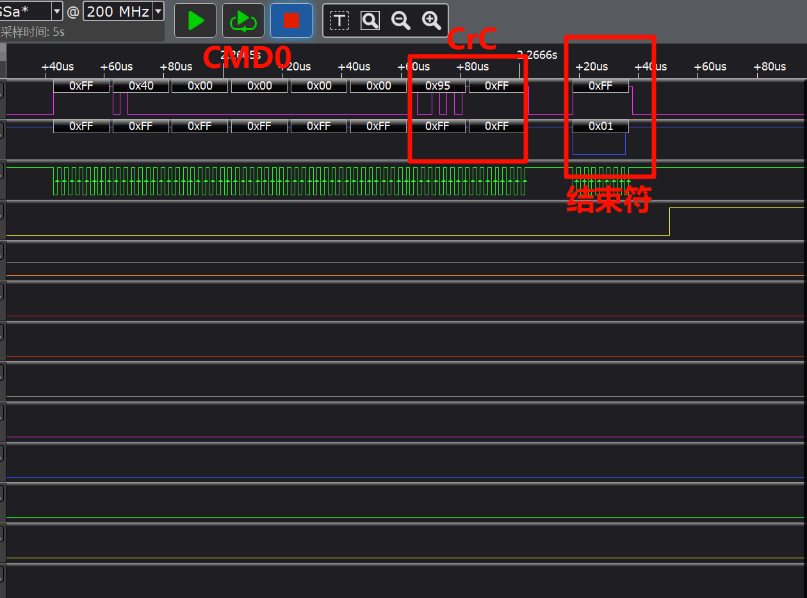
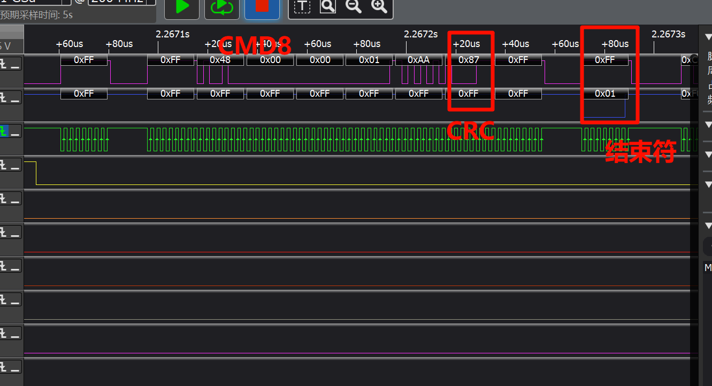
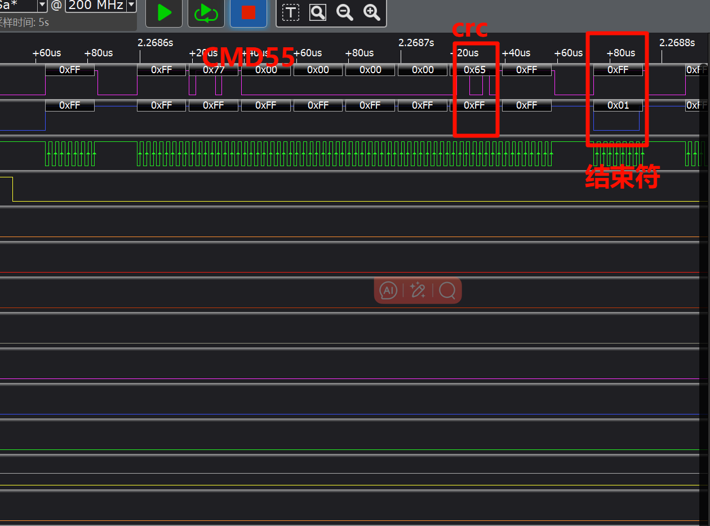
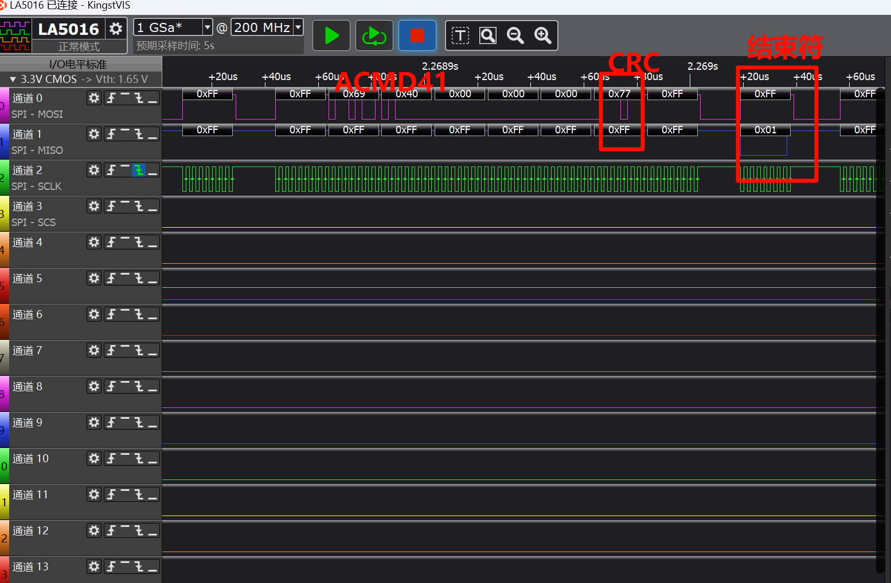
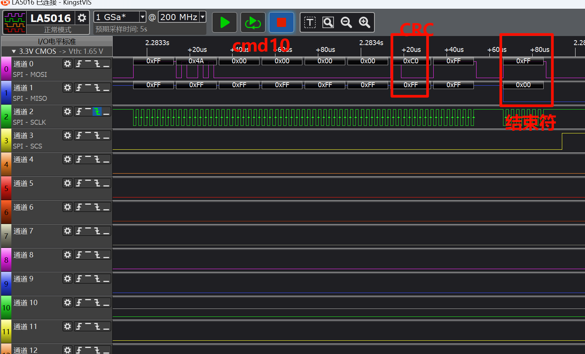

# Using SPI to Read TF Card ID Through CMD Instructions
Source code path: example\rt_device\spi
## Supported Platforms
* sf32lb52-lcd_n16r8
* sf32lb58-lcd_n16r64n4

## Overview
* Under RT-Thread operating system, demonstrate reading TF card ID by sending CMD instructions through SPI interface

## Example Usage
### Compilation and Programming
#### Using sf32lb52-lcd_52d as Example
* This example uses spi1. When using RT-Thread operating system, spi1 peripheral will be virtualized as an rt_device for read and write operations. At this time, you need to confirm whether the `rtconfig.h` file in the path contains the following 2 macros:
```c
#define BSP_USING_SPI 1
#define BSP_USING_SPI1 1
```
Only when the above two macros are included, the `rt_hw_spi_device_attach` function will create the `spi1` rt_device in the `rt_spi_msd_init` function. Only after the device is created can `rt_device_find` and `rt_device_open` succeed later.

If the above macros are missing or not enabled, they can be enabled through the `menuconfig` menu with the following operations:
```
menuconfig --board=sf32lb52-lcd_52d
```
As shown in the figure below, select SPI1 enable (DMA is needed, select corresponding DMA option), save and exit menuconfig, check if `rtconfig.h` macro is generated



* Switch to project example directory and run scons command for code compilation:
```
scons --board=sf32lb52-lcd_52d -j8
```
* Switch to example `project/build_xx` directory and run `uart_download.bat`, select port as prompted to download:

>`build_sf32lb52-lcd_52d_hcpu\uart_download.bat`//Download code

>`Uart Download`

>`please input the serial port num:5`

For detailed steps on compilation and downloading, please refer to [](/quickstart/get-started.md) related introduction.

### Hardware Connection
```{eval-rst}
+-------------------+--------------+------------------+-------------------+----------------------+
| Development Board | Function Pin | Local Device Pin | Remote Device Pin | Physical Pin (CONN2) |
+===================+==============+==================+===================+======================+
| sf32lb52-lcd      | PA_24        | dio              | SPI_MOSI          | 19                   |
+                   +--------------+------------------+-------------------+----------------------+
|                   | PA_25        | di               | SPI_MISO          | 21                   |
+                   +--------------+------------------+-------------------+----------------------+
|                   | PA_28        | clk              | SPI_CLK           | 23                   |
+                   +--------------+------------------+-------------------+----------------------+
|                   | PA_29        | cs               | SPI_CS            | 24                   |
+-------------------+--------------+------------------+-------------------+----------------------+
| sf32lb58-lcd      | PA_21        | dio              | SPI_MOSI          | 8                    |
+                   +--------------+------------------+-------------------+----------------------+
|                   | PA_20        | di               | SPI_MISO          | 10                   |
+                   +--------------+------------------+-------------------+----------------------+
|                   | PA_28        | clk              | SPI_CLK           | 5                    |
+                   +--------------+------------------+-------------------+----------------------+
|                   | PA_29        | cs               | SPI_CS            | 3                    |
+-------------------+--------------+------------------+-------------------+----------------------+

```
* Note that function pins and device pins do not have a one-to-one correspondence. Please refer to schematic for device pins

### Example Output Results Display

Log print results for successful or failed ID reading are as follows
* If no TF card is inserted or reading fails, log prints:
```c
[err]SD card goto IDLE mode timeout
[SD]msd init failed,spi_dev=xxxxxxxx 
```
* If ID reading is successful, log prints:
```
 [SD] msd init ok
 find sd0 ok!
 tf_id:2000b3e4(last four digits are TF card ID in hex)
 ``` 

The figure below shows captured waveforms of sending CMD instructions
CMD0 waveform (send CMD0 to set device to SPI mode)

CMD8 waveform (verify if card protocol is SD2.0)

CMD55 waveform (special instruction prefix command, needs to be sent before sending ACMD class instructions)

ACMD41 waveform (get SD voltage value, test current SD card support protocol, check if required voltage value is normal)

CMD10 waveform (read CID information)

**Note** 
1. If using TX DMA, you need to enable `#define BSP_SPI1_TX_USING_DMA 1`;
2. When SPI data volume is small, using DMA increases code overhead and actually reduces real-time performance;

* Using sf32lb52-lcd_52d development board as example, configure corresponding spi1 IO ports
```c
    /* 1, pinmux set to spi1 mode */
    HAL_PIN_Set(PAD_PA24, SPI1_DIO, PIN_PULLDOWN, 1);       // SPI1 (Nor flash)
    HAL_PIN_Set(PAD_PA25, SPI1_DI,  PIN_PULLUP, 1);
    HAL_PIN_Set(PAD_PA28, SPI1_CLK, PIN_NOPULL, 1);
    HAL_PIN_Set(PAD_PA29, SPI1_CS,  PIN_NOPULL, 1);
```
**Note**
1. CLK and CS are output ports, no need to configure pull-up/pull-down state
2. DIO and DI ports are input ports, need to configure pull-up/pull-down. If peripheral has no special requirements, use these default values
3. HAL_PIN_Set last parameter is for hcpu/lcpu selection, 1: select hcpu, 0: select lcpu
4. Hcpu PA ports cannot be configured for Lcpu spi peripherals, such as spi3, spi4 output
* Use `rt_device_find`, `rt_device_control`, `rt_device_open` sequentially to find, configure, and open `spi` device
1. rt-thread defines multiple devices to adapt different devices using the same spi bus. Need to attach `spi1` device to this device through rt_hw_spi_device_attach, here it's `tfcord`

## Workflow
1. Use rt_spi_msd_init() function for SPI device registration
2. Use msd_init() function for device initialization and mount tfcord device on sd device
3. Use rt_msd_init() function for device conversion and spi parameter configuration, send a series of CMD instructions to initialize TF card and read data from its cid register to get its ID

## Exception Diagnosis
* No spi1 waveform output
1. Use `pin status 24/25/28/29` command to check corresponding PA24, PA25, PA28, PA29 IO status FUNC. PA29 as CS pin should be high level, corresponding VAL=1
```
    msh />
 TX:pin status 24
    pin status 24
    [32m[109951461] I/TEST.GPIO: PIN 24, FUNC=2, VAL=0, DIG_IO_PD, GPIO_MODE_INPUT, irqhdr=/, arg=/
    [0mmsh />
    msh />
 TX:pin status 25
    pin status 25
    [32m[110036013] I/TEST.GPIO: PIN 25, FUNC=2, VAL=1, DIG_IO_PU, GPIO_MODE_INPUT, irqhdr=/, arg=/
    [0mmsh />
    msh />
 TX:pin status 28
    pin status 28
    [32m[110115999] I/TEST.GPIO: PIN 28, FUNC=2, VAL=0, DIG_IO, GPIO_MODE_INPUT, irqhdr=/, arg=/
    [0mmsh />
    msh />
 TX:pin status 29
    pin status 29
    [32m[110195531] I/TEST.GPIO: PIN 29, FUNC=2, VAL=1, DIG_IO, GPIO_MODE_INPUT, irqhdr=/, arg=/
    [0mmsh />
    msh />

```
2. Use `list_device` command to check if `spi1`, `nor_flash` devices exist and are opened
3. Check if spi1 initialization and configuration process are all effective
* spi1 waveform normal, spi1 DI cannot receive data
1. First use oscilloscope to check if waveform level is normal
2. Use logic analyzer to capture timing, compare with peripheral specification to see if waveform requirements are consistent
3. Check if spi1 output and peripheral connection are normal
4. Check if peripheral power supply is normal
* spi waveform timing is insufficient
1. As shown in the figure, cs signal to clk actual data has excessive delay in between, this is due to delay caused by rt-thread encapsulation. If high timing requirements exist, refer to direct HAL operation examples
