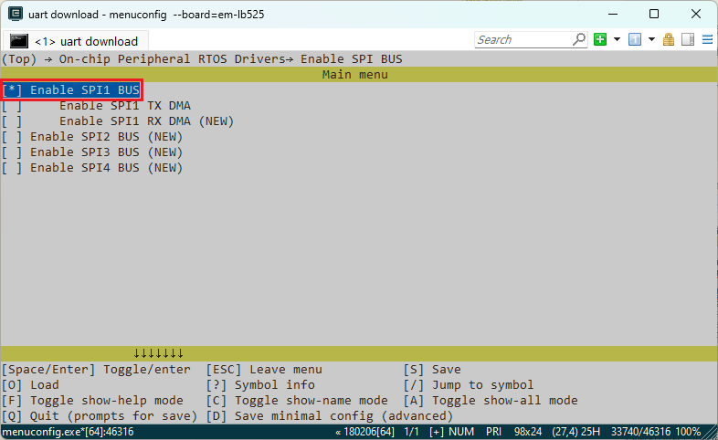
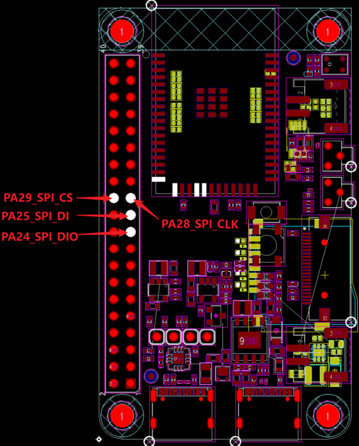
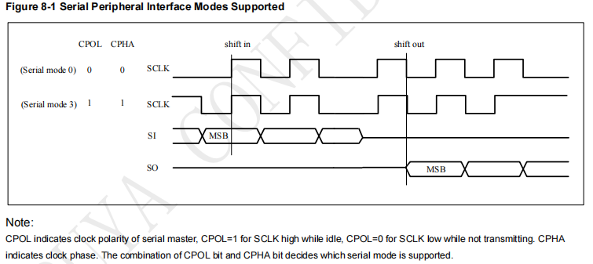

# SPI Example
Source code path: example\rt_device\spi
## Supported Platforms
The example can run on the following development boards:
* sf32lb52-lcd_n16r8
* sf32lb58-lcd_n16r64n4

## Overview
* Under RT-Thread operating system, demonstrate read and write operations on nor flash through spi interface

## Example Usage
### Compilation and Programming
#### Using sf32lb52-lcd_n16r8 as Example
* This example uses spi1. When using RT-Thread operating system, spi1 peripheral will be virtualized as an rt_device for read and write operations. At this time, you need to confirm whether the `rtconfig.h` file in the path contains the following 2 macros:
```c
#define BSP_USING_SPI 1
#define BSP_USING_SPI1 1
```
Only when the above two macros are included, the `rt_spi_bus_register` function will register the `"spi1"` `rt_device` in the `rt_hw_spi_bus_init` function, and then this device can be successfully found and opened with `rt_device_find` and `rt_device_open`.

If the above three macros are missing, you need to enable them through the following `menuconfig` command:
```c
menuconfig --board=sf32lb52-lcd_n16r8
```
As shown in the figure below, select spi1 (DMA is needed, select corresponding DMA option), save and exit menuconfig, check if `rtconfig.h` macro is generated

* Switch to example project directory and run scons command to execute compilation:
```c
> scons --board=sf32lb52-lcd_n16r8 -j8
```
* Switch to example `project/build_xx` directory and run `uart_download.bat`, select port as prompted to download:

>`build_sf32lb52-lcd_n16r8_hcpu\uart_download.bat`

>`Uart Download`

>`please input the serial port num:5`

For detailed steps on compilation and downloading, please refer to [Quick Start](quick_start) related introduction.

### Hardware Connection

```{eval-rst}
+-------------------+--------------+------------------+-------------------+----------------------+
| Development Board | Function Pin | Local Device Pin | Remote Device Pin | Physical Pin (CONN2) |
+===================+==============+==================+===================+======================+
| sf32lb52-lcd      | PA_24        | dio              | SPI_MOSI          | 19                   |
+                   +--------------+------------------+-------------------+----------------------+
|                   | PA_25        | di               | SPI_MISO          | 21                   |
+                   +--------------+------------------+-------------------+----------------------+
|                   | PA_28        | clk              | SPI_CLK           | 23                   |
+                   +--------------+------------------+-------------------+----------------------+
|                   | PA_29        | cs               | SPI_CS            | 24                   |
+-------------------+--------------+------------------+-------------------+----------------------+
| sf32lb58-lcd      | PA_21        | dio              | SPI_MOSI          | 8                    |
+                   +--------------+------------------+-------------------+----------------------+
|                   | PA_20        | di               | SPI_MISO          | 10                   |
+                   +--------------+------------------+-------------------+----------------------+
|                   | PA_28        | clk              | SPI_CLK           | 5                    |
+                   +--------------+------------------+-------------------+----------------------+
|                   | PA_29        | cs               | SPI_CS            | 3                    |
+-------------------+--------------+------------------+-------------------+----------------------+
```

      
sf32lb52-lcd_n16r8 hardware schematic reference as shown below:


#### Example Output Results Display:
* Log output:
```
  SFBL
  Serial:c2,Chip:4,Package:3,Rev:3  Reason:00000080
   \ | /
  - SiFli Corporation
   / | \     build on Oct 24 2024, 2.2.0 build 00000000
   2020 - 2022 Copyright by SiFli team
  mount /dev sucess
  [32m][1920] I/drv.rtc: PSCLR=0x80000100 DivAI=128 DivAF=0 B=256
  [0m][32m][1947] I/drv.rtc: RTC use LXT RTC_CR=00000001
  [0m][32m][1968] I/drv.rtc: Init RTC, wake = 0
  [0m][32m][2129] I/drv.audprc: init 00 ADC_PATH_CFG0 0x606
  [0m][32m][2152] I/drv.audprc: HAL_AUDPRC_Init res 0
  [0m][32m][2173] I/drv.audcodec: HAL_AUDCODEC_Init res 0
  [0m][32m][2195] I/TOUCH: Regist touch screen driver, probe=1203bcad 
  [0mcall par CFG1](35bb)
  fc 9, xtal 2000, pll 2052
  call par CFG1(35bb)
  fc 9, xtal 2000, pll 2052
  Start spi demo!
  msh />
  [35017] D/spi1: Find spi bus spi1:20008184
  [35036] D/spi1: rt_spi_configure result:0
  [38320] D/spi1: rt_spi_transfer recv reg:9f value:85
  spi read:0x85,0x20,0x18,0x85,0x20,0x18,0x85,0x20,0x18,0x85,0x20,0x18,0x85,0x20,0x18,0x85,
  [38375] D/spi1: spidev_register_write addr:0x2 value:0x33
  spi demo end!
```
The figure below shows captured waveform of the first half of `spidev_register_read(reg,1,read_data, 16);`:

```
```
#### spi1 Configuration Process
* Ensure `rtconfig.h` file contains the following 2 macros:
```c
#define BSP_USING_SPI 1
#define BSP_USING_SPI1 1
```
**Note** 
1. If using TX DMA, you need to enable `#define BSP_SPI1_TX_USING_DMA 1`;
2. When SPI data volume is small, using DMA increases code overhead and actually reduces real-time performance;

* Using sf32lb52-lcd development board as example, configure corresponding spi1 IO ports
```c
    /* 1, pinmux set to spi1 mode */
    HAL_PIN_Set(PAD_PA24, SPI1_DIO, PIN_PULLDOWN, 1);       // SPI1 (Nor flash)
    HAL_PIN_Set(PAD_PA25, SPI1_DI,  PIN_PULLUP, 1);
    HAL_PIN_Set(PAD_PA28, SPI1_CLK, PIN_NOPULL, 1);
    HAL_PIN_Set(PAD_PA29, SPI1_CS,  PIN_NOPULL, 1);
```
**Note**
1. CLK and CS are output ports, no need to configure pull-up/pull-down state
2. DIO and DI ports are input ports, need to configure pull-up/pull-down. If peripheral has no special requirements, use these default values
3. HAL_PIN_Set last parameter is for hcpu/lcpu selection, 1: select hcpu, 0: select lcpu
4. Hcpu PA ports cannot be configured for Lcpu spi peripherals, such as spi3, spi4 output
* Use `rt_device_find`, `rt_device_control`, `rt_device_open` sequentially to find, configure, and open `spi` device
1. rt-thread defines multiple devices to adapt different devices using the same spi bus. Need to attach `spi1` device to this device through rt_hw_spi_device_attach, here it's `nor_flash`
```c
#define NOR_FLASH_DEVICE_NAME     "nor_flash"

#define SPI_BUS_NAME "spi1"

static struct rt_spi_device *spi_dev_handle = {0};/* Define spi device operation handle */

static struct rt_spi_configuration spi_dev_cfg = {0}; /* Structure to configure spi */

rt_err_t spi_dev_init(void) 
{
    rt_err_t rst = RT_EOK;
    /* 1, pinmux set to spi1 mode */
#ifdef  SF32LB52X
    HAL_PIN_Set(PAD_PA24, SPI1_DIO, PIN_PULLDOWN, 1);       // SPI1 (Nor flash)
    HAL_PIN_Set(PAD_PA25, SPI1_DI,  PIN_PULLUP, 1);
    HAL_PIN_Set(PAD_PA28, SPI1_CLK, PIN_NOPULL, 1);
    HAL_PIN_Set(PAD_PA29, SPI1_CS,  PIN_NOPULL, 1);

#elif defined(SF32LB58X)
    HAL_PIN_Set(PAD_PA21, SPI1_DO, PIN_PULLDOWN, 1);       // SPI1 (Nor flash)
    HAL_PIN_Set(PAD_PA20, SPI1_DI,  PIN_PULLUP, 1);
    HAL_PIN_Set(PAD_PA28, SPI1_CLK, PIN_NOPULL, 1);
    HAL_PIN_Set(PAD_PA29, SPI1_CS,  PIN_NOPULL, 1);
#endif
    /* 2, find/open/config spi1 device  */
    rt_device_t spi_bus = rt_device_find(SPI_BUS_NAME);

    if (spi_bus)
    {
		rt_device_open(spi_bus, RT_DEVICE_FLAG_RDWR);
		LOG_D("Find spi bus %s:%x\n", SPI_BUS_NAME, spi_bus);
        spi_dev_handle = (struct rt_spi_device *)rt_device_find(NOR_FLASH_DEVICE_NAME);
        if (spi_dev_handle == NULL)
        {
            rst = rt_hw_spi_device_attach(SPI_BUS_NAME, NOR_FLASH_DEVICE_NAME);
            spi_dev_handle = (struct rt_spi_device *)rt_device_find(NOR_FLASH_DEVICE_NAME);
            if (spi_dev_handle == NULL)
            {
                LOG_E("Register spi_dev spi device fail\n");
                return -RT_ERROR;
            }
        }
        /* Need to use interrupt or DMA, OR with corresponding parameters */
        rst = rt_device_open((rt_device_t)(spi_dev_handle), RT_DEVICE_FLAG_RDWR);//|RT_DEVICE_FLAG_DMA_TX);

        spi_dev_cfg.data_width = 8; //bit
        spi_dev_cfg.max_hz = 20 * 1000 * 1000; // hz
        spi_dev_cfg.mode = RT_SPI_MODE_0 | RT_SPI_MSB | RT_SPI_MASTER;
        spi_dev_cfg.frameMode = RT_SPI_MOTO; //RT_SPI_TI;
        rst = rt_spi_configure(spi_dev_handle, &spi_dev_cfg);
        LOG_D("rt_spi_configure result:%d", rst);
    }

    /* rt_pin_mode(spi_dev_CS_PIN, PIN_MODE_OUTPUT); */
    /* rt_pin_write(spi_dev_CS_PIN, PIN_HIGH); */

    return rst;
}
```
* spi parameter configuration
```c
/* Data width, parameters 8, 16 correspond to 8bit, 16bit */
    spi_dev_cfg.data_width = 8; //bit
/* spi clk frequency in hz */
    spi_dev_cfg.max_hz = 20 * 1000 * 1000; // hz
/**
RT_SPI_MODE_0: select mode 0-3;
RT_SPI_MSB: bit7 is sent first in one byte, bit0 is sent last;
RT_SPI_MASTER: spi master mode (slave mode not demonstrated here)
*/
    spi_dev_cfg.mode = RT_SPI_MODE_0 | RT_SPI_MSB | RT_SPI_MASTER;
```
1. RT_SPI_MODE_0 (0-3) corresponds to the 4 spi modes shown below. The difference between the 4 modes is the level state when clk is idle, and whether the first or second clk rising edge samples data
2. MODE0, MODE1 have low level when clk is idle, MODE1 and MODE3 sample DIO or DI data on the second clk rising edge after CS is pulled low

3. The nor flash specification used in the example indicates that both MODE0 and MODE3 are supported

* spi send and receive data
```c
    uint8_t reg_data[] = {0x02,0x11,0x22,0x33,0x44,0x55,0x66,0x77,0x88,0x99,0xaa,0xbb,0xcc,0xdd,0xee,0xff};
    uint8_t reg[2] = {0x9f,0xff};
    uint8_t read_data[16] = {0};
    /* Send a single byte 0xFF */
    spidev_write(&reg[1],1);
    /* Send a byte 0x9f command, then read 16 bytes of data */
    spidev_register_read(reg,1,read_data, 16);
    /* Print out the read data */
    rt_kprintf("spi read:");
    for(uint8_t i = 0; i < 16; i++)
    {
        rt_kprintf("0x%x,",read_data[i]);
    }
    rt_kprintf("\n");
     /* Send 3 bytes first, then send 13 bytes */   
    spidev_register_write(reg_data,3,&reg_data[3],13);
```
* After enabling `finsh` functionality, you can input `list_device` in log serial terminal to check if `spi1` and `nor_flash` are in open status. 0 means device is registered, 1,2 means number of times device is opened

```c
    msh />
 TX:list_device
    list_device
    device           type         ref count
    -------- -------------------- ----------
    nor_flas SPI Device           1       
    audcodec Sound Device         0       
    audprc   Sound Device         0       
    rtc      RTC                  0       
    pwm3     Miscellaneous Device 0       
    touch    Graphic Device       0       
    lcdlight Character Device     0       
    lcd      Graphic Device       0       
    i2c4     I2C Bus              0       
    i2c1     I2C Bus              0       
    spi1     SPI Bus              1       
    lptim1   Timer Device         0       
    btim1    Timer Device         0       
    uart2    Character Device     0       
    uart1    Character Device     2       
    pin      Miscellaneous Device 0       
    msh />
```
* This only demonstrates one recommended usage of spi as master. For other operation methods under rt-thread operating system, refer to rt-thread official website user manual


## Exception Diagnosis
* No spi1 waveform output
1. Use `pin status 24/25/28/29` command to check corresponding PA24, PA25, PA28, PA29 IO status FUNC. PA29 as CS pin should be high level, corresponding VAL=1
```
    msh />
 TX:pin status 24
    pin status 24
    [32m[109951461] I/TEST.GPIO: PIN 24, FUNC=2, VAL=0, DIG_IO_PD, GPIO_MODE_INPUT, irqhdr=/, arg=/
    [0mmsh />
    msh />
 TX:pin status 25
    pin status 25
    [32m[110036013] I/TEST.GPIO: PIN 25, FUNC=2, VAL=1, DIG_IO_PU, GPIO_MODE_INPUT, irqhdr=/, arg=/
    [0mmsh />
    msh />
 TX:pin status 28
    pin status 28
    [32m[110115999] I/TEST.GPIO: PIN 28, FUNC=2, VAL=0, DIG_IO, GPIO_MODE_INPUT, irqhdr=/, arg=/
    [0mmsh />
    msh />
 TX:pin status 29
    pin status 29
    [32m[110195531] I/TEST.GPIO: PIN 29, FUNC=2, VAL=1, DIG_IO, GPIO_MODE_INPUT, irqhdr=/, arg=/
    [0mmsh />
    msh />

```
2. Use `list_device` command to check if `spi1`, `nor_flash` devices exist and are opened
3. Check if spi1 initialization and configuration process are all effective
* spi1 waveform normal, spi1 DI cannot receive data
1. First use oscilloscope to check if waveform level is normal
2. Use logic analyzer to capture timing, compare with peripheral specification to see if waveform requirements are consistent
3. Check if spi1 output and peripheral connection are normal
4. Check if peripheral power supply is normal
* spi waveform timing is insufficient
1. As shown in the figure, cs signal to clk actual data has excessive delay in between, this is due to delay caused by rt-thread encapsulation. If high timing requirements exist, refer to direct HAL operation examples

## Reference Documents
* EH-SF32LB52X_Pin_config_V1.3.0_20231110.xlsx
* DS0052-SF32LB52x-芯片技术规格书 V0p3.pdf
* PY25Q128HA_datasheet_V1.1.pdf
* RT-Thread Official Website https://www.rt-thread.org/document/site/#/rt-thread-version/rt-thread-standard/programming-manual/device/spi/spi

## Update Log
|Version |Date   |Release Notes |
|:---|:---|:---|
|0.0.1 |10/2024 |Initial version |
| | | |