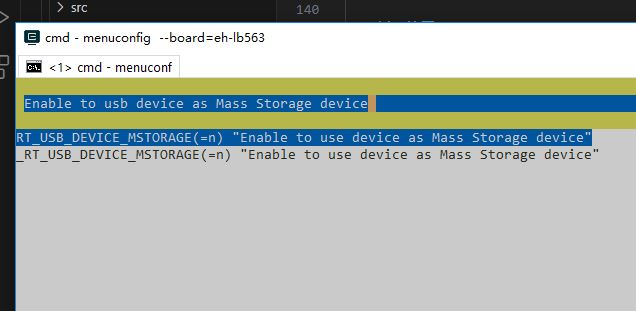
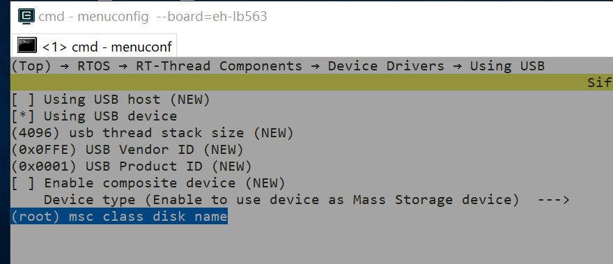
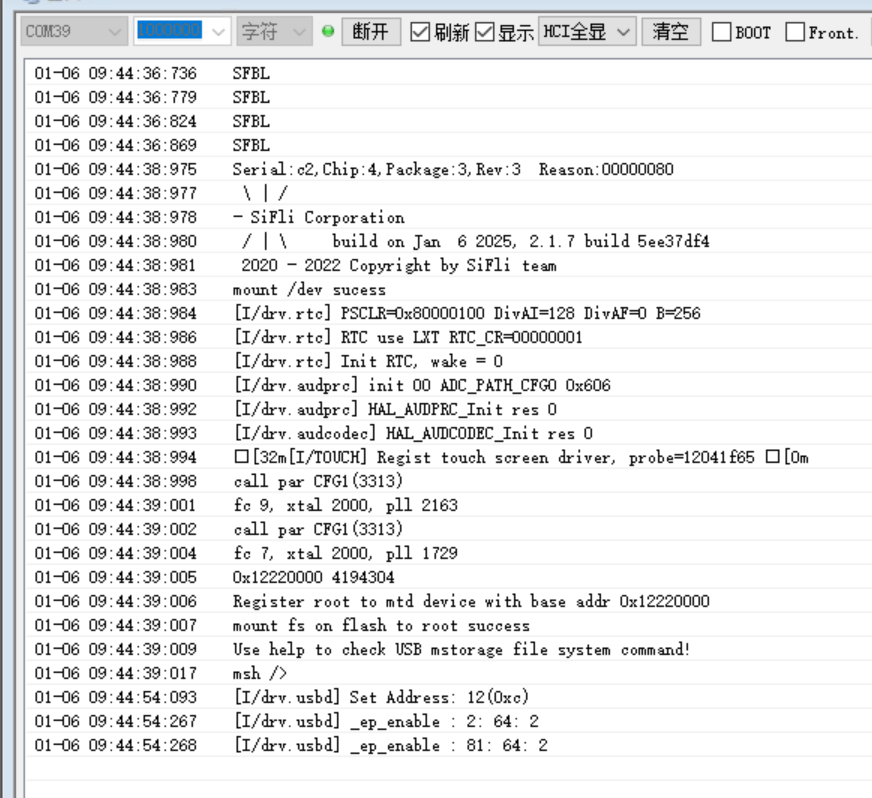

# USB_MSTORAGE Example
## Overview
The example demonstrates USB as a device functioning as a USB flash drive, which can mount local file system on PC.

## Supported Development Boards
The example can run on the following development boards:
* sf32lb52-lcd_n16r8


**Note:** Generally, examples run on the chip's HCPU. "eh-lb563_v2" is equivalent to "eh-lb563_v2_hcpu". If you want to run the example on LCPU, you can use "eh-lb563_v2_lcpu". Currently USB functionality temporarily only supports running on HCPU.

## Example Directory Structure
USB_MSTORAGE project contains 1 .c file (main.c). The tree structure below shows other files in the project directory.
```
|--Readme.md
|--src
|    |--main.c
|    |--Sconscript
|--project  
        |--Kconfig
        |--Kconfig.proj
        |--proj.conf
        |--rtconfig.py
        |--SConscript
        |--SConstruct
```
## Example Usage
### Hardware Requirements
1. To run the example, you need to have a development board that supports this example.
2. A USB data cable capable of data transmission.
3. HDK52X V1.2 version hardware needs the following changes:
| R0105 | R0710 | R0706 |
|-------|-------|-------|
|   NF  |   NF  |   NF  |

4. HDK56X V1.1 version hardware needs the following changes:
| R0210 | R0211 | R0202 | R0204 | R0634 | R0633 | R0132 | R0107 | R0103 | R0106 |
|-------|-------|-------|-------|-------|-------|-------|-------|-------|-------|
|   NF  |   NF  |   NF  |   NF  |   NF  |   NF  |   NF  |   NF  | 220K  | 390K  |
### Pin Configuration
**Note:** The table below shows pin configurations for VBUS control on each development board.
1. In HDK52X V1.2 version, USB insertion/removal pin uses NTC function pin multiplexing.
2. In HDK56X V1.1 version, USB DP and DM pins are multiplexed with UART1, so you need to change LOG print uart1 to uart4 and disable uart1.
|               |   vbus pin  |  DP  |  DM  |
|---------------|-------------|------|------|
|eh-lb523    |    PA32     | PA35 | PA36 |
|eh-lb520    |    PA32     | PA35 | PA36 |
|eh-lb525    |    PA32     | PA35 | PA36 |
|eh-lb561    |    PA51     | PA17 | PA18 |
|eh-lb563    |    PAXX     | PA17 | PA18 |

### menuconfig Configuration
```
//Execute command
menuconfig --board=sf32lb52-lcd_n16r8
```
**Note:** USB pins in HDK52X are not multiplexed with UART, so steps 1 and 2 can be skipped.

1. Configure log print serial port number "the device name for console"

2. Enable log print serial port uart4, disable uart1; "Enable UART4"


3. Enable USB device functionality; "Enable USB Device"


4. Configure USB insertion detection pin; "usb Insertion detetion PIN", configure it to corresponding pin number

5. Enable USB storage functionality; "Enable to usb device as Mass Storage device"


6. Configure USB mount file system partition;
If there is no DHARA functionality (used for NAND management and optimization) like HDK523, HDK561, you only need to modify "msc class disk name" to the file system partition name to be loaded for USB recognition.


If there is DHARA functionality (like 525, 563 using external NAND flash chip series), due to DHARA mapping existence, "msc class disk name" is the DHARA name after mapping: for example, currently 563HDK has only one partition with DHARA name dhara0.


### Compilation and Programming
Follow these steps to complete compilation and programming.

```
scons --board=sf32lb52-lcd_n16r8

.\build_sf32lb52-lcd_n16r8_hcpu\uart_download.bat
```

## Example Output Results Display
The following results show the log after the example runs on the development board. If you cannot see these logs, it means the example did not run successfully as expected and requires troubleshooting.
System startup

```
mount fs on flash to root success
usb_init
Use help to check USB mstorage file system command!
msh />usb_thread_entry
```

Log when USB is inserted and USB flash drive device is detected



## Troubleshooting
If expected log does not appear, troubleshooting can be done from the following aspects:
* Whether hardware connection is normal
* Whether pin configuration is correct
* Check if USB interface is loose
* Check if USB cable has data transmission capability
* Check if USB clock is 60MHz frequency

## Example Extension
 
If you want to modify VBUS detection pin number, you can modify as follows:
1. Modify configuration menuconfig --board=eh-lb525 and re-modify the parameter in "usb Insertion detection PIN" to the desired detection pin
D:\MyWork\code_sdk\siflisdk\customer\boards\ec-lb555xxx
2. Modify pinmux configuration file **"\siflisdk\customer\boards\ec-lb corresponding model directory\bsp_pinmux.c"**, configure this pin to GPIO mode;
```c
HAL_PIN_Set(PAD_PA32, GPIO_A32, PIN_NOPULL, 1);//USB VBUS
```

## Example Instance sf32lb52-lcd_52d

The following are instance steps for implementing USB flash drive functionality using sf32lb52-lcd_52d
### Hardware Requirements
* To run the example, you need to have a development board that supports this example.
* Two USB data cables capable of data transmission.

Insert two data cables into 52d interfaces and connect to PC. If PC shows "Unrecognized USB device", it may be due to:

* USB Device not enabled
* Hardware device not connected correctly
* USB interface is loose
* Connected data cable is damaged and cannot perform data transmission

Here are some solutions:
* Enter menu page through menuconfig --board=sf32lb52-lcd_52d command, enable Enable USB Device, then check register data for self-diagnosis


* Replace with a normally functioning data cable

When USB insertion can be recognized normally, you can proceed with file writing and programming

### Compilation and Programming
Execute the following commands to complete compilation and programming for -emlb52d.

```
scons --board=sf32lb52-lcd_52d -j8
build_sf32lb52-lcd_52d_hcpu\uart_download.bat

```

## Example Instance -emlb587

The following are instance steps for implementing USB flash drive functionality using -emlb587
### Hardware Requirements
* To run the example, you need to have a development board that supports this example.
* Two USB data cables capable of data transmission.
* A j-link for programming

After connecting link with development board and PC, proceed with file compilation and programming

### Compilation and Programming
Execute the following commands to complete compilation for -emlb587.

```
scons --board=sf32lb58-lcd_n16r64n4 -j8 
```

After compilation, open J-LINK connection tool, execute connect command to connect. If connection fails, check if serial port is occupied or other issues. After successful J-LINK connection, proceed with file programming

Execute the following commands to complete programming for -emlb587.

```
build_sf32lb58-lcd_n16r64n4_hcpu\download.bat 
```


### Example Implementation Effect

USB flash drive device appears in PC device list

