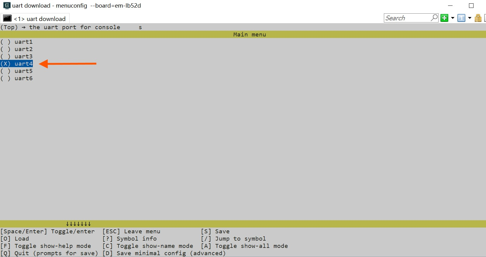
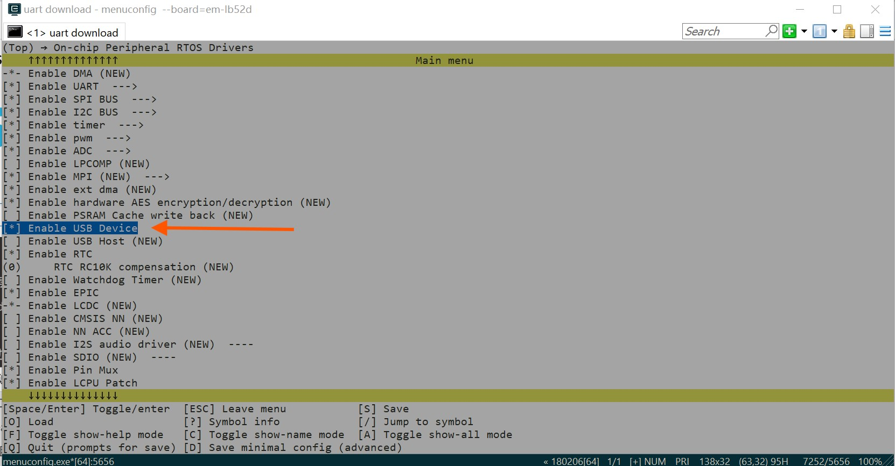
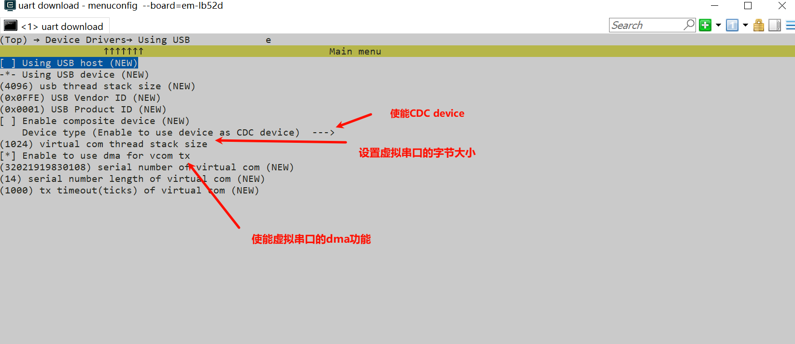
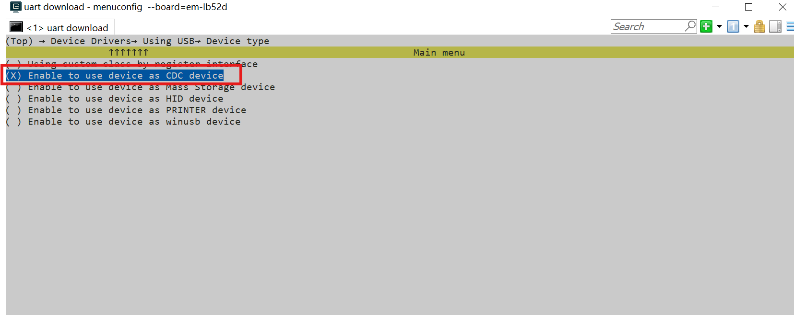
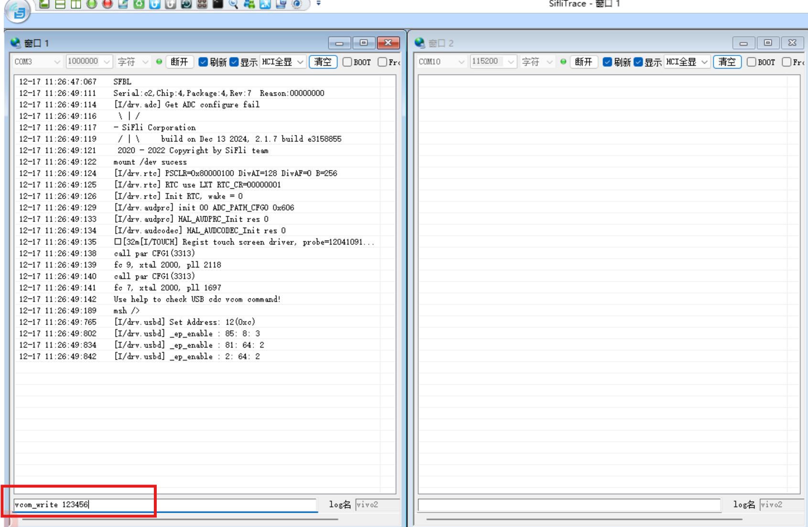
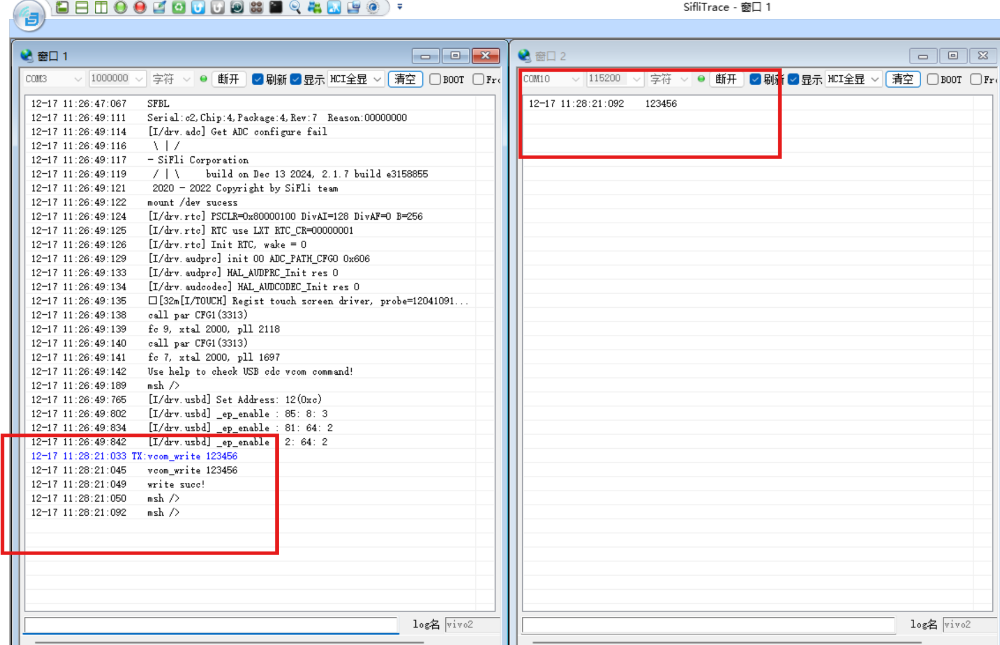
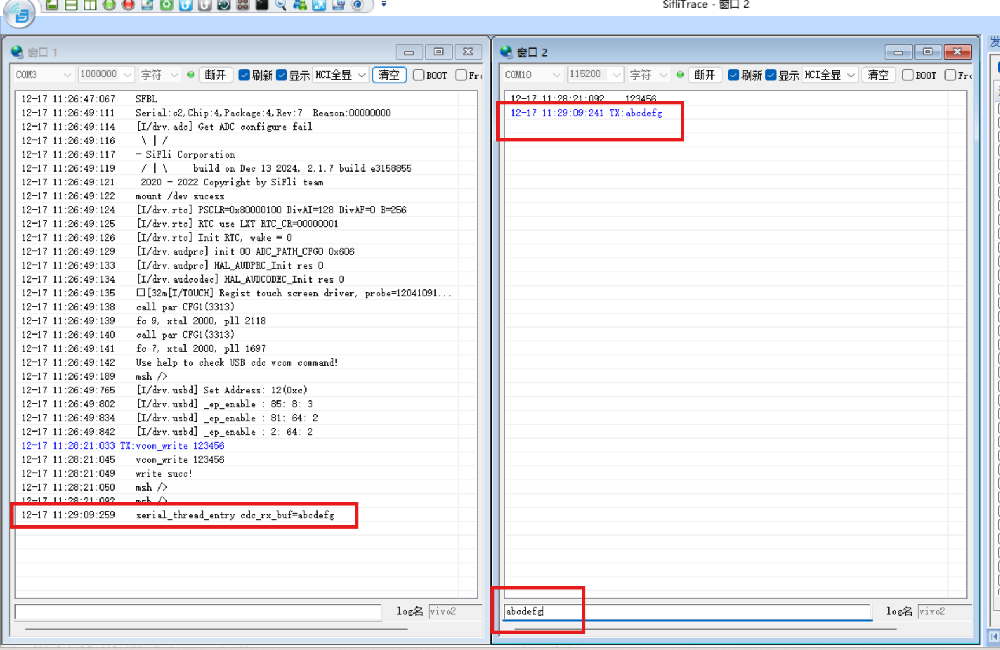
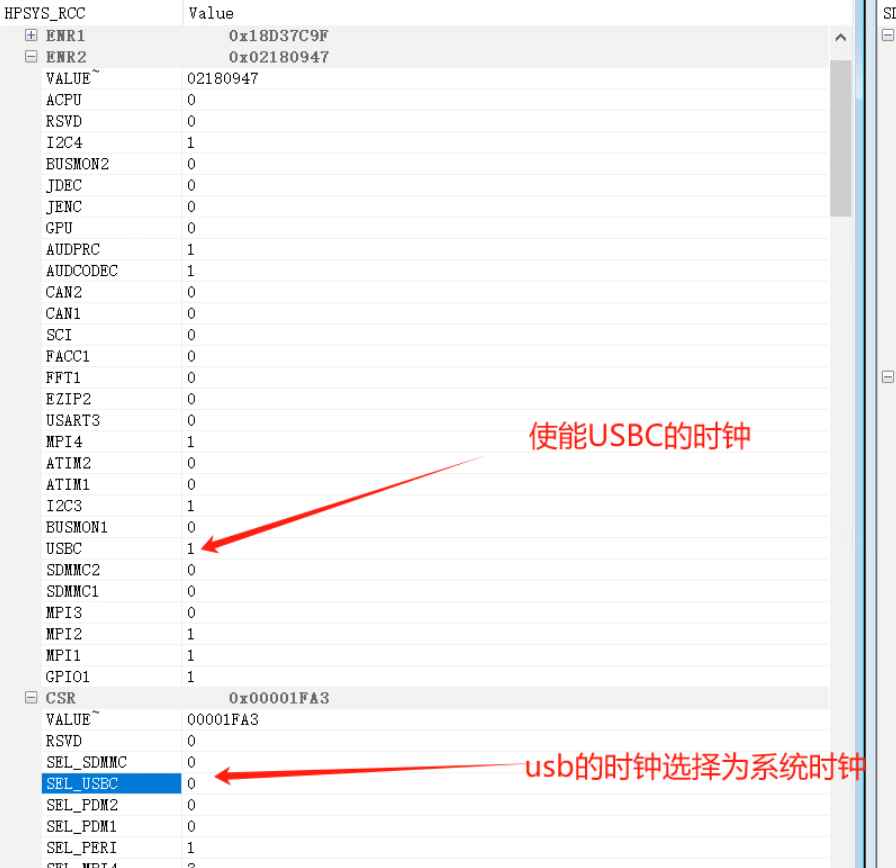
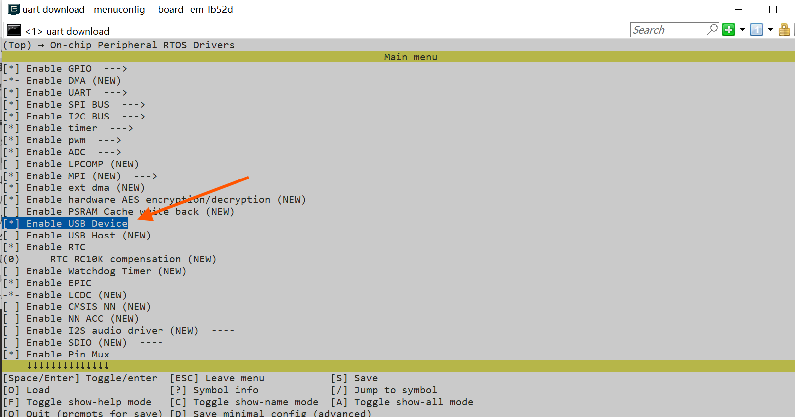

# USB_VCOM Example
## Overview
The example demonstrates USB as a device functioning as virtual serial port, which can access USB device through serial port on PC.

## Supported Development Boards
The example can run on the following development boards:<br>
* sf32lb52-lcd_n16r8
* sf32lb58-lcd_n16r64n4

**Note:** Generally, examples run on the chip's HCPU. "eh-lb563" is equivalent to "eh-lb563_hcpu". If you want to run the example on LCPU, you can use "eh-lb563_lcpu". Currently USB functionality temporarily only supports running on HCPU.

## Example Directory Structure
USB_MSTORAGE project contains 1 .c file (main.c). The tree structure below shows other files in the project directory.
```
|--Readme.md
|--src
|    |--main.c
|    |--Sconscript
|--project  
        |--Kconfig
        |--Kconfig.proj
        |--proj.conf
        |--rtconfig.py
        |--SConscript
        |--SConstruct
```
## Example Usage
### Hardware Requirements
1. To run the example, you need to have a development board that supports this example.
2. A USB data cable capable of data transmission.
3. HDK52X V1.2 version hardware needs the following changes:
| R0105 | R0710 | R0706 |
|-------|-------|-------|
|   NF  |   NF  |   NF  |

4. HDK56X V1.1 version hardware needs the following changes:
| R0210 | R0211 | R0202 | R0204 | R0634 | R0633 | R0132 | R0107 | R0103 | R0106 |
|-------|-------|-------|-------|-------|-------|-------|-------|-------|-------|
|   NF  |   NF  |   NF  |   NF  |   NF  |   NF  |   NF  |   NF  | 220K  | 390K  |
### Pin Configuration
**Note:** The table below shows pin configurations for VBUS control on each development board.
1. In HDK52X V1.2 version, USB insertion/removal pin uses NTC function pin multiplexing.
2. In HDK56X V1.1 version, USB DP and DM pins are multiplexed with UART1, so you need to change LOG print uart1 to uart4 and disable uart1.
|               |   vbus pin  |  DP  |  DM  |
|---------------|-------------|------|------|
|eh-lb523    |    PA32     | PA35 | PA36 |
|eh-lb520    |    PA32     | PA35 | PA36 |
|eh-lb525    |    PA32     | PA35 | PA36 |
|eh-lb561    |    PA51     | PA17 | PA18 |
|eh-lb563    |    PAXX     | PA17 | PA18 |

### menuconfig Configuration
```
//Execute command
menuconfig --board=sf32lb52-lcd_n16r8
```
**Note:** USB pins in HDK52X are not multiplexed with UART, so steps 1 and 2 can be skipped.

1. Configure log print serial port number "the device name for console"


2. Enable log print serial port uart4, disable uart1; "Enable UART4"


3. Enable USB device functionality; "Enable USB Device"
* In compilation interface, input `menuconfig --board=sf32lb52-lcd_52d` to enter menu, configure as follows under `(Top) → On-chip Peripheral RTOS Drivers`

* Under `(Top) → Device Drivers → Using USB`, enable CDC device, set virtual serial port character size, enable virtual serial port DMA functionality.

* Under `(Top) → Device Drivers → Using USB → Device type`, select CDC device


### Compilation and Programming
Follow these steps to complete compilation and programming.

```
scons --board=sf32lb52-lcd_n16r8 -j8
build_sf32lb52-lcd_n16r8_hcpu\uart_download.bat
```

(For operating different chip boards, just change the chip name, for example 587 board, just replace 'eh-lb525' with 'sf32lb58-lcd_n16r64n4')

## Example Output Results Display
The following results show the log after the example runs on the development board. If you cannot see these logs, it means the example did not run successfully as expected and requires troubleshooting.
System startup
```c
 usb_init
 Use help to check USB cdc vcom command!
 msh />
```
1. Serial port data transmission; input finsh command "vcom_write 123456" (using serial port tool SifliTrace)

```c
void vcom_write(int avgc, char **argv)
{
    rt_size_t len =  rt_device_write(usb_vcom, 0, argv[1], strlen(argv[1]));
    if (len != strlen(argv[1])) rt_kprintf("write fail!\n");
    else rt_kprintf("write succ!\n");
}
MSH_CMD_EXPORT(vcom_write, vcom write);
```
2. On corresponding PC serial port assistant, you can see received "123456"

3. Serial port data reception; send string on PC serial port assistant. HDK will print as follows: abcdefg
```c
    serial_thread_entry cdc_rx_buf=abcdefg
```

 ## Troubleshooting
If expected log does not appear, troubleshooting can be done from the following aspects:
* Whether hardware connection is normal
* Whether pin configuration is correct
* Check if USB interface is loose
* Check if USB cable has data transmission capability
* Check if USB clock is 60MHz frequency

If virtual serial port number cannot be recognized, troubleshooting can be done from the following aspects:
* Whether USB clock is enabled, refer to the following
* Whether USB data transmission line has data capability

### Check if USB Clock is Enabled
You can open Ozone, select chip to connect, then check


* If clock is not enabled, you can enter menuconfig –board=sf32lb52-lcd_52d menu to enable it (specific operation as follows)

Then connect virtual serial port USB
 ## Example Extension
 
 If you want to modify VBUS detection pin number, you can modify as follows:
 1. Modify configuration menuconfig --board=sf32lb52-lcd_n16r8 and re-modify the parameter in "usb Insertion detection PIN" to the desired detection pin
 D:\MyWork\code_sdk\siflisdk\customer\boards\ec-lb555xxx
 2. Modify pinmux configuration file **"\siflisdk\customer\boards\ec-lb corresponding model directory\bsp_pinmux.c"**, configure this pin to GPIO mode;
  ```c
HAL_PIN_Set(PAD_PA32, GPIO_A32, PIN_NOPULL, 1);//USB VBUS
```