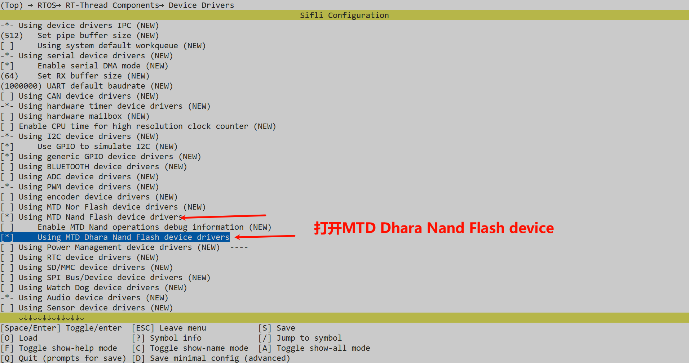
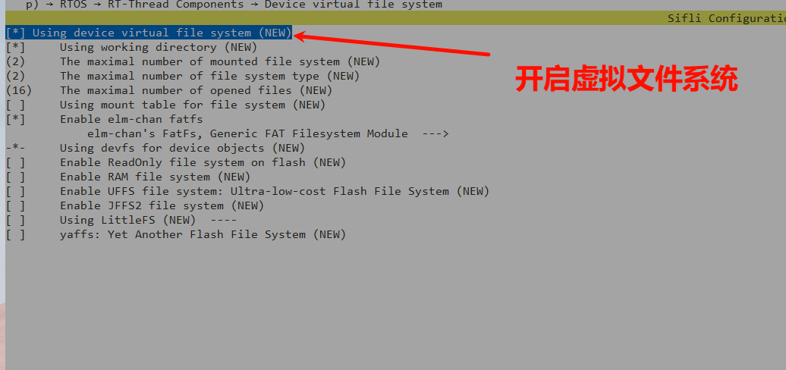
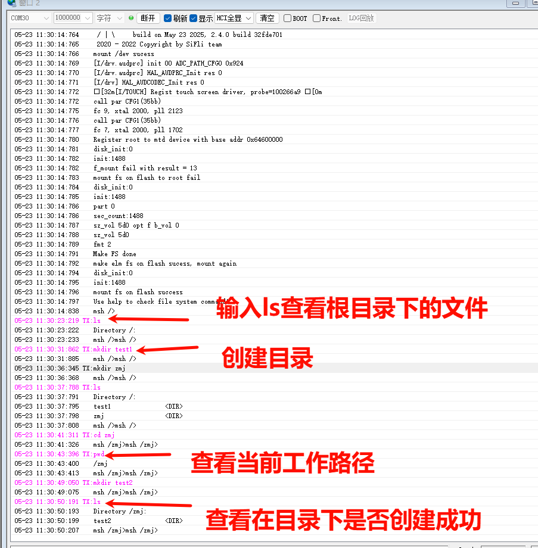

# FatFs NAND Example
## Usage Guide
This example demonstrates FatFs file system functionality using FAT format. Common file commands can be called in UART console, such as:

```
df               - Disk free
mountfs          - Mount device to file system
mkfs             - Format disk with file system
mkdir            - Create the DIRECTORY.
pwd              - Print the name of the current working directory.
cd               - Change the shell working directory.
rm               - Remove(unlink) the FILE(s).
cat              - Concatenate FILE(s)
mv               - Rename SOURCE to DEST.
cp               - Copy SOURCE to DEST.
ls               - List information about the FILEs.

```
  
### File System Packaging

The default compilation script does not download file system partition image files, so if the mount fails during the first program run, it will automatically format the partition. For specific implementation, see the `mnt_init` function in `main.c`. The SDK also provides functionality to package files in specified directories and generate file system image files. You can uncomment the following code in `SConstruct`. This code packages files in the disk directory during compilation and generates the `fs_root.bin` file in the build directory. If the partition table in `ptab.json` defines a partition with `img` attribute as `fs_root`, the download script will simultaneously download that bin file.
      
```
# fs_bin=FileSystemBuild( "../disk", env)
# AddCustomImg("fs_root",bin=[fs_bin])
```
## Example Usage Instructions
### Hardware Requirements
1. To run the example, you need to have a development board that supports this example
2. A USB data cable capable of data transmission
### menuconfig Configuration
```
 //Execute command
 menuconfig --board=em-lb561
```  
1. First, you need to enable MTD Dhara Nand Flash device in menuconfig


2. Use device virtual file system


3. Select HAL Assert type


## Project Description
- Compilation method: Enter project directory and execute command `scons --board=<board_name> -j8`, where board_name is the board name. For example, to compile eh-lb561 board, the complete command is `scons --board=eh-lb561 -j8`. The compiled image file is stored in HCPU's build_<board_name> directory. For common project usage, refer to <<General Project Build Method>>
- Download method: Enter project directory and execute command `build_<board_name>_hcpu\download.bat(uart_download.bat)`, where board_name is the board name. If download has uart prefix, it uses serial port for program burning; without it, it uses jlink burning (depending on whether the board model supports jlink burning). For example, compiling eh-lb561 board, the complete command is `build_en-lb561_hcpu\download.bat`

## Example Output Results Display
The following results show the log after the example runs on the development board. If you cannot see these logs, it means the example did not run successfully as expected and requires troubleshooting.
```
mount fs on flash root success//Indicates successful file system mounting
```
1. Send ls through serial port to view files in root directory.

2. Input mkdir test1 to create test1 folder (directory).

3. Input cd+directory name to go to XXX directory, input pwd to check if current working path is in the cd directory.

4. You can create mkdir test2 again in this working directory, use ls to check if creation was successful in this directory.

### Troubleshooting
If the log does not show expected log and phenomena, troubleshooting can be done from the following aspects:
* Whether hardware connection is normal
* Check if USB cable has data transmission capability
* Whether the above menu is configured correctly (especially board flash model)