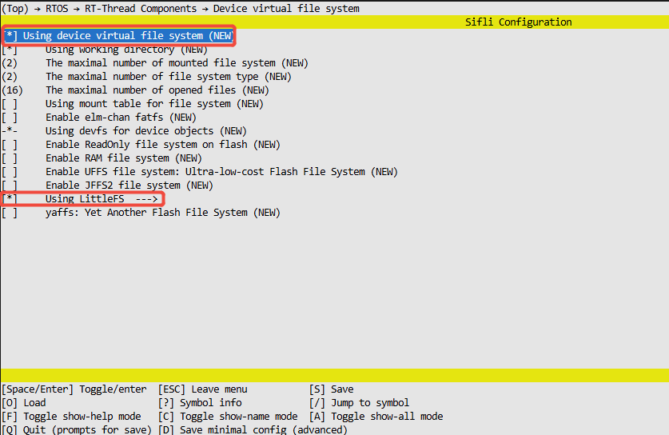
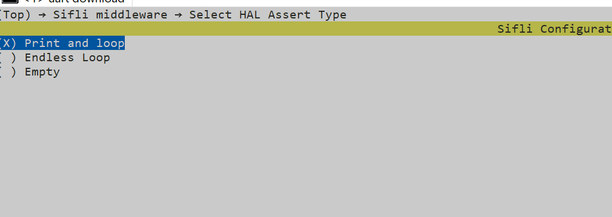

# LittleFs NOR Example

Source code path: example/storage/littlefs

## Supported Platforms
<!-- Which boards and chip platforms are supported -->

+ sf32lb52-lcd_n16r8

## Overview
<!-- Example introduction -->
LittleFS is a lightweight, power-loss safe file system designed for embedded systems, especially suitable for non-volatile storage devices such as NOR Flash.

## Usage Guide
This example demonstrates the file system functionality of LittleFs. You can call common file commands in the UART console, such as:

```
df               - Disk free
mountfs          - Mount device to file system
mkfs             - Format disk with file system
mkdir            - Create the DIRECTORY.
pwd              - Print the name of the current working directory.
cd               - Change the shell working directory.
rm               - Remove(unlink) the FILE(s).
cat              - Concatenate FILE(s)
mv               - Rename SOURCE to DEST.
cp               - Copy SOURCE to DEST.
ls               - List information about the FILEs.

```
  
### File System Packaging

The default compilation script does not download the file system partition image file, so the first time the program runs, if the mount fails, it will automatically format the partition. The specific implementation can be found in the `mnt_init` function in `main.c`. The SDK also provides the functionality to package files under a specified directory and generate a file system image file. You can uncomment the following code in `SConstruct`. This code's function is to package files under the disk directory during compilation and generate a `fs_root.bin` file in the build directory. If the partition table in `ptab.json` defines a partition with the `img` attribute as `fs_root`, the download script will also download the bin file.
      
```
# fs_bin=FileSystemBuild( "../disk", env)
# AddCustomImg("fs_root",bin=[fs_bin])
```

## Example Usage Instructions
### Hardware Requirements
1. Before running the example, you need to have a development board that supports this example
2. A USB data cable with data transmission capability

### menuconfig Configuration
```
 //Execute command
 menuconfig --board=em-lb561
```  
1. First, you need to enable MTD Nor Flash device in menuconfig


2. Use device virtual file system and enable LittleFs file system


3. Select HAL Assert type



### Compilation and Flashing
Switch to the example project directory and run the scons command to compile:
```c
> scons --board=sf32lb52-lcd_n16r8 -j32
```
Switch to the example `project/build_xx` directory and run `uart_download.bat`, select the port as prompted for download:
```c
$ ./uart_download.bat

     Uart Download

please input the serial port num:5
```
For detailed steps on compilation and download, please refer to the relevant introduction in [Quick Start](quick_start).

## Expected Results
The following results show the log after the example runs on the development board. If you don't see these logs, it means the example didn't run as expected and you need to investigate the cause.
```
mount fs on flash root success//indicates successful file system mounting
```
1. Send ls via serial port to view files in the root directory

2. Enter mkdir test2 to create a test2 folder (directory)

3. Enter ls again to see if the test2 folder (directory) was created successfully

4. Enter pwd to view the current working path


## Exception Diagnosis
If the expected log and phenomena do not appear, you can troubleshoot from the following aspects:
* Whether the hardware connection is normal
* Check if the USB cable has data transmission capability
* Whether the above menuconfig is configured correctly 