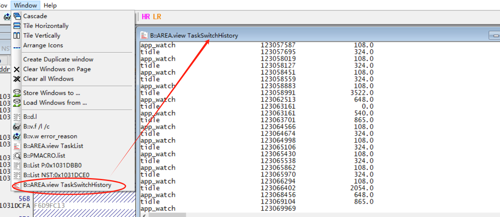

# CPU Usage Profiler Example

Source code path: example/system/cpu_usage_profiler

## Supported Platforms
<!-- Which boards and chip platforms are supported -->
+ sf32lb52-lcd_n16r8

## Overview
<!-- Example introduction -->
This example demonstrates the configuration and usage of cpu_usage_profiler, with features including:
+ CPU usage statistics: idle time (idle_run_time), non-idle time (other_run_time), CPU usage rate (default 2s statistics once).
+ Thread switching history records. Records the thread name and switching time for each thread switch.
+ Interrupt history records. Records the interrupt number and interrupt trigger time.
+ CPU Usage Metrics. Records CPU idle time (idle time), non-idle time (other run time), thread run time (thread run time). Supports:
     + Periodic printing.
     + Collection and storage through `Metrics Collector` functionality.

```{tip}
+ The time for thread switching and interrupt records is calculated based on GTIMER boot time (seconds/microseconds).
+ The statistical information of `CPU Usage Metrics` is cleared and restarted after each collection or printing.
```

## Example Usage
<!-- Explain how to use the example, such as which hardware pins to connect to observe waveforms, compilation and flashing can reference related documentation.
For rt_device examples, also list the configuration switches used in this example, for example PWM example uses PWM1, need to enable PWM1 in onchip menu -->

### Hardware Requirements
Before running this example, you need to prepare a development board supported by this example.

### menuconfig Configuration
1. Enable cpu usage profiler (master switch):  

2. Configure task switching record count:  

3. Configure interrupt history records (enable, configure record count):  

4. Configure CPU Usage Metrics:    
4.1 Enable Metrics:  
  
4.2 Configure report type:    

     ```{tip}
     In this example, `report type` is configured as periodic printing.
     ```

### Compilation and Flashing
Switch to the example project directory and run the scons command to compile:
```
scons --board=sf32lb52-lcd_n16r8 -j32
```
Run `build_sf32lb52-lcd_n16r8_hcpu\uart_download.bat`, select the port as prompted for download:
```
$ ./uart_download.bat

     Uart Download

please input the serial port num:5
```
For detailed steps on compilation and download, please refer to the relevant introduction in [](/quickstart/get-started.md).

## Expected Results
<!-- Describe the expected results of running the example, such as which LEDs will light up, what logs will be printed, to help users determine if the example is running normally. Results can be explained step by step in conjunction with the code -->
1. Thread switching history is saved in `thread_switch_hist`, interrupt history records are saved in `isr_hist`, which can be viewed through online or offline means such as `ozone\T32`. For example, when an exception occurs, you can easily see the thread switching records through T32:

2. When CPU Usage Metrics is configured as periodic printing, it will periodically print `CPU Usage` information (the printing period configured here is 10s):
     ```c
     07-03 17:59:52:616    [328360] I/NO_TAG: ============================
     07-03 17:59:52:625    [0m[328382] I/NO_TAG: CPU Usage:    9.93/   9.94 (   0.15%)
     07-03 17:59:52:632    [0m[328411] I/NO_TAG: ========================================================
     07-03 17:59:52:641    [0m[328442] I/NO_TAG: thread      run_time(s)    load(%)
     07-03 17:59:52:648    [0m[328465] I/NO_TAG: --------------------------------------------------------
     07-03 17:59:52:662    [0m[328496] I/NO_TAG: [tshell  ]:    0.01    0.15% 
     07-03 17:59:52:672    [0m[328518] I/NO_TAG: [tidle   ]:    9.93   99.85% 
     07-03 17:59:52:680    [0m[328540] I/NO_TAG: [timer   ]:    0.00    0.00% 
     07-03 17:59:52:692    [0m[328562] I/NO_TAG: [main    ]:    0.00    0.00% 
     07-03 17:59:52:813    [0m
     07-03 18:00:02:607    [656066] I/NO_TAG: ============================
     07-03 18:00:02:619    [0m[656087] I/NO_TAG: CPU Usage:    9.99/  10.00 (   0.07%)
     07-03 18:00:02:627    [0m[656112] I/NO_TAG: ========================================================
     07-03 18:00:02:637    [0m[656143] I/NO_TAG: thread      run_time(s)    load(%)
     07-03 18:00:02:644    [0m[656166] I/NO_TAG: --------------------------------------------------------
     07-03 18:00:02:653    [0m[656197] I/NO_TAG: [tshell  ]:    0.00    0.00% 
     07-03 18:00:02:660    [0m[328218] I/NO_TAG: [tidle   ]:    9.99   99.93% 
     07-03 18:00:02:670    [0m[328240] I/NO_TAG: [timer   ]:    0.01    0.07% 
     07-03 18:00:02:678    [0m[328262] I/NO_TAG: [main    ]:    0.00    0.00% 
     ```
3. Supported FINSH commands:
     Command|Description 
     --|--
     `cpu_prof_init`|Initialize profiler functionality
     `cpu_prof_deinit`|Cancel profiler functionality
     `cpu_prof_reset`|Reset CPU statistics
     `cpu`|Print CPU statistics (if `CPU Usage Metrics` is enabled, it will also print thread loads)

     The following is the `cpu` command print (here `CPU Usage Metrics` is enabled):
     ```c
     07-03 23:35:53:806 TX:cpu
     07-03 23:35:53:811    [1049619] I/NO_TAG: CPU usage: 0.33
     07-03 23:35:53:814    
     07-03 23:35:53:819    [0m[1049637] I/NO_TAG: ============================
     07-03 23:35:53:822    [0m[1049659] I/NO_TAG: CPU Usage:    1.94/   1.95 (   0.34%)
     07-03 23:35:53:828    [0m[1049684] I/NO_TAG: ========================================================
     07-03 23:35:53:832    [0m[1049715] I/NO_TAG: thread      run_time(s)    load(%)
     07-03 23:35:53:837    [0m[1049739] I/NO_TAG: --------------------------------------------------------
     07-03 23:35:53:839    [0m[1049770] I/NO_TAG: [tshell  ]:    0.00    0.00% 
     07-03 23:35:53:844    [0m[1049792] I/NO_TAG: [tidle   ]:    1.94   99.66% 
     07-03 23:35:53:848    [0m[1049814] I/NO_TAG: [timer   ]:    0.01    0.34% 
     07-03 23:35:53:852    [0m[1049836] I/NO_TAG: [main    ]:    0.00    0.00% 
     ```

## Exception Diagnosis

## Reference Documentation
<!-- For rt_device examples, RT-Thread official documentation provides detailed explanations. Web links can be added here, for example, refer to RT-Thread's [RTC Documentation](https://www.rt-thread.org/document/site/#/rt-thread-version/rt-thread-standard/programming-manual/device/rtc/rtc) -->

## Update History
|Version |Date   |Release Notes |
|:---|:---|:---|
|0.0.1 |07/2025 |Initial version |
| | | | 