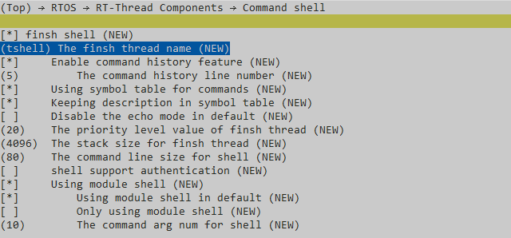

# FinSH

## Supported Platforms
The example can run on the following development boards.
* sf32lb52-lcd_n16r8
* sf32lb58-lcd_n16r64n4

## Overview
* FinSH is RT-Thread's command line component (shell), providing a set of operational interfaces for users to call from the command line, mainly used for debugging or viewing system information. In addition to FinSH's built-in commands, FinSH also provides multiple macro interfaces to export custom commands, and exported commands can be executed directly in FinSH.

## FinSH Function Configuration
* FinSH functionality can be trimmed, with macro configuration options defined in the _rtconfig.h_ file. The specific configuration items are shown in the table below.

|Macro Definition	                           |Value Type	            |Description	|Default Value|
|:---                             |:---                    |:---   |:---|
|#define RT_USING_FINSH	          |None	  |Enable FinSH	         |Enabled|
|#define FINSH_THREAD_NAME	      |String |FinSH thread name	      |"tshell"|
|define  FINSH_USING_HISTORY	  |None	  |Enable history recall function	      |Enabled|
|#define FINSH_HISTORY_LINES	  |Integer |Number of history command lines that can be recalled	   |5|
|#define FINSH_USING_SYMTAB	      |None	  |Enable symbol table usage in FinSH	   |Enabled|
|#define FINSH_USING_DESCRIPTION  |None	  |Add a description to each FinSH symbol	|Enabled|
|#define FINSH_USING_MSH	      |None	  |Enable msh mode	          |Enabled|
|#define FINSH_ARG_MAX	          |Integer |Maximum number of input parameters	           |10|
|#define FINSH_USING_AUTH	      |None	  |Enable permission verification	              |Disabled|
|#define FINSH_DEFAULT_PASSWORD   |String |Permission verification password	              |Disabled |


* The reference configuration example in _rtconfig.h_ is shown below, and can be configured according to actual functional requirements. Enter `menuconfig` in the compilation interface and configure under `RTOS → RT-Thread Components → Command shell`.

```c
/* Enable FinSH */
#define RT_USING_FINSH

/* Define thread name as tshell */
#define FINSH_THREAD_NAME "tshell"

/* Enable history commands */
#define FINSH_USING_HISTORY
/* Record 5 lines of history commands */
#define FINSH_HISTORY_LINES 5

/* Enable Tab key usage */
#define FINSH_USING_SYMTAB
/* Enable description function */
#define FINSH_USING_DESCRIPTION

/* Define FinSH thread priority as 20 */
#define FINSH_THREAD_PRIORITY 20
/* Define FinSH thread stack size as 4KB */
#define FINSH_THREAD_STACK_SIZE 4096
/* Define command character length as 80 bytes */
#define FINSH_CMD_SIZE 80

/* Enable msh function */
#define FINSH_USING_MSH
/* Maximum number of input parameters is 10 */
#define FINSH_ARG_MAX 10
```
## FinSH Custom Command Application Examples
### msh Command Example without Parameters
* Export a custom command to msh, example code is shown below. The code creates a `myhello` function, then uses the `MSH_CMD_EXPORT` command to export the `myhello` function to the FinSH command list.
```c
#include <rtthread.h>

void myhello(void)
{
    rt_kprintf("hello RT-Thread!\n");
}

MSH_CMD_EXPORT(myhello , say hello to RT-Thread);
```
Run the hello command, the result is as follows:
```
msh />hello
hello RT_Thread!
msh />
```
### msh Command Example with Parameters
* Export a custom command with parameters to FinSH, example code is shown below. The code creates an `atcmd()` function, then uses the `MSH_CMD_EXPORT` command to export the `atcmd()` function to the msh command list.
```c
#include <rtthread.h>

static void atcmd(int argc, char**argv)
{
    if (argc < 2)
    {
        rt_kprintf("Please input'atcmd <server|client>'\n");
        return;
    }

    if (!rt_strcmp(argv[1], "server"))
    {
        rt_kprintf("AT server!\n");
    }
    else if (!rt_strcmp(argv[1], "client"))
    {
        rt_kprintf("AT client!\n");
    }
    else
    {
        rt_kprintf("Please input'atcmd <server|client>'\n");
    }
}

MSH_CMD_EXPORT(atcmd, atcmd sample: atcmd <server|client>);

```
Run the `atcmd` command, the result is as follows:
```
msh />atcmd
Please input 'atcmd <server|client>'
msh />

```
Run the `atcmd server` command, the result is as follows:
```
msh />atcmd server
AT server!
msh />

```
Run the `atcmd client` command, the result is as follows:
```
msh />atcmd client
AT client!
msh />

```

**Note**: 
An infinite loop must be added in the main function to enter the msh command.
```c
int main(void)
{
    while (1)
    {
      rt_thread_mdelay(5000);
    }
    return 0;
}

```

## Reference Documentation
* 
## Update Log
|Version |Date   |Release Notes |
|:---|:---|:---|
|0.0.1 |12/2024 |Initial version |
| | | |